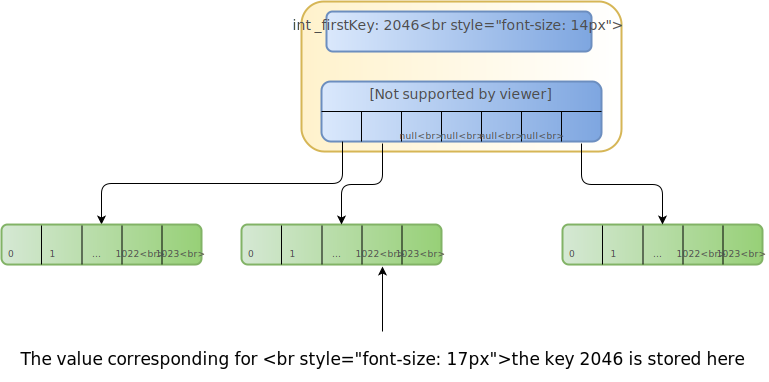

Previously, I blogged quite extensively about some core functionality that was overhauled to use CoreCLR architecture dependent intrinsics, but I purposely didn't discuss the data-structure that was in need for those fast bitmap search functions.

Due to popular demand, and for completeness sake, I thought I might take this opportunity to discuss the rest 

### Detour: Why is `DenseSortedList<TV>` such a special snowflake

While `DenseSortedList` is essentially a dictionary-like object, as its borrowed name implies, there's a lot of domain specific stuff going on here, that justifies writing this from scratch, so lets kick things off by showing its rough API, and the key operations we support:

```csharp
public class DenseSortedList<TV> where TV : struct {
    // Update / Insert a new key, return value(s) mark what actualy happenned
    // index marks the index of that key in the sorts list of keys
    public (bool, ref TV) Upsert(int key, out int index);
    // Read by key, but also report the index at the time of retrieval
    public (ref TV, bool) TryGetByKey(int key, out int index);
    // Read by index, but also report the key at the time of retrieval
    public ref TV GetByIndex(int index, out int key);
    // Remove by key & returns the old index
    public int RemoveByKey(int key);
    // Remove by index & returns the old key
    public int RemoveByIndex(int index);    
}
```

As it should be clear from glancing over this API, there's a lot of domain specific things going on here:

* Unlike any other `IDictionary<TKey, TValue>` there's no `TKey` here. This is a very specific type of dictionary whose key is always a plain integer, and we will take advantage of this.
* When we need to update/insert, we just call `Upsert` and end up either inserting a new key, or retrieving the value associated with the existing key.
* We are oriented towards extreme performance, as it will become increasingly apparent, and therefore constrain `TV : struct` which in turn, helps us being [mechanically sympathetic](https://mechanical-sympathy.blogspot.com/2011/07/why-mechanical-sympathy.html), w.r.t. the CPU cache utilization and performance:
  * Unlike reference types, value types don't have any memory overhead (16 bytes of object header in a 64 bit arch).
  * Unlike reference types, arrays of value types are guaranteed to be allocated in contiguous virtual/physical memory (yes, that's only partly true, I know) which takes advantage of the fact that CPUs, through their TLB/L1/L2/L3 caching mechanisms, are optimized for locality of reference in the physical address space.
* Since we will be storing arrays of value-types for speed purposes, we also take advantage of C# 7.0's ref-return language feature, which allows us (finally!) to return references to value types (e.g. pointers) without incurring wasteful coying of memory and causing needless cache thrashing.
* The API is sprayed with a somewhat unique duality: We know that the consumers **always** need to deal *both* with the key AND its index within the set of sorted keys. So we end up always accepting one of them as a unique key for any given operation, and returning the other while we're at it.

This last point about the duality of keys and indices, and our need to continuously deal with both of them, is really THE key factor that justifies writing this data structure.
It's not only about designing an API that always accepts/returns both of them (although that also helps), it is mainly about making that translation between the two as efficient and speedy as possible WHILE ALSO implementing an efficient dictionary like functionality at the same time.

So here follows a summary of the requirements / constraints for `DenseSortedList<TV>`:

* `TKey` is implicitly an integer, and `TValue` can really be anything, but is constrained to a value type for performance reasons
* We need various APIs to support both access / mutation by key AND BY index (more on indices in a moment)
* This really needs to be super-fast, as querying/updating this dictionary-like structure boils down to double digit % of our hot code path
* We absolutely need predictability here, both in the sense that:
  * deleting / inserting / updating new key-value-pairs has to be a constant time operation, e.g. O(*1*) 
  * We literally want t<sub>update</sub> == t<sub>insert</sub> == t<sub>delete</sub>  (or more precisely not to deviate extremely from each other) as predictable service time, regardless of operation is also important 

#### Key ⇄ Index

So, if you've been following so far, our little homegrown data structure is built on top of the requirement that we continuously deal both with keys and their respective indices.

This requirement, requires a formal definition, before we dive into optimizing around it: As keys are inserted/removed into a sorted dictionary (for the purpose of this discussion, we assume ascending sorting only) we need, at any given moment, to be able to swiftly translate a given key, into its index, within a sorted list of keys that the dictionary is currently mapping.

Just to be super clear, here's are a few examples:

When the dictionary contains the following keys, this is what their indices are:


| Key:   | 11342 | 11344 | 11345 | 11346 |
| ------ | ----- | ----- | ----- | ----- |
| Index: | 0     | 1     | 2     | 3     |

When we call `Upsert` on this "instance" like this:

```csharp
var (didWeInsert, _) = dsl.Upsert(11340, out var newIndex);
// didWeInesrt == True, newIndex = 0
```

We will end up with a dictionary looking like this:

| Key:   | 11340 | 11342 | 11344 | 11345 | 11346 |
| ------ | ----- | ----- | ----- | ----- | ----- |
| Index: | 0     | 1     | 2     | 3     | 4     |

After which, when we call `RemoveByKey` like this:

```csharp
var _ = dsl.GetByKey(11345, out var oldIdxOf11345);
// oldIdxOf11345 == 3
var removedIndex = dsl.RemoveByKey(11344);
// removedIndex == 2
var _ = dsl.GetByKey(11345, out var newIdxOf11345);
// newIdexOf11345 == 2
```

And our dictionary now looks like this:

| Key:   | 11340 | 11342 | 11345 | 11346 |
| ------ | ----- | ----- | ----- | ----- |
| Index: | 0     | 1     | 2     | 3     |

#### The distribution of incoming keys

TBD?

#### Implementation

We're finally getting close to the reason I wrote this thing, which was intrinsics, but to really get there we need to describe our actual implementation.

##### Storing the Keys and the Values

We ended up using a dead simple two-level array for the actual keys and values, given our description of the incoming distribution of keys.

A two level array is really, conceptually, a single very large array, that was broken into two levels of indirection (for reasons that will immediately become clear).

The top-level/master array contains references to the second-level arrays.

The second array holds the actual values of the dictionary, and has a predetermined 2<sup>n</sup> size.
We chose n ==10, so 1024 values for every second level array.

But what about the keys? How do we know which key every value corresponds to?

The answer to that is pretty simple: We simply take the conceptual index in the very large virtual array we've just described, and that index is simply the key.

Since we have just defined that each second-level array has exactly 1,024 entries, we now can a very simply operation that converts from key => first-level index + second-level index:

```csharp
(int chunkIndex, int offsetWithinChunk) GetChunkIdxAndOffset(int key) => 
  (key >> 10, key & ((1 << 10) - 1));
```

And conversely, a mapping from the chunk index + offset within the chunk back to the key:

```csharp
int key GetKey(int chunkIndex, int offsetWithinChunk) => 
  (chunkIndex << 10) + offsetWithinChunk;
```

##### Why Two-Level storage?

Two level storage allows us to keep a balance between performance and memory usage.

In reality, we have upwards of thousands of the data-structure up and running and any given moment, and while each `DenseSortedList` has a very tight distribution of keys, the absolute span between the lowest and highest key is actually quite large.

Had we simply pre-allocated the whole thing with one large array it would literally consume hundrends of MBs of RAM, or even potentually GBs of RAM per single instance. Instantiating thousands of instances in this manner would simply be un-realistic.

By opting for a two-level-storage, when we have large gaps over the distribution of keys, we can actually store a null value(s) in the top-level array, thereby not allocating memory we would never use.

The trade-off, naturally is that lookup time, while still remaining constant

Additionally, to avoid scanning thousands and thousands of empty keys before finding the first populated key in our dictionary, we also keep single key-value for the smallest key we are currently storing inside our virtual array, so we can quickly find the first value.

So let's put this in a diagram and give a concrete example:



So here is a real-life exap

So if you squint your eyes, you end up seeing what is essentially ends up being one pre-alocated array, with the ability to not pay in advance, too much memory, in case there's a big jump in the keys (more than 1,024)

Now, what becomes apparent very quickly is that without more work/information, this is really a design that is skewed towards accessing values by key where:

* Retrieving the value for a known key, is super fast:
  * Single Right Shift (`>>`) operation to find the right array (index)
  * Single bitwise and (`&`) operation to find the index within the array
* Deleting / Inserting new values for new keys does not require moving / copying a single bit in memory
* Keeping a two level mapping between keys/values allows us to deal with occasional large jumps in the key space

What should also become almost immediately apparent is what is not covered by the description so far:

* Since the array is really an array of value types, there is no way of telling which keys have been allocated(!)
* Even if we could in some magical way find values which have a valid mapping set up for them, doing any sort of index based retrieval / modification is extremely painful, as we need to literally traverse the entire value space to calculate the index

##### The Bitmap

The solution we opted for, which we feel fits well with our constraints / understanding of the data, was to use a presence bitmap that to mark the presence of a any specific key (e.g. if a given key is mapped to anything or not).

The bitmap completes the `DenseSortedList` implementation, now that we can actually figure out (and cheaply) if a given key is mapped (it's corresponding bit in the bitmap is `1`) or not-mapped (`0`)

What we are left with is basically implementing two functions that will:

1. Retrieve the index for a given key (`GetIndexForKey()`)
2. Retrieve the key for a given index (`GetKeyForIndex()`)

