As I've described in [part 1]() of this series, I've recently overhauled an internal data structure we use at Work<sup>&reg;</sup> to start using [platform dependent intrinsics](https://github.com/dotnet/designs/blob/master/accepted/platform-intrinsics.md).

If you've not read part 1 yet, I suggest you do so, since we continue right where we left off...

As a reminder, this series is made in 3 parts:

* [The data-structure/operation that we'll optimize and basic usage of intrinsics]().
* Using intrinsics more effectively (this post).
* [The C++ version(s) of the corresponding C# code, and what I learned from them]().

All of the code (C# & C++) is published under the [bitgoo github repo](https://github.com/damageboy/bitgoo).

### PDEP - Parallel Bit Deposit

We're about to twist our heads with a bit of a challenge: For me, this was a lot of fun, since I got to play with something I knew *nothing* about which turned out to be very useful, and not only for this specific task, but useful in general.

We're going to optimize a subset of this method's performance "spectrum": lower bit counts.  
If you go back to the previous iteration of the code, we can clearly see that apart from the one 64 bit `POPCNT` loop up at the top, the ratio between instructions executed and bits processed for low values of `N` doesn't look too good. I summed up the instruction counts from the JIT Dump linked above:

* The 64-bit `POPCNT` loop takes 10 instructions, split into two fragments of the function, processing 64 bits each iteration.
* The rest of the code (31 instructions not including the `ret`!) is spent processing the last <= 64 bits, executing a single time.

While just counting instructions isn't the best profiling metric in the world, it’s still very revealing...  
Wouldn't it be great if we could do something to improve that last, long code fragment?
Guess what...  
Yes we can! using a weird little instruction called [`PDEP`](https://en.wikipedia.org/wiki/Bit_Manipulation_Instruction_Sets#Parallel_bit_deposit_and_extract) whose description (copy-pasted from [Intel's bible of instructions](https://www.intel.com/content/dam/www/public/us/en/documents/manuals/64-ia-32-architectures-software-developer-instruction-set-reference-manual-325383.pdf) in page 922) goes like this:

> PDEP uses a mask in the second source operand (the third operand) to transfer/scatter contiguous low order bits in the first source operand (the second operand) into the destination (the first operand). PDEP takes the low bits from the first source operand and deposit them in the destination operand at the corresponding bit locations that are set in the second source operand (mask). All other bits (bits not set in mask) in destination are set to zero.

Luckily, it comes with a diagram that makes is more digestible:


I know this might be a bit intimidating at first, but what `PDEP` can do for us, in my own words, is this: Process a single 64-bit value (`SRC1`) according to a mask of bits (`SRC2`) and copy ("deposit") the least-significant bits from `SRC1` (or from right to left in the diagram) into a destination register according to the the position of `1` bits in the mask (`SRC2`).  
It definitely takes time to wrap your head around how/what can be done with this, and there are many more applications than just this bit-searching. To be honest, right after I read a [paper](http://palms.ee.princeton.edu/PALMSopen/hilewitz06FastBitCompression.pdf) about `PDEP`, which from what I gathered, was the inspiration that led to having these primitives in our processors and an extremely good paper for those willing to dive deeper, I felt like a hammer in search of a nail, in wanting to apply this somewhere, until I remembered I had *this* little thing I need (e.g. this function) and I tried using it, still in C++, about 2 years ago...  
It took me a good day of goofing around (I actually started with its sister instruction `PEXT` ) with this on a white-board until I finally saw *a* solution...
<u>*Note*</u>: There might be other solutions, better than what I came up with, and if anyone reading this finds one, I would love to hear about it!

For those of you who don't like spoilers, this might be a good time to grab a piece of paper and try to figure out how `PDEP` could help us in processing the last 64 bits, where we know our target bit is hiding...

If you are ready for the solution, I'll just show the one-liner C# expression that replaces the **31** instructions we saw the JIT emit for us to handle those last < 64 bits in our bitmap all the way town to **13** instructions and just as importantly: with **0** branching:

```csharp
// Where:
// n is the # of the target bit we are searching for
// value is the 64 bits when we know for sure that n is "hiding" within
var offsetOfNthBit = TrailingZeroCount(
                         ParallelBitDeposit(1UL << (n - 1), value);
```

It’s not trivial to see how/why this works just from reading the code, so lets break this down, for an imaginary case of a 16-bit `PDEP` and assorted registers, for simplicity:

As an example, let’s pretend we are are looking for the offset (position) of the 8<sup>th</sup> `1` bit.  
We pass two operands to `ParallelBitDeposit()`:  
The `SRC1` operand has the value of `1` left shifted by the bit number we are searching for minus 1, so for our case of `n = 8`, we shift a single `1` bit 7 bits to the left, ending up with:

```ini
0b_0000_0000_1000_0000
```

Our “fake” 16-bit `SRC1` now has a single `1` bit in the **position** that equals our target-bit **count** (This last emphasis is important!)
Remember that by this point in our search function, we have made sure our `n` is within the range `1..64`, so `n-1` can only be `0..63` we we can never shift negative number of bits, or above the size of the register (this can be seen more easily in the full code listing below).

As for `SRC2`,  We load it up with our remaining portion of the bitmap, whose n<sup>th</sup> lit bit position we are searching for, so with careful mashing of the keyboard, I came up with these random bits:

```ini
0b_0001_0111_0011_0110
```

This is what executing `PDEP` with these two operands does:



By now, we’ve managed to generate a temporary value where only our original target-bit remains lit, in its original position, so thanks for that, `PDEP`! In a way, we've managed to tweak `PDEP` into a custom masking opcode, capable of masking out the first `n-1` lit bits...  
Finally, all that remains is to use the BMI1 `TZCNT` instruction to count the number of `0` bits leading up to our deposited `1` bit marker. That number ends up being the offset of the n<sup>th</sup> lit bit in the original bitmap! Cool, eh?

Let's look at the final code for this function:

```csharp
using static System.Runtime.Intrinsics.X86.Popcnt;
using static System.Runtime.Intrinsics.X86.Bmi1;
using static System.Runtime.Intrinsics.X86.Bmi2;

public static unsafe int POPCNTAndBMI2(ulong* bits, int numBits, int n)
{
    var p64 = bits;
    int prevN;
    do {
        prevN = n;
        n -= (int) PopCount(*p64);
        p64++;
    } while (n > 0);

    p64--;
    // Here, we know for sure that 1 .. prevN .. 64 (including)
    var pos = (int) TrailingZeroCount(
                        ParallelBitDeposit(1UL << (prevN - 1), *p64));
    return (int) ((p64 - bits) << 6) + pos;
}
```

With the code out of the way, time to see if the whole thing paid off?

Method           |     N |         Mean (ns) | Scaled to "POPCNTAndBMI1" 
---------------- |------ |------------------:|-------:
   POPCNTAndBMI2 |     1 |          2.232 |   0.95 
   POPCNTAndBMI2 |     4 |          9.497 |   0.62 
   POPCNTAndBMI2 |    16 |         40.259 |   0.34 
   POPCNTAndBMI2 |    64 |        193.253 |   0.19 
   POPCNTAndBMI2 |   256 |      1,581.082 |   0.32 
   POPCNTAndBMI2 |  1024 |     23,174.989 |   0.51 
   POPCNTAndBMI2 |  4096 |    341,087.341 |   0.82 
   POPCNTAndBMI2 | 16384 | 4,979,229.288 |   0.95 
   POPCNTAndBMI2 | 65536 | 76,144,935.381 |   0.98 

Oh boy did it! results are much better for the lower counts of `N`:

* As expected, the scaling improved with *peak improvement* compared to the previous version at `N==64`, with a 400% speedup compared to the previous version!
* As N grows beyond 64, this version's performance resembles the previous version's more and more (duh!).

All in all, everything looks as we would have expected so far...  
Again, for those interested, here's a [gist](https://gist.github.com/9b049a464dc66237500454ed367a79aa) of the JITDump, for your pleasure.

### Loop Unrolling

A common optimization technique we haven't used up to this point, is [loop unrolling/unwinding](https://en.wikipedia.org/wiki/Loop_unrolling):

> The goal of loop unwinding is to increase a program's speed by reducing 
> or eliminating instructions that control the loop, such as [pointer arithmetic](https://en.wikipedia.org/wiki/Pointer_arithmetic) and "end of loop" tests on each iteration;[[1\]](https://en.wikipedia.org/wiki/Loop_unrolling#cite_note-1) reducing branch penalties; as well as hiding latencies including the delay in reading data from memory.[[2\]](https://en.wikipedia.org/wiki/Loop_unrolling#cite_note-2) To eliminate this [computational overhead](https://en.wikipedia.org/wiki/Computational_overhead), loops can be re-written as a repeated sequence of similar independent statements.[[3\]](https://en.wikipedia.org/wiki/Loop_unrolling#cite_note-3)

By now, we’re left with only one loop, so clearly the target of loop unrolling is the `POPCNT` loop.  
After all, we are potentially going over thousands of bits, and by shoving more `POPCNT` instructions in between the looping instructions, we can theoretically drive the CPU harder.  
Not only that, but modern (in this case x86/x64) CPUs are notorious for having internal parallelism that comes in many shapes and forms. For `POPCNT` specifically, we know from [Agner Fog's Instruction Tables](https://www.agner.org/optimize/instruction_tables.pdf) that:

* Intel Skylake can execute certain `POPCNT` instructions on two different execution ports, with a single `POPCNT` latency of 3 cycles, and a reciprocal throughput of 1 cycle, so a latency of `x + 2` cycles as a best case, where `x` is the number of **continuous independent** `POPCNT` instructions.
* AMD Ryzen can execute up to 4 `POPCNT` instructions in 1 cycle, with a latency of 1 cycle, for **continuous independent**  `POPCNT` instructions, which is even more impressive (I've not yet been able to verify this somewhat extravagant claim...).

These numbers were measured on real CPUs, with very specific benchmarks that measure single independent instructions. They should **not** be taken as a target performance for **our** code, since we are attempting to solve a real-life problem, which isn't limited to a single instruction and has at least SOME dependency between the different instructions and branching logic on top of that.  
But the numbers do give us at least one thing: motivation to unroll our `POPCNT` loop and try to get more work out of the CPU by issuing independent `POPCNT` on different parts of our bitmap.

Here's the code that does this:

```csharp
using static System.Runtime.Intrinsics.X86.Popcnt;
using static System.Runtime.Intrinsics.X86.Bmi1;
using static System.Runtime.Intrinsics.X86.Bmi2;

public static unsafe int POPCNTAndBMI2Unrolled(ulong* bits, int numBits, int n)
{
    var p64 = bits;
    for (; n >= 256; p64 += 4) {
        n -= (int) (
            PopCount(p64[0]) +
            PopCount(p64[1]) +
            PopCount(p64[2]) +
            PopCount(p64[3]));
    }
    var prevN = n;
    while (n > 0) {
        prevN = n;
        n -= (int) PopCount(*p64);
        p64++;
    }

    p64--;
    var pos = (int) TrailingZeroCount(
                        ParallelBitDeposit(1UL << (prevN - 1), *p64));
    return (int) ((p64 - bits) * 64) + pos;
}
```

We had to change the code flow to account for the unrolled loop, but all in all this is pretty straight forward, so let's see how this performs:

| Method             | N     |         Mean (ns) | Scaled to POPCNTAndBMI2 |
| ------------------ | ----- | ----------------: | -------------------: |
| POPCNTAndBMI2Unrolled | 1     |          2.249 |                 1.04 |
| POPCNTAndBMI2Unrolled | 4     |         10.904 |                 1.15 |
| POPCNTAndBMI2Unrolled | 16    |         50.368 |                 1.11 |
| POPCNTAndBMI2Unrolled | 64    |        208.272 |                 1.13 |
| POPCNTAndBMI2Unrolled | 256   |      1,580.026 |                 0.99 |
| POPCNTAndBMI2Unrolled | 1024  |     21,282.905 |                 0.92 |
| POPCNTAndBMI2Unrolled | 4096  |    255,186.977 |                 0.74 |
| POPCNTAndBMI2Unrolled | 16384 |  3,730,420.068 |                 0.77 |
| POPCNTAndBMI2Unrolled | 65536 | 56,939,817.593 |                 0.76 |

There are a few interesting things going on here:

* For low bit-counts (`N <= 64`) we can see a drop in performance compared to the previous version. That is totally acceptable: We've made the code longer and more branch-y, and all of this was done in order to gain some serious change on the other side of this benchmark (Also, in reality, no one ever complains that your code used to take 193ns, but is now taking 208ns :).
* In other words: The drop is not horrible, And we hope to make up enough for it on higher bit counts.
* And we are making up for it, kind of... We can see a 33%-ish speedup for `N >= 4096`.

For those interested, here's the [JITDump](https://gist.github.com/c73959ad3dfe31e5d65e6bf273f53211) of this version.

In theory, we should be happy, pack our bags, and call it a day! We've done it, we've squeezed every last bit we could hope to.  
**Except we really didn't...**  
While it might not be clear from these results alone, the loop unrolling hit an unexpected snag: the performance improvement is actually disappointing.  
How can I tell? Well, that's simple: **I'm cheating!**  
I've already written parallel C++ code as part of this whole effort (to be honest, I wrote the C++ code two years before C# intrinsics were a thing), and I've seen where unrolled `POPCNT` can go, and this is not it.  
Not *yet* at least.

From my C++ attempts, I know we should have seen a ~100% speedup in high bit-counts with loop unrolling, but we are seeing much less than that.

To understand why though, and what is really going on here, you'll have to wait for the next post, where we cover some of the C++ code, and possibly learn more about processors than we cared to know...

## Mid-Journey Conclusions

We've taken our not so bad code at the end of the first post and improved upon quite a lot!  
I hope you've seen how trying to think outside the box, and finding creative ways to compound various intrinsics provided by the CPU can really pay off in performance, and even simplicity.

With the positive things, we must also not forget there are some negative sides to working with intrinsics, which by now, you might also begin sensing them:

- You'll need to map which CPUs your users are using, and which CPU intrinsics are supported on each model (even within a single architecture, such as Intel/AMD x64 you'll see great variation throughout different models!).
- You'll sometimes need to cryptic implementation-selection code, that uses the provided `.IsHardwareAccelerated` properties (for example detecting `BMI1` only CPUs vs. `BMI1` + `BMI2` ones) to steer the JIT into the "best" implementation, while praying to the powers that be that the JIT will be intelligent enough to elide the un-needed code at generation time, and still inline the resulting code.
- Due to having multiple implementations, architecture specific *testing* becomes a new requirement.
  This might sound basic to a C++ developer, but less so for C#/CLR developers; this would mean that you need to have access to x86 (both 32 and 64 bit) ,arm32,arm64 test agents and run tests on **all of them** to be able to sleep calmly at night.

All of these are considerations to be taken seriously, especially if you work outside of Microsoft (where there are considerably more resources for testing, and greater impact for using intrinsics at the same time), while considering intrinsics.

In the [next and final post](), we'll explore the performance bug I uncovered, and how generally C# compares to C++ for this sort of code...
