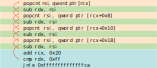

As I've described in [part 1](2018-08-18-netcoreapp3.0-instrinsics-in-real-life-pt1.md) & [part 2](2018-08-19-netcoreapp3.0-instrinsics-in-real-life-pt2.md) of this series, I've recently overhauled an internal data structure we use at Work<sup>&reg;</sup> to start using [platform dependent intrinsics](https://github.com/dotnet/designs/blob/master/accepted/platform-intrinsics.md).

If you've not read the previous posts, I suggest you do so, as a lot of what is discussed here relies on the code and issues presented there...

As a reminder, this series is made in 3 parts:

- [The data-structure/operation that we'll optimize and basic usage of intrinsics](2018-08-18-netcoreapp3.0-instrinsics-in-real-life-pt1.md).
- [Using intrinsics more effectively](2018-08-19-netcoreapp3.0-instrinsics-in-real-life-pt2.md)
- The C++ version(s) of the corresponding C# code, and what I learned from them (this post).

All of the code (C# & C++) is published under the [bitgoo github repo](https://github.com/damageboy/bitgoo).

## C++ vs. C\#

I think I've mentioned this somewhere before: I started working on better versions of my bitmap search function way before CoreCLR intrinsics were even imagined. This led me to starting to tinker with C++ code where I tried out most of my ideas. When CoreCLR 3.0 became real enough, I ported the C++ code back to C# (which was surprisingly consisted of a couple of search and replace operations, no more...).

As such, having two close implementations begs doing a head-to-head comparison.
After some additional work I had basic [google benchmark](https://github.com/google/benchmark) and [google test](https://github.com/google/googletest) suites up and running[^1]

I'll cut right to the chase and present a relative comparison between what are essentially the same pieces of code:


There are two things that stand out from this comparison:

* C# is doing pretty well here, in every "important" version except:
* What is going on with the unrolled version? Why is there such a big difference for what is a relatively optimized (and equivalent) piece of code between the two languages?

I'll start with answering this last question directly, and then proceed to explain the underlying relevant basics (hint: it's not so basic) of CPU pipelining and register renaming in order for the explanation to stick for people reading this that are not familiar with those terms/concepts.

The bottom line is: there is a bug in the CPU! There is a well known errata (even if very cryptic) and compiler developers are more or less generally aware of this issue and have been working around it for the better part of the last 5 years.

### False Dependencies

So what is this mysterious CPU bug all about? The JIT was producing what should be, according to the processor documentation, pretty good code:

```nasm
BEGIN_POPCNT_UROLLED_LOOP:
popcnt   rsi, qword ptr [rcx]
sub      rdx, esi
popcnt   rsi, qword ptr [rcx+8]
sub      rdx, esi
popcnt   rsi, qword ptr [rdi+16]
sub      rdx, esi
popcnt   rsi, qword ptr [rcx+24]
sub      rdx, esi
add      rcx, 32
cmp      rdx, 256
jge SHORT BEGIN_POPCNT_UROLLED_LOOP
```

I've narrowed down the entire `POPCNTAndBMI2Unroleld` method to the main loop that does 4 `POPCNT` instructions in succession.

Even if you are not an assembly guru, it's pretty clear we have 4 pairs of `POPCNT` + `SUB` instructions where:

*  Each `POPCNT` instruction is **reading** from successive memory addresses and **writing** their result temporarily into a register *named* `rsi`. 
* This temporary value is then subtracted from another register which represents our good old C# variable `n` (the target-bit count).

The high-level explanation of the bug goes like this: The CPU *should* have **detected** that each `POPCNT` + `SUB` instruction *pair* is effectively *independent* of the previous pair (inside our unrolled loop and *between* the loops iterations). In other words: although all 4 pairs are using the same destination register (`rsi`), each such pair is really not dependent on the previous value of `rsi`. This dependency analysis, performed by the CPU, *should* have led it to use an internal optimization called register-renaming (more on that later).  
Had register renaming been triggered the CPU could have processed our `POPCNT` instructions with a higher degree of parallelism and we would be able to process more "stuff" per cycle (i.e. have better IPC, or Instruction-Per-Cycle ratio).  
In reality, the bug is causing the CPU to delay the processing of each pair for a few cycles, per pair, introducing a lot of garbage time inside the CPU, where it's stalling, doing less work than it should, leading to the slowdown we are discussing. 

Terminology wise, this sort of bug is called a *false-dependency* bug: In our case, the CPU wrongfully introduces a dependency between the different `POPCNT` instructions on their destination register, it *thinks* each `POPCNT` instruction is **not only writing** into `rsi` but **also reading** from it (it does no such thing)!  
Given that this false dependency now exists, it is preventing the CPU from using register-renaming to execute the code more efficiently.

I will first focus on describing how compilers have been working around this, and afterwards I will describe in much more detail how the CPU employs register renaming to improve the throughput of the pipeline when the bug does not exist *or* is worked around.

### Working Around False Dependencies

As I've mentioned, this bug has been around for quite some time: It was reported somewhere is 2012 and is unfortunately still persistent to this day on most Intel CPUs, at least when it comes to the `POPCNT` instruction[^2].

Luckily, compiler developers have been able to workaround this issue with relative ease by generating extra code that *breaks* the aforementioned false-dependency. As far as I can tell, the people who originally wrote the workarounds were Intel developers, so I presume they had very good understanding of the exact nature of this false-dependency. What they opted to do was to introduce a single-byte instruction that clears the lower 32-bits of the destination register, this comes in the form of a `xor esi, esi` instruction in our case, which is the shortest way (instruction length wise) in x86 CPUs to zero out a register. While I don't know this for sure, it appears the Intel engineers *knew* that the dependency is not the entire 64-bit register (`rsi`) but only on the lower 32-bit part of that register (`esi`[^3]) and took advantage of this understanding to introduce a single byte fix into the instruction stream, which is relatively very cheap.

The correct x86 assembly should look like this:

```nasm
BEGIN_POPCNT_UROLLED_LOOP:
xor      esi, esi				; This breaks the dependency
popcnt   rsi, qword ptr [rcx]
sub      rdx, esi
xor      esi, esi				; This breaks the dependency
popcnt   rsi, qword ptr [rcx+8]
sub      rdx, esi
xor      esi, esi				; This breaks the dependency
popcnt   rsi, qword ptr [rdi+16]
sub      rdx, esi
xor      esi, esi				; This breaks the dependency
popcnt   rsi, qword ptr [rcx+24]
sub      rdx, esi
add      rcx, 32
cmp      rdx, 256
jge SHORT BEGIN_POPCNT_UROLLED_LOOP
```

This short piece of code is the sort of code that gcc/clang would generate for `POPCNT` to go around the bug. As you can see, it appears silly when you just read it without having prior knowledge about the CPU bug, as it appears like the compiler generated useless code to begin with, and you'll find people wondering about this publicly in stackoverflow and other forums from time to time. But for most in-production x86 CPUs this code will substantially outperform the original code we saw above...

## Update: CoreCLR does the right thing

I originally started writing part 3 thinking I would finish writing this post before anyone would fix the underlying issue. I was wrong on both counts: Writing this post became an ever growing challenge as I attempted to explain pipelines and register-renaming for the uninitiated, while [Fei Peng fixed the issue](https://github.com/dotnet/coreclr/pull/19772) in a matter of two weeks.

What CoreCLR now does (since commit [6957b4f](https://github.com/dotnet/coreclr/pull/19772/commits/6957b4f44f0917209df89499b7c4071bb0bc1941)) is ALWAYS introduce the `xor dest, dest` workaround/dependency breaker for the 3 affected instructions `LZCNT`, `TZCNT`, `POPCNT`. This is not the optimal solution, since the JIT will introduce this both for CPUs afflicted with this bug (specific Intel CPUs) as well as CPUs that have this bug (All AMD CPUs and newer Intel CPUs).  
From the discussion, it's clear that this path was chosen for simplicity's sake: it would require more infrastructure both to detect the correct CPU family at the JIT, and introduce questions around what should the JIT do in case of AOT (Ahead Of Time) compilation, as well as require more testing infrastructure than what is currently in place on the one hand, while the fix is very cheap even for CPUs that are not affected given its a single byte workaround...

Let's see if this CoreCLR fix does anything to our unmodified piece of code...:

Method |     N |              Mean | Scaled to "POPCNTAndBMI2" |Scaled To Older CoreCLR
------------------- |------ |------------------:|-------:|-------:
 IntrinsicsUnrolled |     1 |          2.170 ns |   1.19 |0.96
 IntrinsicsUnrolled |     4 |        11.910 ns |   1.08 |1.09
 IntrinsicsUnrolled |    16 |         55.016 ns |   1.17 |1.09
 IntrinsicsUnrolled |    64 |        225.156 ns |   1.12 |1.08
 IntrinsicsUnrolled |   256 |      1,637.336 ns |   1.01 |1.04
 IntrinsicsUnrolled |  1024 |     11,698.421 ns |   0.54 |0.55
 IntrinsicsUnrolled |  4096 |    149,247.146 ns |   0.44 |0.58
 IntrinsicsUnrolled | 16384 |  1,904,945.748 ns |   0.39 |0.51
 IntrinsicsUnrolled | 65536 | 27,712,720.427 ns |   0.36 |0.49

It sure does! It appears now that the unrolled version is running roughly 85-101% faster that it did with the previous, unfixed CoreCLR!. If you consider for a moment, that we got here by making the JIT spill out extra, supposedly useless instructions, this makes the achievement that much more impressive :), as before, [here is the JITDump](https://gist.github.com/damageboy/0266018efbbf0a8478aa4d50de1c894f) with the newly fixed JIT in place.

Now we see how this false dependency had a profound effect on our performance. In theory, this might be the right time to finish this post, however, I couldn't let it go without attempting to explain the underlying issue of *why* the false dependency had such a deep effect on performance. For readers well aware of how CPU pipelines work and how they interact with the register renaming functionality on a modern CPU this is a good time to stop reading. What follows is me trying to explain how the CPU tries to handle loops of code effectively, and how register renaming plays an important role in that. 

## The love/hate story that is tight loops in CPUs

It takes very little imagination to realize that CPUs spend a lot their processing time executing loops (or the same machine code multiple times, in this context).   
We need to remember that CPUs achieve remarkable throughput (e.g. instructions per cycles, or IPC) even though the table, in some ways, is set **against** them:

* A modern CPU will often have a dozen or so stages in their pipeline (14 in Skylake, 19 in AMD Ryzen)
  * This means a single instruction will take about 14 cycles from start to finish if we were only executing a single instruction and waiting for it to complete!
* While the CPU does attempt to handle multiple instructions in different stages of the pipeline, it may become *stalled* (i.e. do no work) when it needs to wait for a previous instruction to advance through the pipeline enough to have its result ready (this is generally referred to as instruction dependencies).
* To improve the utilization of CPU caches (L1/2/3 caches) and memory bus utilization, most modern processors artificially limit the amount of register **names** they support for instructions (seems like in 2018 everyone has settled on 16 general purpose registers, except for PowerPC at 32)
  * That way instructions take up less bits, and can be read more quickly over these highly subscribed resources (Caches and memory bus).
  * On the flip side of this design decision, that would mean, that on the surface of things, compilers do not have the ability to generate code that uses many different registers, which in turn leads them to generate more code fragments that are dependent of each other because of the limited register names available for them.

With that in mind, lets take a short piece of assembly code, which was generated by the JIT[^2] for our last unrolled attempt at `POPCNT`,  and see how it theoretically executes on a Skylake CPU:

## Visualizing our loop, take 1

Without any additional fanfare, lets introduce the following visualization:


I created this diagram by prettifying a trace file generate by a little known tool made by Intel called  [IACA](https://software.intel.com/en-us/articles/intel-architecture-code-analyzer), which stands for **I**ntel **A**rchitecture **C**ode **A**nalyzer. IACA takes a piece of machine code + target CPU family and produces a textual trace file that can help us "see" better that the CPU does, at every cycle of a relatively short loop.  
If you dislike having to use commercial (non-OSS) tools, please note that there is a similar tool by the llvm project called [llvm-mca](https://llvm.org/docs/CommandGuide/llvm-mca.html), and you can even use it from the [infamous compiler-explorer](https://godbolt.org/z/baOZWy).

This is merely the first time I'm introducing this diagram in this post, and we will get back to it and focus more on the details, but for now, I just want you to get a general feel for what is going on here, when you (literally, physically) take a step back and look at it:

- The left most column contains the loop counter, I've limited the trace to 2 (0, 1) iterations of that loop, to keep everything compact.
- Next, the instruction counter WITHIN its respective loop, clearly we have 10 instructions per loop.
- Next is the disassembly, where we can see 4 `POPCNT` instructions and they are interleaved with 4 subtractions of each `POPCNT` result from the register `rdx`
- Next we see how the instructions are broken down to µops[^3]  
  For now, we will simply make note that every `POPCNT` we have , having been encoded as an instruction that reads from memory AND calculates the population count, was broken down to two µops:
  - A load µop (`TYPE_LOAD`) loading the data from its respective pointer.
  - An operation µop (`TYPE_OP`) performing the actual `POPCNT`ing into our destination register (`rsi`).
- Then comes the real kicker: IACA **simulates** what a Skylake CPU *should* be doing at every cycle of those two loop iterations and provides us with critical insight into the various state each instruction is at every cycle (relative to the beginning of the first loop). These states are described by the coded symbols in each box, that I will shortly describe in more detail.

What I would like you to take from this visual, at this stage of the post, is only **one thing**, which I've highlighted with that <span style="color:red">**red-ellipse**</span>: Notice how effective the CPU pipeline is! For our purposes here, the `R` symbol represents the final stage of each instruction. To me, it's very impressive to see how all of the instructions terminate execution either 0 or 1 cycle apart of each other. Serious engineering went into making this a reality, so lets try to appreciate it a bit more.

### Instruction Dependencies

Let's look at the code again, this time adding arrows between the various instructions, marking their interdependencies.



If we interpret this code naively, we see that `rsi` is being used in each and every instruction of this code fragment, this could lead us to assume that the heavy usage of `rsi` is generating a long dependency chain:

* The `POPCNT` is writing into `rsi`
* `rsi` is then used as a source for the subtraction from `rdx`, so naturally the `sub` instruction cannot proceed before `rsi` has the value of `POPCNT`
* The next `POPCNT` is again writing to `rsi` but would seemingly be unable to write before the previous `sub` has finished.
* After four such operations we loop (in turquoise) again and we are again taking a dependency on `rsi` at the beginning of the loop.

This naive dependency analysis pretty much contradicts the output we saw come out of IACA in the previous diagram. It would seem impossible for the CPU to run so many things in parallel where every instruction here seems to have a dependency through the use of the `rsi` register.  
In fact, our original C# code did not force the JIT to re-use the same register over and over, it could have allocated 4 different registers and use them to generate code where each `POPCNT` + `SUB` pair would be independent of the previous one, so why didn't it do so?  
Well, it turns out there is no need to! The JIT is doing exactly what it needs to be doing, it's just us, that need need to learn about a very important concept in modern processors called register renaming.

### Register Renaming

To understand why anyone would need something like register renaming, we first need to understand that CPU designers are stuck between a rock and a hard place: 

- On one hand they want to be able to read our program code as fast as possible, from memory 🡒 cache 🡒 instruction decoder (a.k.a front side bus), this requirement leads down a path where they have to severely *limit* the amount of register *names* available for machine code, since less register names leads to more compact instructions (less bits) in memory and more efficient utilization of memory buses and caches.
- On the other hand, they would like to give compilers / JIT engines as much flexibility as possible in using as many registers as the want (possibly hundreds) without needing to move their contents into memory (or more realistically: CPU cache) just because they ran out of registers names.

These contradicting requirements led CPU designers to decouple the idea of register names and register storage: modern CPUs have many more (hundreds) or physical registers (storage) in their register-file, than they have names for our software to use. This is where register renaming enters the scene.

What CPU designers have been doing, for quite a long time now (since 1967, believe it or not) is really remarkable: they have been employing a really neat trick that effectively gets the best of both worlds (i.e. satisfy both requirements) at the cost of more complexity and more stages in the pipeline (hence also a little slowdown in single instruction execution) to achieve better pipeline utilization at the global scale.

Register renaming, accomplishes, just that: by analyzing *when* a register is being **written** (write-only, not read-write) to, the CPU understands that the previous value of that register is no longer required for the execution instructions reading/writing to that same register from that moment onwards, even if previous instructions have not completed execution! What this really means, is that if we go back to the naive (now you see why) dependency analysis we did in the previous section, it's clear that each `POPCNT` + `SUB` pair are actually completely **independent** of each other because they begin with overwriting `rsi`!  
What the CPU does, therefore, is continuously map named registers to different register *locations* on the register-file, according to the real dependency chain, and use that newly allocated location within the register file until the dependency chain is broken again (e.g. the same register is written to again).  
This is a super important tool under the CPU's belt, that allows it to schedule multiple instruction to execute concurrently, either at different stages of the same pipeline, or in parallel in different pipelines that exist in a super-scalar CPU.

How big of a deal is this? How good is the CPU in using this renaming trick? To best answer this, I think, we can take a look into the disparity between how many register *names* exist, for example, in the x64 architecture, that number being 16, and how *many physical register* storage space there is on the register-file, for example, on an Intel Skylake CPU: 180 (!).

After the temporary (renamed) register has finished its job for a given instruction chain, we are still, unfortunately, not done with it. Understand that the CPU cannot look too far into the incoming instruction stream, and it can not know, with certainty, if the last written value it just wrote to a renamed register will not be required by some future part of the code it hasn't seen yet. Which brings us to the last phase of register renaming, which is retirement: The CPU must still write the last value for our symbolic register back to the canonical location of that register (a.k.a the "real" register), in case future instructions that have not been loaded/decoded will attempt to read that value.  
Moreover, this retirement phase must be done exactly in program order for the program to continue operating at its original intention.

### An single instruction's lifetime

Let's focus on a single`POPCNT` and learn how to generalize from that:


This instruction reads directly from memory and writes directly to the `rsi` register. As we now understand the entire thing happens on a renamed register on the register file inside the CPU for `rsi`.

allocatedAccording to IACA, we see that this instruction was first broken down to two µops: one for reading from the memory location pointed to by the `rcx` register and a second µop to actually do the `POPCNT`ing.  
While all the various states of the instruction within the pipeline are interesting I will focus on giving some more meaning to specific states:

| mnemonic | Meaning                                                      |
| -------- | ------------------------------------------------------------ |
| d        | Dispatched to execution: The CPU has completed decoding and waiting for the instruction's dependencies to be ready, and has now started execution |
| e        | Executing: The instruction is being executed, often in multiple cycles within a specific execution port (unit) inside the CPU |
| w        | Writeback: The instruction's result is being written back to the renamed register in the register-file, where it will be available for other instructions that might have a dependency on that instruction |
| R        | Retired: The temporary register used during the execution/writeback has to be written back to the "real" destination register, according to the original order of the program code, this is called retirement, after which the CPUs internal, temporary register is free again |

Armed with this "new" knowledge we can now go back to the `POPCNT` pipeline diagram, and understand how the various states relate to register renaming:

- Prior to instruction execution, the CPU needs to decode the instruction and allocate space on the register-file (Basically everything up to the `d` state including) for the written values (in this case one un-named location for the memory load, and one location for our renamed `rsi`).
- During `w` (writeback) the CPU is actually writing the allocated location.
- During the retirement phase, the CPU is carefully evicting the temporary location back to the canonical location of the `rsi` register so that future instructions outside of the CPUs view could still read that value in the future.

## Visualizing our loop

Without any additional fanfare, lets introduce the following visualization:


* 

[^1]: As a side note, after not doing serious C++ work for years, coming back to it and discovering sanitizers, cmake, google test & benchmark was a very pleasant surprise. I distinctly remember the surprise of writing C++ and not having violent murderous thoughts at the same time. 
[^2]: Apparently Intel have fixed the bug (according to reports) for the `LZCNT` and `TZCNT` instructions on Skylake processors, but not so for the `POPCNT` instruction for reasons unknown to practically anyone.
[^3]: yes, x86 registers are weird in that way, where *some* 64 bit registers have additional symbolic names referring to their lower 32, 16, and both 8 bit parts of their lower 16 bits, don't ask.
[^4]: I'm actually lying. I recreated the same code by re-writing it in assembly so I could have is a static object file on disk, but this is close enough
[^5]: µop or micro-op, is a low-level hardware operation. The CPU Front-End is responsible for reading the x86 machine code and decoding them into one or more µops[^2].
