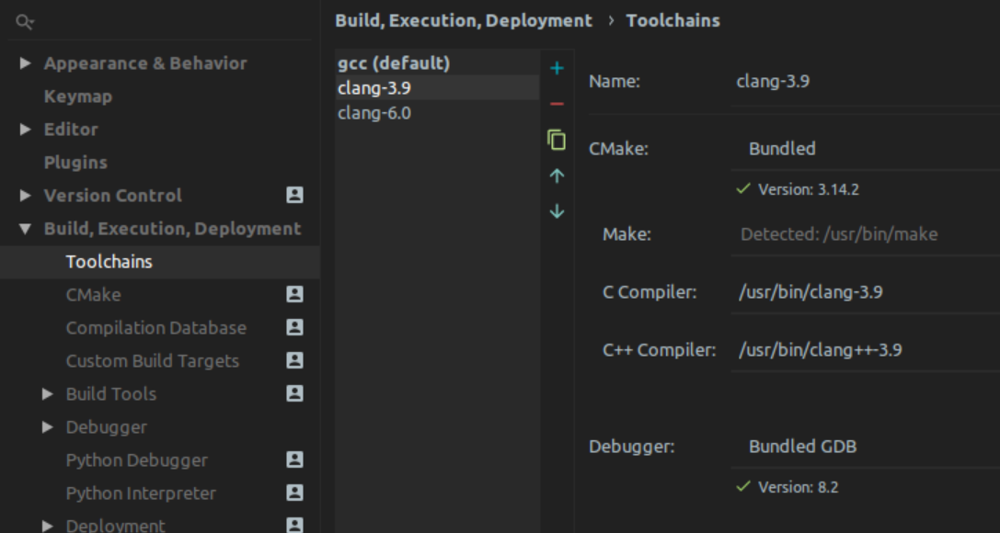
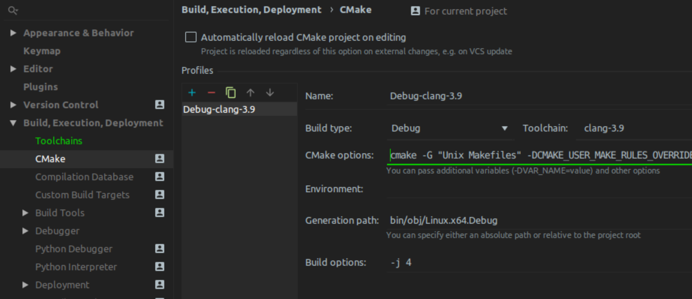

## What/Why?

Being a regular Linux user, when I can, I was looking for a decent setup for myself to grok through CoreCLR for a side project / hack I'm working on, which will remain undisclosed until I nail it.

CoreCLR, namely the C++ code that implements the runtime (GC, JIT and more) is a BIG project, and trying to peel through its layers for the first time is no easy task for sure. While there are many great resources available for developers that want to read about the runtime such as the [BotR](https://github.com/dotnet/coreclr/blob/master/Documentation/botr/README.md), for me, there really is no replacement for reading the code and trying to reason about what/how it gets stuff done, preferably during a debug session, with a very focused task/inquiry at hand. For this reason, I really wanted a proper IDE for the huge swaths of C++ code, and I couldn't think of anything else but [JetBrains' own CLion IDE](https://www.jetbrains.com/clion/) under Linux (and macOS, which I'm not a user of).  
With my final setup, I really can do non-trivial navigation on the code base such as:

<video width="900" controls >
    <source src="../assets/images/clion-coreclr.webm" type="video/webm">
</video>

## Getting it Done

CoreCLR is a beast of a project, and getting it to parse properly under CLion, moreover, **build and debug** inside it requires some non-trivial setup, so I thought I'd disclose my process here, for other people to see and maybe even improve upon...

Generally speaking, everything should fit since the CoreCLR build-system is 95% made of running `cmake` to generate standard GNU makefiles, and then build the whole thing using said makefiles, where the other 5% is made of some scripts wrapping the `cmake` build-system. At the same time, CLion builds upon `cmake` to bootstrap its own internal project representation, *provided* that it can invoke `cmake` just like the normal build would.

Here's what I did to get everything working:

1. First, We'll clone and perform a single build of CoreCLR by [following the instructions](https://github.com/dotnet/coreclr/blob/master/Documentation/building/linux-instructions.md#environment), What I did on my ubuntu machine consisted of:
   ```bash
   $ sudo apt install cmake llvm-3.9 clang-3.9 lldb-3.9 liblldb-3.9-dev libunwind8 libunwind8-dev gettext libicu-dev liblttng-ust-dev libcurl4-openssl-dev libssl-dev libnuma-dev libkrb5-dev
   $ ./build.sh
   ```

2. Once the build is over, you should have everything under the `bin/Product/Linux.x64.Debug` like so:
   ```bash
   $ ls bin/Product/Linux.x64.Debug
   bin           libcoreclr.so                  netcoreapp2.0
   coreconsole   libcoreclrtraceptprovider.so   PDB
   corerun       libdbgshim.so                  sosdocsunix.txt
   createdump    libmscordaccore.so             SOS.NETCore.dll
   crossgen      libmscordbi.so                 SOS.NETCore.pdb
   gcinfo        libprotononjit.so              superpmi
   IL            libsosplugin.so                System.Globalization.Native.a
   ilasm         libsos.so                      System.Globalization.Native.so
   ildasm        libsuperpmi-shim-collector.so  System.Private.CoreLib.dll
   inc           libsuperpmi-shim-counter.so    System.Private.CoreLib.ni.{fe21e59b-7903-49b4-b2d3-67de152c1d7d}.map
   lib           libsuperpmi-shim-simple.so     System.Private.CoreLib.xml
   libclrgc.so   Loader
   libclrjit.so  mcs
   ```
   Now that an initial build is over, we can be sure that some scripts that were crucial to generate a few headers used during the rest of the compliation process have completed successfully and CLion will be able to find all the necessary source code once we teach it how to...
   
3. CLion will need to invoke `cmake` just like the build scripts did. To get the `cmake` command line we'll use an old bash trick to generate traces for a `build.sh`s excution, `bash -x`:

   ```bash
   $ bash -x ./build.sh
   + pushd /home/damageboy/projects/public/coreclr/bin/obj/Linux.x64.Debug
   ... # omitted
   ++ cmake -G 'Unix Makefiles' -DCMAKE_USER_MAKE_RULES_OVERRIDE=/home/damageboy/projects/public/coreclr/src/pal/tools/clang-compiler-override.txt -DCMAKE_AR=/usr/bin/llvm-ar-3.9 -DCMAKE_LINKER=/usr/bin/llvm-link-3.9 -DCMAKE_NM=/usr/bin/llvm-nm-3.9 -DCMAKE_OBJDUMP=/usr/bin/llvm-objdump-3.9 -DCMAKE_BUILD_TYPE=DEBUG '-DCMAKE_EXPORT_COMPILE_COMMANDS=1 ' -DCLR_CMAKE_ENABLE_CODE_COVERAGE=OFF -DCLR_CMAKE_COMPILER=Clang -DCLR_CMAKE_LINUX_ID=ubuntu -DCLR_CMAKE_TARGET_OS=Linux -DCLR_CMAKE_PACKAGES_DIR=/home/damageboy/projects/public/coreclr/packages -DCLR_CMAKE_PGO_INSTRUMENT=0 -DCLR_CMAKE_OPTDATA_VERSION=99.99.99-master-20190424.1 -DCLR_CMAKE_PGO_OPTIMIZE=1 -DCLR_CMAKE_BUILD_TESTS=ON /home/damageboy/projects/public/coreclr
   -- The C compiler identification is Clang 3.9.1
   -- The CXX compiler identification is Clang 3.9.1
   -- Check for working C compiler: /usr/bin/clang-3.9
   -- Check for working C compiler: /usr/bin/clang-3.9 -- works
   -- Detecting C compiler ABI info
   -- Detecting C compiler ABI info - done
   -- Detecting C compile features
   -- Detecting C compile features - done
   -- Check for working CXX compiler: /usr/bin/clang++-3.9
   -- Check for working CXX compiler: /usr/bin/clang++-3.9 -- works
   -- Detecting CXX compiler ABI info
   -- Detecting CXX compiler ABI info - done
   -- Detecting CXX compile features
   ```

   So, right before the initial `cmake` output (`-- The C compiler identification is Clang 3.9.1`) we can see the monstrous `cmake` command line we were searching for... We need to copy the whole thing, except for the `cmake` program name itself:
   ```bash
   -G 'Unix Makefiles' -DCMAKE_USER_MAKE_RULES_OVERRIDE=/home/damageboy/projects/public/coreclr/src/pal/tools/clang-compiler-override.txt -DCMAKE_AR=/usr/bin/llvm-ar-3.9 -DCMAKE_LINKER=/usr/bin/llvm-link-3.9 -DCMAKE_NM=/usr/bin/llvm-nm-3.9 -DCMAKE_OBJDUMP=/usr/bin/llvm-objdump-3.9 -DCMAKE_BUILD_TYPE=DEBUG '-DCMAKE_EXPORT_COMPILE_COMMANDS=1 ' -DCLR_CMAKE_ENABLE_CODE_COVERAGE=OFF -DCLR_CMAKE_COMPILER=Clang -DCLR_CMAKE_LINUX_ID=ubuntu -DCLR_CMAKE_TARGET_OS=Linux -DCLR_CMAKE_PACKAGES_DIR=/home/damageboy/projects/public/coreclr/packages -DCLR_CMAKE_PGO_INSTRUMENT=0 -DCLR_CMAKE_OPTDATA_VERSION=99.99.99-master-20190424.1 -DCLR_CMAKE_PGO_OPTIMIZE=1 -DCLR_CMAKE_BUILD_TESTS=ON /home/damageboy/projects/public/coreclr
   ```

   This 99% percent of what we need... The only remaining missing piece is that the build script runs the whole thing inside the `bin/obj` folder, as you can see in the first line of the bash -x output, so we'll make note of this too:
   ```bash
   + pushd /home/dans/projects/public/coreclr/bin/obj/Linux.x64.Debug
   ```

4. Now it's time to open up CLion and get this show on the road:
   Let's start with defining a clang-3.9 based toolchain, since on Linux Clion defaults to using the gcc toolchain, while CoreCLR uses clang-3.9 to build itelf:

5. Now for the last remaining step, we'll change the CMake settings to run just like the build script had ran it:
   

   What we need to make sure is that we change the:

   * "Toolchain" to clang-3.9 that we just created
   * The "CMake options" to that mess we copied aside in step (3)
   * The "Generation Path" to the directory where the build script jumped for the entire build, again from step (3)

6. That's it, let CLion do it's thing while grinding your machine to a halt, and once it's done you can start navigating and building the CoreCLR project like a first class citizen of the civilized world :)
