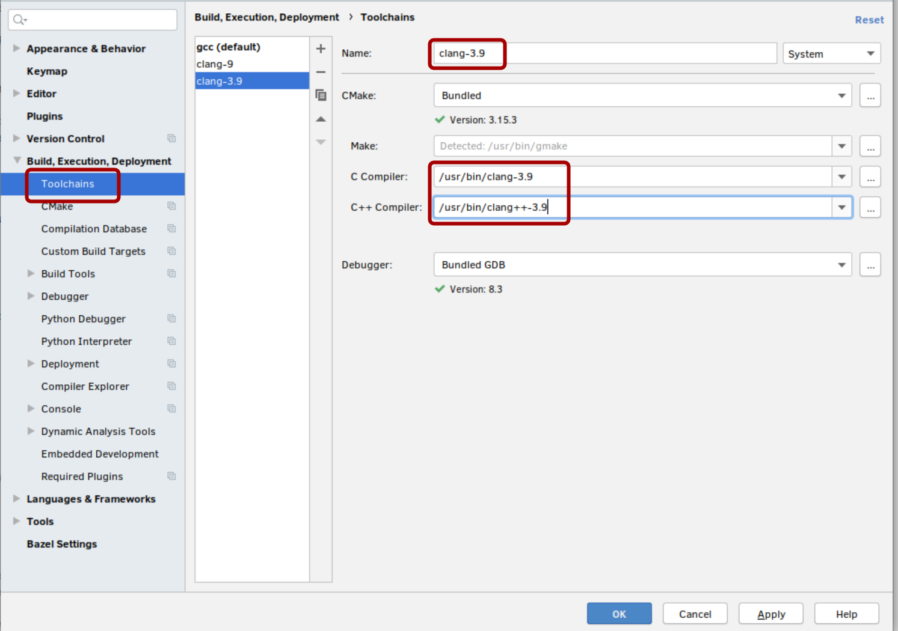
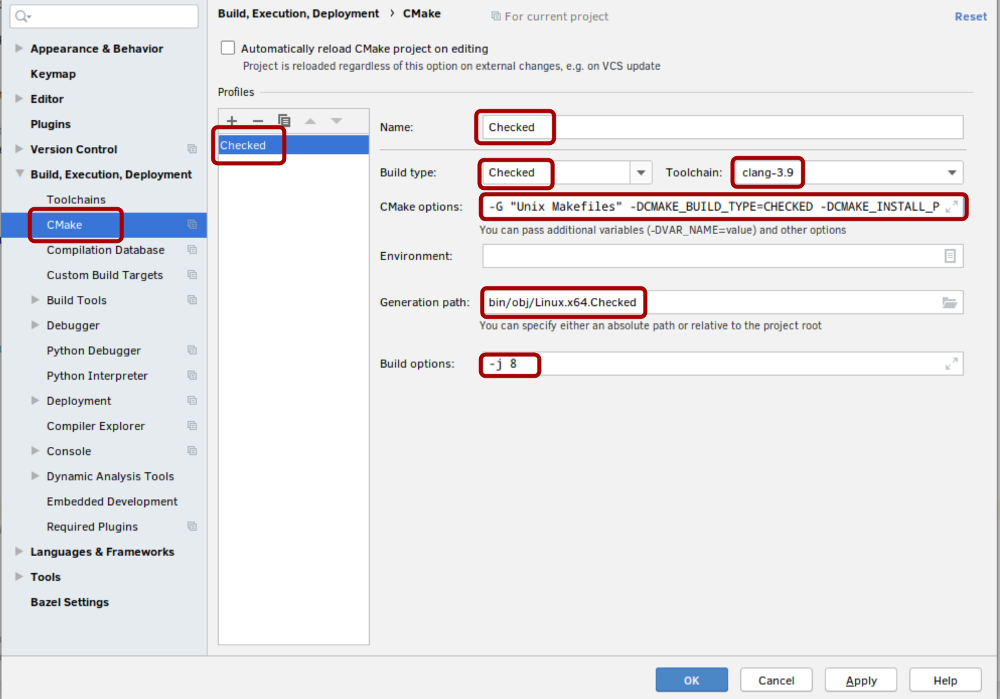

## What/Why?

Being a regular Linux user, when I can, I was looking for a decent setup for myself to grok then hack on CoreCLR's C++ code.

CoreCLR, namely the C++ code that implements the runtime (GC, JIT and more) is a BIG project, and trying to peel through its layers for the first time is no easy task for sure. While there are many great resources available for developers that want to read about the runtime such as the [BotR](https://github.com/dotnet/coreclr/blob/master/Documentation/botr/README.md), for me, there really is no replacement for reading the code and trying to reason about what/how it gets stuff done, preferably during a debug session, with a very focused task/inquiry at hand. For this reason, I really wanted a proper IDE for the huge swaths of C++ code, and I couldn't think of anything else but [JetBrains' own CLion IDE](https://www.jetbrains.com/clion/) under Linux (and macOS, which I'm not a user of).  
With my final setup, I really can do non-trivial navigation on the code base such as:

<video width="900" controls >
    <source src="../assets/images/clion-coreclr.webm" type="video/webm">
</video>

## Loading CoreCLR with CLion Navigation

CoreCLR is a beast of a project, and getting it to parse properly under CLion, moreover, it requires some non-trivial setup, so I thought I'd disclose my process here, for other people to see and maybe even improve upon...

Generally speaking, all the puzzle pieces should fit since the CoreCLR build-system is 95% made of running `cmake` to generate standard GNU makefiles, and then builds the whole thing using said makefiles, where the other 5% is made of some scripts wrapping the `cmake` build-system. At the same time, CLion builds upon `cmake` to bootstrap its own internal project representation, *provided* that it can invoke `cmake` just like the normal build would.

Here's what I did to get everything working:

1. First, We'll clone and perform a single build of CoreCLR by [following the instructions](https://github.com/dotnet/coreclr/blob/master/Documentation/building/linux-instructions.md#environment), What I did on my Ubuntu machine consisted of:
   ```bash
   $ sudo apt install cmake llvm-3.9 clang-3.9 lldb-3.9 liblldb-3.9-dev libunwind8 libunwind8-dev gettext libicu-dev liblttng-ust-dev libcurl4-openssl-dev libssl-dev libnuma-dev libkrb5-dev
   $ ./build.sh checked
   ```

2. Once the build is over, you should have everything under the `bin/Product/Linux.x64.Checked` like so:
   ```bash
   $ ls bin/Product/Linux.x64.Checked
   bin           libcoreclr.so                  netcoreapp2.0
   coreconsole   libcoreclrtraceptprovider.so   PDB
   corerun       libdbgshim.so                  sosdocsunix.txt
   createdump    libmscordaccore.so             SOS.NETCore.dll
   crossgen      libmscordbi.so                 SOS.NETCore.pdb
   gcinfo        libprotononjit.so              superpmi
   IL            libsosplugin.so                System.Globalization.Native.a
   ilasm         libsos.so                      System.Globalization.Native.so
   ildasm        libsuperpmi-shim-collector.so  System.Private.CoreLib.dll
   inc           libsuperpmi-shim-counter.so    System.Private.CoreLib.ni.{fe21e59b-7903-49b4-b2d3-67de152c1d7d}.map
   lib           libsuperpmi-shim-simple.so     System.Private.CoreLib.xml
   libclrgc.so   Loader
   libclrjit.so  mcs
   ```
   Now that an initial build is over, we can be sure that some scripts that were crucial to generate a few headers essential for the rest of the compilation process were generated and CLion will be able to find all the necessary source code once we teach it how to...
   
3. CLion needs to invoke `cmake` with the same arguments that the build scripts use. To sniff out the `cmake` command-line we'll use an *nix old-timer's trick to generate traces for `build.sh` run: use `bash -x`. Unfortunately, nothing is ever so simple in life, and CoreCLR's `build.sh` script doesn't directly invoke `cmake`, so we will need to make this `-x` parameter sticky or recursive. There is no better way to do this than the following somewhat convoluted procedure:  
First we need to generate a wrapper-script for `build.sh`, we'll call it `build-wrapper.sh`:
   
   ```bash
   echo "export SHELLOPTS && ./build.sh \$@" > build-wrapper.sh
   ```
   
   After we have our wrapper in place. we run it instead of `build.sh` like this:
   
   ```bash
   $ bash -x ./build-wrapper.sh checked
   ... # omitted
   + /usr/bin/cmake -G 'Unix Makefiles' -DCMAKE_BUILD_TYPE=CHECKED -DCMAKE_INSTALL_PREFIX=/home/dmg/projects/public/coreclr/bin/Product/Linux.x64.Checked -DCMAKE_USER_MAKE_RULES_OVERRIDE= -DCLR_CMAKE_PGO_INSTRUMENT=0 -DCLR_CMAKE_OPTDATA_PATH=/home/dmg/.nuget/packages/optimization.linux-x64.pgo.coreclr/99.99.99-master-20190716.1 -DCLR_CMAKE_PGO_OPTIMIZE=1 -S /home/dmg/projects/public/coreclr -B /home/dmg/projects/public/coreclr/bin/obj/Linux.x64.Checked
   ```
   
   Boom! We've hit that jackpot. For folks following this that are feeling a bit shaky, I've isolated the exact part we're after below: 
   
   ```bash
   -G 'Unix Makefiles' -DCMAKE_BUILD_TYPE=CHECKED -DCMAKE_INSTALL_PREFIX=/home/dmg/projects/public/coreclr/bin/Product/Linux.x64.Checked -DCMAKE_USER_MAKE_RULES_OVERRIDE= -DCLR_CMAKE_PGO_INSTRUMENT=0 -DCLR_CMAKE_OPTDATA_PATH=/home/dmg/.nuget/packages/optimization.linux-x64.pgo.coreclr/99.99.99-master-20190716.1 -DCLR_CMAKE_PGO_OPTIMIZE=1 -S /home/dmg/projects/public/coreclr -B /home/dmg/projects/public/coreclr/bin/obj/Linux.x64.Checked
   ```
   
4. The "hard" part is over. It's a series of boring clicks from here on. it's time to open up CLion and get this show on the road:
   We'll start with defining a clang-3.9 based toolchain, since on Linux Clion defaults to using the gcc toolchain (at least on Linux), while CoreCLR needs clang-3.9 to build itself:

5. With a toolchain setup, we need to tell `cmake` about our build configuration, so we set it up like so:
   

   I've highlighted all the text boxes you'll need to set. I'll go over the less trivial stuff:

   * The command line option we just set aside in (3) goes into the `CMake options` field.  
     Unfortunately CLion doesn't like single quotes (weird...), so I've had to change the `-G 'Unix Makefiles'` into `-G "Unix Makrfiles"` (notice the use of double quotes).
   * It would be a wise idea to share the same build folder as our initial command line build used, more over, we might end up going back and forth between CLion and the command line, so I override the "Generation Path" setting with the value `bin/obj/Linux.x64.Checked`. This is again extracted from the same command line we set-aside before. You'll find it in my case towards the end, specified right after the `-B` switch. 
   * For the build options, I've specified `-j 8`. This option controls how many parallel builds (compilers) are launched during the build process. A good default is to set it to 2x the number of physical cores your machine has, so in my case that means using `-j 8`.

6. That's it, let CLion do it's thing while grinding your machine to a halt, and once it's done you can start navigating and building the CoreCLR project like a first class citizen of the civilized world :)

## Debugging CoreCLR from CLion

Once we have CLion understanding the CoreCLR project structure we can take it up a notch and try to debug CoreCLR by launching "something" while setting a breakpoint.

Let's try to debug the JIT as an example for a useful scenario. 

1. First we need a console application:  
    ```bash
    $ cd /tmp/
    $ dotnet new console -n clion_dbg_sample
    The template "Console Application" was created successfully.
    Processing post-creation actions...
    Running 'dotnet restore' on clion_dbg_sample/clion_dbg_sample.csproj...
    Restore completed in 54.39 ms for /tmp/clion_dbg_sample/clion_dbg_sample.csproj.

    Restore succeeded.

    $ cd clion_dbg_sample
    $ dotnet publish -c release -o linux-x64 -r linux-x64
    Microsoft (R) Build Engine version 16.3.0+0f4c62fea for .NET Core
    Copyright (C) Microsoft Corporation. All rights reserved.

    Restore completed in 66.26 ms for /tmp/clion_dbg_sample/clion_dbg_sample.csproj.
    clion_dbg_sample -> /tmp/clion_dbg_sample/bin/release/netcoreapp3.0/linux-x64/clion_dbg_sample.dll
    clion_dbg_sample -> /tmp/clion_dbg_sample/linux-x64/
    ```
    
    Now we have a console application published in some folder, in my case it's `/tmp/clion_dbg_sample/linux-x64`
    
2. Next we will setup a new configuration under CLion:  
    

3. Now we define a **new** configuration:  
    
    We provide some name, I've decided to use the same name as my test program: `clion_dbg_sample`, We select "All targets" as the Target, and under executable we need to choose "Select other..." to provide a custom path to `corerun`. The reason behind this is that we need to run `corerun` from a directory that actually contains the entire product: jit, gc and everything else.

4. The path we provide is to the `corerun` executable that resides in the `bin/Product/Linux.x64.Checked` folder:
    

5. Finally we provide our sample project from before to the `corerun` executable. This is how my final configuration looks like:  
    

6. It's time to set a break-point and launch. As a generic sample I will navigate to `compiler.cpp` and find the `jitNativeCode` method. It's pretty much one of the top-level functions in the JIT, and therefore a good candidate for us. If we set a breakpoint in that method and launch our newly created configuration, we should hit it in no time:
   

7. We're done! If you really want to figure out what to do next, it's probably a good time to hit the [BotR](https://github.com/dotnet/coreclr/blob/master/Documentation/botr/README.md), namely the [RyuJit Overview](https://github.com/dotnet/coreclr/blob/master/Documentation/botr/ryujit-overview.md) and [RyuJit Tutorial](https://github.com/dotnet/coreclr/blob/master/Documentation/botr/ryujit-tutorial.md) pages that contain a more detailed overview of the JIT. Alternatively, if you're a "get your hands dirty" sort of person, you can also do some warm-up exercises for your fingers and start hitting that step-into keyboard shortcut. You're debugging the JIT as we speak!

I hope this end up helping someone wanting to get started digging into the JIT not on Windows. I also personally have a strong preference for CLion as I really think it's much more faster and powerful option than all the other stuff I've tried this far. At any rate, it's the only viable option for Linux/macOs people.

Have fun! Let me know on [twitter](https://twitter.com/damageboy) if you're encountering any difficulties or you think I can make anything clearer...
