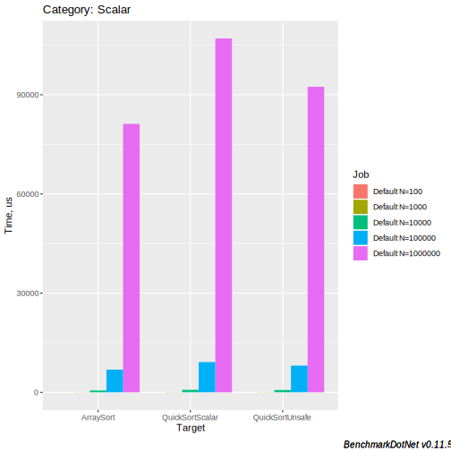

# Let’s do this

Everyone needs to sort arrays, once in a while. We’re used to thinking about this as a solved problem that nothing could be done about it in 2019 except for waiting for newer, marginally faster machines to pop-up.  
But that is not the case, and if you join me in this long journey we’ll end up with a replacement function for `Array.Sort()`, written in C# that can outperform the CoreCLR’s own C++ based code by a factor of 5x.  
Sometime in the future, when some additional tricks will end up landing in the JIT, the same concepts in this series can’t take us all the way to roughly 10x performance bump.  
Sounds intersting? If so, down the rabbit hole we go…

As I was reading the now somewhat famous post by Sthepen Toub about [Improvements in CoreCLR 3.0](https://devblogs.microsoft.com/dotnet/performance-improvements-in-net-core-3-0/), two things were apparent: performance improvements with HW Intrinsics were happening on a large scale in CoreCLR 3.0, and that so much was still left untouched...

One thing led to another, and I decided I’d do something that thankfully, hadn’t been done by then…  
I decided I’d take on array sorting and try to squeeze the machine out of it’s juice.

What I came up with eventually would become a re-write of `QuickSort` / `Array.Sort()` with AVX2 HW intrinsics. Thankfully, choosing  sorting, and specifically `QuickSort` also makes for a great blog post series / talk, since:

* Everyone should be familiar about the starting point (It is the bread and butter of learning CS)
* It's relatively easy to explain / refresh on it.
* If I can make it there, I can make it anywhere.
* I had no idea how to do it.

I originally found an interesting paper with a title that made me think this would be a walk in the park: [Fast Quicksort Implementation Using AVX Instructions](http://citeseerx.ist.psu.edu/viewdoc/download?doi=10.1.1.1009.7773&rep=rep1&type=pdf) by Shay Gueron and Vlad Krasnov.  
While the title sounded very promising, it wasn’t good enough as a drop-in replacement for `Array.Sort` for reasons I’ll shortly go into, so I ended up (or rather, still am, to be honest) having a lot of fun with expanding on their ideas. I should probably attempt to have a serious discussion with CoreCLR  / CoreFX people about starting a slow process that would end with integrating this code into the main C# repos, but for now, let's get in the ring and show what AVX/AVX2 intrinsics can really do for a non-trivial problem, and even discuss potential improvements that future CoreCLR versions could bring to the table.

Since there’s a lot to over go over here, I’ll split it up into a few parts:

1. In this part, we do a short refresher on `QuickSort` and how it compares to `Array.Sort()`. If you don’t need any refresher, you can skip over it and get right down to part 2 and onwards , although I really recommend skimming through, mostly because I’ve got really good visualizations for that should be in the back of everyone’s mind as we’ll be dealing with vectorization & optimization later.
2. In [part 2](2019-08-08-trumping-arraysort-with-avx2-pt2.md), we went over the basics of Vectorized HW Intrinsics, discussed vector types, and a handful of vectorized instructions we’ll actually be using in part 3, but we still weren't sorting anything.
3. In [part 3](2019-08-08-trumping-arraysort-with-avx2-pt3.md) we go through the initial code for the vectorized sorting and we’ll finally start seeing some payoff. We’ll finish with some agony courtesy of CPU’s Branch Predictor, just so we don't get too cocky.
4. In [part 4](2019-08-08-trumping-arraysort-with-avx2-pt4.md), we go over a handful of optimization approaches that I attempted trying to get the vectorized partition to run faster, we'll see what worked and what didn't.
5. In part 5, we’ll see how we can almost get rid of 100% of the remaining scalar code, by implementing small-constant size array sorting. We’ll use, drum roll…, yet more AVX2 vectorization and gain a considerable amount of performance / efficiency in the process.
6. Finally, in part 6, I’ll list the outstanding stuff / ideas I have for getting more juice and functionality out of my vectorized code.

## QuickSort Crash Course

QuickSort is deceivingly simple.  
No really, it is.  
In 20 lines of C# / Whatever language you can sort numbers. Lots of them, and really quickly. But try and change something about it, it quickly becomes apparent just how tricky it is to really do anything about it without breaking any of the tenants its built upon.

### In words

Before we’ll discuss any of that let’s put quicksort in words, then in code:

- QuickSort uses a *divide-and-conquer* approach.
  - In other words, it's recursive.
- Has an average of $$\mathcal{O}(n\log{}n)$$ comparisons for *n* items.
- Performs an in-place sort.

That last point, referring to in-place sorting, sounds simple and neat, and it sure is from the perspective of the user: no additional memory allocation needs to occur regardless of how much data is being sorted.  
But in reality, I’ve spent days trying to overcome the correctness and performance challenges that arise from it, specifically in the context of vectorization.  
My life would be much simpler had it not been in-place, and indeed, some people do take that shortcut, but that won’t cut it for us, specifically because the intent here is end up with a *drop-in* replacement for `Array.Sort()`.

More concretely, QuickSort works like this:

1. Pick a pivot value.
2. Partition the array around the pivot value .
3. Recurse on the left side of the pivot.
4. Recurse on the right side of the pivot.

Picking a pivot could be a blog-post in itself, but again, in the context of `Array.Sort()` we don’t necessarily need to dive into it, we’ll just copy whatever the CLR does, and get on with our lives.  
CoreCLR uses a pretty common scheme of median-of-three for pivot selection, which can basically be summed up as: “Let’s sort these 3 elements: first, middle and last, then pick the middle one of those three”.

**Partitioning** the array is obviously the *meat on the bone* here, as we take our pivot value, whatever it is, and rearrange the segment that was handed to to us such that all numbers *smaller* than the pivot are in the beginning or **left** (in no particular order), then comes the *pivot*, in its **final** resting position, and following it are all elements *larger than* the pivot, again in no particular order amongst themselves.

Once partitioning is done, we know the new position of the pivot in the partitioned segment, and all that’s left to do is recurse to the left (e.g. from our left boundary  → pivot position), and then recurse to the right  (e.g. from our pivot position  → right boundary).

That’s really it: this will get millions of numbers sorted, in-place, as efficiently as we know how to do 60+ years after it was invented.

Bonus trivia points for those who are still here with me: [Tony Hoare](https://en.wikipedia.org/wiki/Tony_Hoare), who invented QuickSort back when it was still acceptable for Brits to go study in Moscow also took responsibility for inventing the `null` pointer concept. So I guess there really is no good without evil in this world…
{: .notice--info}

### In code

```csharp
void QuickSort(int[] items, int left, int right)
{
    if (left == right) return;
    int pivot = PickPivot(items, left, right);
    int pivotPos = Partition(items, pivot, left, right);
    QuickSort(items, left, pivotPos);
    QuickSort(items, pivotPos + 1, right);
}

int PickPivot(int[] items, int left, int right)
{
    var mid = lo + ((hi - lo) / 2);
    SwapIfGreater(ref items[lo],  ref items[mid]);
    SwapIfGreater(ref items[lo],  ref items[hi]);
    SwapIfGreater(ref items[mid], ref items[hi]);
    var pivot = items[mid];                                       
}

int Partition(int[] array, int pivot, int left, int right)
{
    while (left <= right) {
        while (array[left] < pivot) left++;
        while (array[right] > pivot) right--;

        if (left <= right) {
            var t = array[left];
            array[left++]  = array[right];
            array[right--] = t;
        }
    }
    return left;
}
```

I’ve omitted the implementation of `SwapIfGreater` since it’s easy to imagine just from its name and to keep everything short, but you can read the whole thing in my repo for this work anyway if you feel you need it for completeness.

I did say it is deceptively simple, and grasping how QuickSort really works sometimes feels like trying to lift sand through your fingers, so I’ve decided to include two more visualizations of QuickSort, which are derivatives of the amazing work done by @mbostock with D3

### Visualizing QuickSort’s recursion

One thing that we will have to keep in mind, is that the same data will be partitioned over-and-over again, many times, with ever shrinking partition sizes until we end up having a partition size of 2 or 3, in which case we can simply sort the partition as-is and return.

To help see this better we’ll use this way of visualizing arrays in QuickSort:


Here, we see an unsorted array of 200 elements (in the process of getting sorted).  
The different sticks represent numbers in the  [-45..+45] range, and the angle of the stick represents that value, as I hope it is easy to discern.  
The pivots are represented with TWO colors:

* Red for the currently selected pivot at a given recursion level and
* Green for previous pivots we’ve already partitioned around in previous rounds of the recursion

Our ultimate goal is go from the image above, to the image below:


Here is how the whole thing looks:

<iframe src="../talks/intrinsics-dotnetos-2019/quicksort-mbostock/qs-static.html" frameborder="0" width="1600" marginwidth="0" marginheight="0" scrolling="" style="border:3px solid #666; max-width: 100%;background: #FFFFFF;" allowfullscreen=""></iframe>
I encourage you to look at this, and try to explain to yourself what QuickSort “does” here, at every step.  
By the way, this is automatically generated in Javascript + D3, so feel free in refreshing the page once you feel you want to see a new set of numbers being sorted.

What you can see here is the interaction between each pivot that is selected, and where it “lands” in the next recursion level (or row) and how new pivots are then selected to its left and right and in the next level or recursion we have twice as many pivots (in total) to partition around, in ever shrinking partition sizes.

### Visualizing QuickSort’s Comparisons/Swaps

While the above visualization really does a lot to help understand HOW quick sort works, I also wanted to leave you with an impression of the amount of work done by quicksort:

<iframe src="../talks/intrinsics-dotnetos-2019/quicksort-mbostock/qs-animated.html" frameborder="0" width="1600" height="600" marginwidth="0" marginheight="0" scrolling="" style="border:3px solid #666; max-width: 100%;background: #FFFFFF;" allowfullscreen=""></iframe>
Here we can witness just how many comparisons and swap operations need to happen for a 200 element quicksort to complete successfully.

There’s genuinely a lot of work than needs to happen per element (when considering the how we re-partition virtually most elements again and again) for the whole thing to finish.

With these visages implanted into our minds, I think this is a good time to measure how a couple of different scalar versions compare to `Array.Sort()`. I’ll show some BDN results for:

* `Array.Sort` as the baseline
* Scalar as the code I’ve just presented above, or in the repo.
* ScalarUnsafe as roughly the same thing, but with everything converted to pointers and unsafe code (using C#‘s new `unmanaged` constraint, neat!) to get a grasp of how painful is bounds-checking for this sort of code (spoiler: a-lot!)

I’m running the benchmarks for various array sizes (parameter name: `N`): $$10^i_{i=1\cdots6}$$ and this is how it looks:



Unsurprisingly, all C# versions run slower than `Array.Sort()` mostly because of eliminating all bound-checking, but also, to some extent, due to C++  compilers having better code-gen capabilities, especially for this sort of code.

I’ll include some results down below in table format, where I’ve added a “new” column in BDN, where I’ve normalized the amount of time spent sorting a single element, and we can see that this time is pretty constant for each variant:

### `Array.Sort()` vs `QuickSort`

It's important to make note that `Array.Sort()` uses a couple of more tricks in order to get better performance. I would be irresponsible if I don't mention those, since in the later posts I will also borrow at least one idea from their playbook, and improve upon it with intrinsics...

`Array.Sort()` isn't really `QuickSort`; it is really a variation on it called [Introspective Sort](https://en.wikipedia.org/wiki/Introsort) invented by David Musser in 1997.  
What it does is combine QuickSort, HeapSort and Insertion Sort, and switch dynamically between them according to the recursion depth and the partition size.

This last trick, where it switches to using Insertion Sort on small partitions is actually critical, both for the general case and also for intrinsics / vectorization. With scalar code, it is useful because of the fact that it replaces the last 4 levels of recursion (for partition sizes `<= 16`) with a single call to an insertion sort. This replaces some of the overhead associated with recursion with simpler loop based code which runs slightly faster for such small partitions.

As mentioned, I’ll end up borrowing this idea with my code as the issues around smaller partition sizes are naturally aggravated when using intrinsics in the next posts.

## Scalar Summary

We've spent quite some time polishing our foundations with respect to QuickSort. I know long introductions are somewhat boring, but I think time spent on this post will pay off when we next encounter our actual implementation in the 3<sup>rd</sup> post…

But before that, we need to pick up some knowledge that is specific to vectorized intrinsics and introduce a few select intrinsics we’ll be actually using, so this is a good time to break off this post, grab a fresh cup of coffee and head to the [next post](2019-08-08-trumping-arraysort-with-avx2-pt2.md).
