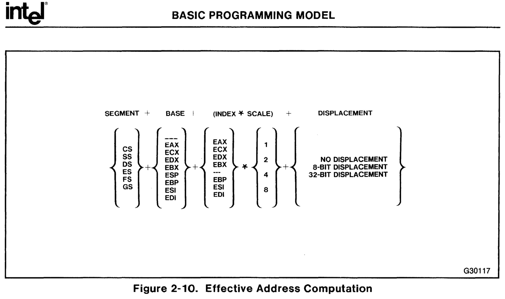

I ended up going down the rabbit hole re-implementing array sorting with AVX2 intrinsics, and there's no reason I should go down alone.

Since there’s a lot to go over here, I’ll split it up into a few parts:

1. In [part 1](), we start with a refresher on `QuickSort` and how it compares to `Array.Sort()`.
2. In [part 2](), we go over the basics of vectorized hardware intrinsics, vector types, and go over a handful of vectorized instructions we’ll use in part 3. We still won't be sorting anything.
3. In [part 3]() we go through the initial code for the vectorized sorting, and start seeing some payoff. We finish agonizing courtesy of the CPU’s branch predictor, throwing a wrench into our attempts.
4. In this part, we go over a handful of optimization approaches that I attempted trying to get the vectorized partition to run faster, seeing what worked and what didn't.
5. In [part 5](), we'll take a deep dive into how to deal with memory alignment issues.
6. In part 6, we’ll take a pause from the vectorized partitioning, to get rid of almost 100% of the remaining scalar code, by implementing small, constant size array sorting with yet more AVX2 vectorization.
7. In part 7, We'll circle back and try to deal with a nasty slowdown left in our vectorized partitioning code
8. In part 8, I'll tell you the sad story of a very twisted optimization I managed to pull off while failing miserably at the same time.
9. In part 9, I'll try some algorithmic improvements to milk those last drops of perf, or at least those that I can think of, from this code.

## Squeezing some more juice

I thought it would be nice to show a bunch of things I ended up trying to improve performance.
I tried to keep most of these experiments in separate implementations, both the ones that yielded positive results and the failures. These can be seen in the original repo under the [Happy](https://github.com/damageboy/VxSort/tree/research/VxSortResearch/Unstable/AVX2/Happy) and [Sad](https://github.com/damageboy/VxSort/tree/research/VxSortResearch/Unstable/AVX2/Sad) folders.

While some worked, and some didn't, I think a bunch of these were worth mentioning, so here goes:

### Dealing with small JIT hiccups: :+1:

One of the more surprising things I've discovered during the optimization journey was that the JIT could generate much better code, specifically around/with pointer arithmetic. With the basic version we got working by the end of the [3<sup>rd</sup> post](), I started turning my attention to the body of the main loop. That main loop is where I presume we spend most of our execution time. I quickly encountered some red-flag raising assembly code, specifically with this single line of code, which we've briefly discussed before:

```csharp
if (readLeft   - writeLeft <=
    writeRight - readRight) {
    // ...
} else {
    // ...
}
```

It looks innocent enough, but here's the freely commented x86 asm code for it:

```nasm
mov     rax,rdx       ; ✓  copy readLeft
sub     rax,r12       ; ✓  subtract writeLeft
mov     rcx,rax       ; ✘  wat?
sar     rcx,3Fh       ; ✘  wat?1?
and     rcx,3         ; ✘  wat?!?!?
add     rax,rcx       ; ✘  wat!?!@#
sar     rax,2         ; ✘  wat#$@#$@
mov     rcx,[rbp-58h] ; ✓✘ copy writeRight, but from stack?
mov     r8,rcx        ; ✓✘ in the loop body?!?!?, Oh lordy!
sub     r8,rsi        ; ✓  subtract readRight
mov     r10,r8        ; ✘  wat?
sar     r10,3Fh       ; ✘  wat?!?
and     r10,3         ; ✘  wat!?!@#
add     r8,r10        ; ✘  wat#$@#$@
sar     r8,2          ; ✘  wat^!#$!#$
cmp     rax,r8        ; ✓  finally, comapre!
```

It's not every day that we get to see two JIT issues with one line of code, I know some people might take this as a bad sign, but in my mind this is great! To me this feels like digging for oil in Texas in the early 20s...
We've practically hit the ground with a pickaxe accidentally, only to see black liquid seeping out almost immediately!

#### JIT Bug 1: variable not promoted to register

One super weird thing that we see happening here is the difference in the asm code that copies `writeRight` on <span class="uk-label">L8-9</span> from the *stack* (`[rbp-58h]`) before performing the subtraction when compared to <span class="uk-label">L1</span> where a conceptually similar copy is performed for `readLeft` from a register (`rdx`). The code merely tries to subtract two pairs of pointers, but the generated machine code is weird: 3 out of 4 pointers were correctly lifted out of the stack into registers outside the body of the loop (`readLeft`, `writeLeft`, `readRight`), but the 4<sup>th</sup> one, `writeRight`, is the designated black-sheep of the family and is being continuously read from the stack (and later in that loop body is also written back to the stack, to make things worse).  
There is no good reason for this, and this clearly smells! What do we do?

For one thing, I've [opened up an issue](https://github.com/dotnet/runtime/issues/35495) about this weirdness. The issue itself shows just how finicky the JIT is regarding this one variable, and (un)surprisingly, by fudging around the setup code this can be easily worked around for now.  
As a refresher, here's the original setup code I presented in the previous post, just before we enter the loop body:

```csharp
unsafe int* VectorizedPartitionInPlace(int* left, int* right)
{
    var writeLeft = left;
    var writeRight = right - N - 1; // <- Why the hate?
    var tmpLeft = _tempStart;
    var tmpRight = _tempEnd - N;

    var pBase = Int32PermTables.IntPermTablePtr;
    var P = Vector256.Create(pivot);

    PartitionBlock(left,          P, ref tmpLeft, ref tmpRight);
    PartitionBlock(right - N - 1, P, ref tmpLeft, ref tmpRight);

    var readLeft  = left + N;
    var readRight = right - 2*N - 1;
```

And here's a simple fix: moving the pointer declaration closer to the loop body seems to convince the JIT that we can all be friends once more:

```csharp
unsafe int* VectorizedPartitionInPlace(int* left, int* right)
{
    // ... omitted for brevity
    var tmpLeft = _tempStart;
    var tmpRight = _tempEnd - N;

    PartitionBlock(left,          P, ref tmpLeft, ref tmpRight);
    PartitionBlock(right - N - 1, P, ref tmpLeft, ref tmpRight);

    var writeLeft = left;
    var writeRight = right - N - 1; // <- Oh, so now we're cool?
    var readLeft  = left + N;
    var readRight = right - 2*N - 1;
```

The asm is *slightly* cleaner:

```nasm
mov     r8,rax        ; ✓ copy readLeft
sub     r8,r15        ; ✓ subtract writeLeft
mov     r9,r8         ; ✘ wat?
sar     r9,3Fh        ; ✘ wat?1?
and     r9,3          ; ✘ wat?!?!?
add     r8,r9         ; ✘ wat!?!@#
sar     r8,2          ; ✘ wat#$@#$@
mov     r9,rsi        ; ✓ copy writeRight
sub     r9,rcx        ; ✓ subtract readRight
mov     r10,r9        ; ✘ wat?1?
sar     r10,3Fh       ; ✘ wat?!?!?
and     r10,3         ; ✘ wat!?!@#
add     r9,r10        ; ✘ wat#$@#$@
sar     r9,2          ; ✘ wat^%#^#@!
cmp     r8,r9         ; ✓ finally, comapre!
```

It doesn't look like much, but we've managed to remove two memory accesses from the loop body (the read, shown above and a symmetrical write to the same stack variable/location towards the end of the loop).
It's also clear, at least from my comments that I'm not entirely pleased yet, so let's move on to...

#### JIT bug 2: not optimizing pointer difference comparisons

Calling this one a bug might be stretch, but in the world of the JIT, sub-optimal code generation can be considered just that. The original code performing the comparison is making the JIT (wrongfully) think that we want to perform `int *` arithmetic for `readLeft - writeLeft` and `writeRight - readRight`. In other words: The JIT emits code subtracting both pointer pairs, generating a `byte *` difference for each pair; which is great (I marked that with checkmarks in the listings). Then, it goes on to generate extra code converting those differences into `int *` units: so lots of extra arithmetic operations. This is simply useless: we just care if one side is larger than the other. What the JIT is doing here is similar in spirit to converting two distance measurements taken in `cm` to `km` just to compare which one is greater.  
To work around this disappointing behaviour, I wrote this instead:

```csharp
if ((byte *) readLeft   - (byte *) writeLeft) <=
    (byte *) writeRight - (byte *) readRight) {
    // ...
} else {
    // ...
}
```

By doing this sort of seemingly useless casting 4 times, we get the following asm generated:

```nasm
mov rcx, rdi  ; ✓ copy readRight
sub rcx, r12  ; ✓ subtract writeLeft
mov r9, rdi   ; ✓ copy writeRight
sub r9, r13   ; ✓ subtract readRight
cmp rcx, r9   ; ✓ compare
```

It doesn't take a degree in reverse-engineering asm code to figure out this was a good idea.  
Casting each pointer to `byte *` coerces the JIT to do our bidding and just perform a simpler comparison.

#### JIT Bug 3: Updating the `write*` pointers more efficiently

I discovered another missed opportunity in the pointer update code at the end of our inlined partitioning block. When we update the two `write*` pointers, our intention is to update two `int *` values with the result of the `PopCount` intrinsic:

```csharp
var popCount = PopCount(mask);
writeLeft += 8U - popCount;
writeRight -= popCount;
```

Unfortunately, the JIT isn't smart enough to see that it would be wiser to left shift `popCount` once by `2` (e.g. convert to `byte *` distance)  and reuse that left-shifted value **twice** while mutating the two pointers.
Again, uglifying the originally clean code into the following god-awful mess get's the job done:

```csharp
var popCount = PopCount(mask) << 2;
writeRight = ((int *) ((byte *) writeRight - popCount);
writeLeft =  ((int *) ((byte *) writeLeft + 8*4U - popCount);
```

I'll skip the asm this time. It's pretty clear from the C# that we pre-left shift (or multiply by 4) the `popCount` result before mutating the pointers.
We're now generating slightly denser code by eliminating a silly instruction from a hot loop.

All 3 of these workarounds can be seen on my repo in the [research branch](https://github.com/damageboy/VxSort/tree/research). I kept this pretty much as-is under [`B4_1_DoublePumpMicroOpt.cs`](https://github.com/damageboy/VxSort/blob/research/VxSortResearch/Unstable/AVX2/Happy/B4_1_DoublePumpMicroOpt.cs).
Time to see whether all these changes help in terms of performance:

<div markdown="1">
<div class="stickemup">




<div>
<button class="helpbutton" data-toggle="chardinjs" onclick="$('body').chardinJs('start')"><object style="pointer-events: none;" type="image/svg+xml" data="/assets/images/help.svg"></object></button>
<div data-intro="Size of the sorting problem, 10..10,000,000 in powers of 10" data-position="bottom">
<div data-intro="Performance scale: Array.Sort (solid gray) is always 100%, and the other methods are scaled relative to it" data-position="left">
<div data-intro="Click legend items to show/hide series" data-position="right">
<div class="benchmark-chart-container">
<canvas data-chart="line">
N,100,1K,10K,100K,1M,10M
Naive,         1   , 1   , 1  , 1   , 1    , 1
MicroOpt, 1.01, 0.93, 0.93, 0.93, 0.89 , 0.87
<!-- 
{ 
 "data" : {
  "datasets" : [ { 
    "backgroundColor": "rgba(66,66,66,0.35)",
    "rough": { "fillStyle": "hachure", "hachureAngle": -30, "hachureGap": 9, "fillWeight": 0.3	}
  },
  { 
    "backgroundColor": "rgba(33,220,33,.9)",
    "rough": { "fillStyle": "hachure", "hachureAngle": 30, "hachureGap": 3	}
  }]
 },
 "options": {
    "title": { "text": "AVX2 Micro-optimized Sorting - Scaled to AVX2 Naive Sorting", "display": true },
    "scales": { 
      "yAxes": [{
       "ticks": {
         "fontFamily": "Indie Flower",
         "min": 0.84, 
         "callback": "ticksPercent"
        },
        "scaleLabel": {
          "labelString": "Scaling (%)",
          "display": true
        }
      }]
    }
 },
 "defaultOptions": {{ page.chartjs | jsonify }}
}
--> </canvas>
</div>
</div>
</div>
</div>
</div>





<div>
<button class="helpbutton" data-toggle="chardinjs" onclick="$('body').chardinJs('start')"><object style="pointer-events: none;" type="image/svg+xml" data="/assets/images/help.svg"></object></button>
<div data-intro="Size of the sorting problem, 10..10,000,000 in powers of 10" data-position="bottom">
<div data-intro="Time in nanoseconds spent sorting per element. Array.Sort (solid gray) is the baseline, again" data-position="left">
<div data-intro="Click legend items to show/hide series" data-position="right">
<div class="benchmark-chart-container">
<canvas data-chart="line">
N,100,1K,10K,100K,1M,10M
Naive        , 21.2415, 26.0040, 30.7502, 31.4513, 27.4290, 30.6499
MicroOpt, 21.3374, 23.9888, 28.4617, 29.1356, 24.4974, 26.8152
<!-- 
{ 
 "data" : {
  "datasets" : [ { 
    "backgroundColor": "rgba(66,66,66,0.35)",
    "rough": { "fillStyle": "hachure", "hachureAngle": -30, "hachureGap": 9, "fillWeight": 0.3	}
  },
  { 
    "backgroundColor": "rgba(33,220,33,.9)",
    "rough": { "fillStyle": "hachure", "hachureAngle": 30, "hachureGap": 3	}
  }]
 },
 "options": {
    "title": { "text": "AVX2 Naive+Micro-optimized Sorting - log(Time/N)", "display": true },
    "scales": { 
      "yAxes": [{ 
        "type": "logarithmic",
        "ticks": {
          "min": 20,
          "max": 35,
          "callback": "ticksNumStandaard",
          "fontFamily": "Indie Flower"          
        },
        "scaleLabel": {
          "labelString": "Time/N (ns)",
          "fontFamily": "Indie Flower",
          "display": true
        }
      }]
    }
 },
 "defaultOptions": {{ page.chartjs | jsonify }}
}
--> </canvas>
</div>
</div>
</div>
</div>
</div>




<div>
<button class="helpbutton" data-toggle="chardinjs" onclick="$('body').chardinJs('start')"><object style="pointer-events: none;" type="image/svg+xml" data="/assets/images/help.svg"></object></button>
<table class="table datatable"
  data-json="../_posts/Bench.BlogPt4_1_Int32_-report.datatable.json"
  data-id-field="name"
  data-pagination="false"
  data-page-list="[9, 18]"
  data-intro="Each row in this table represents a benchmark result" data-position="left"
  data-show-pagination-switch="false">
  <thead data-intro="The header can be used to sort/filter by clicking" data-position="right">
    <tr>
        <th data-field="TargetMethodColumn.Method" data-sortable="true"
         data-filter-control="select">
          <span
              data-intro="The name of the benchmarked method"
              data-position="top">
            Method<br/>Name
          </span>
        </th>
        <th data-field="N" data-sortable="true"
            data-value-type="int" data-filter-control="select">
            <span
              data-intro="The size of the sorting problem being benchmarked (# of integers)"
              data-position="top">
            Problem<br/>Size
            </span>
        </th>
        <th data-field="TimePerNDataTable" data-sortable="true"
            data-value-type="float2-interval-muted">
            <span
              data-intro="Time in nanoseconds spent sorting each element in the array (with confidence intervals in parenthesis)"
              data-position="top">
              Time /<br/>Element (ns)
            </span>
        </th>
        <th data-field="RatioDataTable" data-sortable="true"
            data-value-type="inline-bar-horizontal-percentage">
            <span data-intro="Each result is scaled to its baseline (Array.Sort in this case)"
                  data-position="top">
                  Scaling
            </span>
        </th>
        <th data-field="Measurements" data-sortable="true" data-value-type="inline-bar-vertical">
            <span data-intro="Raw benchmark results visualize how stable the result it. Longest/Shortest runs marked with <span style='color: red'>Red</span>/<span style='color: green'>Green</span>" data-position="top">Measurements</span>
        </th>
    </tr>
  </thead>
</table>
</div>





```bash
BenchmarkDotNet=v0.12.0, OS=clear-linux-os 32120
Intel Core i7-7700HQ CPU 2.80GHz (Kaby Lake), 1 CPU, 4 logical and 4 physical cores
.NET Core SDK=3.1.100
  [Host]     : .NET Core 3.1.0 (CoreCLR 4.700.19.56402, CoreFX 4.700.19.56404), X64 RyuJIT
  Job-DEARTS : .NET Core 3.1.0 (CoreCLR 4.700.19.56402, CoreFX 4.700.19.56404), X64 RyuJIT

InvocationCount=3  IterationCount=15  LaunchCount=2
UnrollFactor=1  WarmupCount=10

$ grep 'stepping\|model\|microcode' /proc/cpuinfo | head -4
model           : 158
model name      : Intel(R) Core(TM) i7-7700HQ CPU @ 2.80GHz
stepping        : 9
microcode       : 0xb4
```




</div>

This is quite better! I've artificially set the y-axis here to a narrow range of 80%-105% so that the differences would become more apparent. The improvement is *very* measurable. Too bad we had to uglify the code to get here, but such is life. Our results just improved by another ~7-14% across the board.  
If this is the going rate for ugly, I'll bite the bullet :)

I did not include any statistics collection tab for this version since there is no algorithmic change involved.
</div>

### Selecting a better cut-off threshold for scalar sorting: :+1:

I briefly mentioned this at the end of the 3<sup>rd</sup> post: While it made sense to start with the same threshold that `Array.Sort` uses (`16`) to switch from partitioning into small array sorting, there's no reason to assume this is the optimal threshold for *our* partitioning function: Given that the dynamics have changed with vectorized partitioning, the optimal cut-off point probably needs to move too.  
In theory, we should retest the cut-off point after every optimization that succeeds in moving the needle; I won't do this after every optimization, but I will do so again for the final version. For the meantime, let's see how playing with the cut-off point changes the results: We'll try `24`, `32`, `40`, `48` on top of `16`, and see what comes on top:

<div markdown="1">
<div class="stickemup">




<div>
<button class="helpbutton" data-toggle="chardinjs" onclick="$('body').chardinJs('start')"><object style="pointer-events: none;" type="image/svg+xml" data="/assets/images/help.svg"></object></button>
<div data-intro="Size of the sorting problem, 10..10,000,000 in powers of 10" data-position="bottom">
<div data-intro="Performance scale: Array.Sort (solid gray) is always 100%, and the other methods are scaled relative to it" data-position="left">
<div data-intro="Click legend items to show/hide series" data-position="right">
<div class="benchmark-chart-container">
<canvas data-chart="line">
N,100,1K,10K,100K,1M,10M
MicroOpt_24,0.823310023,0.882747579,0.914373696,0.902330475,0.958166708,0.971168474
MicroOpt_32,0.817715618,0.766905542,0.839337033,0.850782566,0.973364241,0.9561571
MicroOpt_40,0.761305361,0.749485401,0.837020549,0.842011671,0.95013881,0.958056824
MicroOpt_48,0.758041958,0.75722345,0.823212214,0.839358026,0.966057806,0.962200074
<!-- 
{ 
 "data" : {
  "datasets" : [ 
  { 
    "backgroundColor": "rgba(33,33,220,.5)",
    "hidden": "true",
    "rough": { "fillStyle": "hachure", "hachureAngle": 30, "hachureGap": 12	}
  },
  { 
    "backgroundColor": "rgba(220,33,33,.5)",
    "hidden": "true",    
    "rough": { "fillStyle": "hachure", "hachureAngle": 90, "hachureGap": 12	}
  },
  { 
    "backgroundColor": "rgba(33,220,33,.9)",
    "rough": { "fillStyle": "hachure", "hachureAngle": 60, "hachureGap": 3	}
  },
  { 
    "backgroundColor": "rgba(33,220,220,.5)",
    "hidden": "true",    
    "rough": { "fillStyle": "hachure", "hachureAngle": 120, "hachureGap": 12	}
  }
  ]
 },
 "options": {
    "title": { "text": "AVX2 Sorting - Cut-off Tuning", "display": true },
    "scales": { 
      "yAxes": [{
       "ticks": {
         "fontFamily": "Indie Flower",
         "min": 0.70, 
         "callback": "ticksPercent"
        },
        "scaleLabel": {
          "labelString": "Scaling (%)",
          "display": true
        }
      }]
    }
 },
 "defaultOptions": {{ page.chartjs | jsonify }}
}
--> </canvas>
</div>
</div>
</div>
</div>
</div>





<div>
<button class="helpbutton" data-toggle="chardinjs" onclick="$('body').chardinJs('start')"><object style="pointer-events: none;" type="image/svg+xml" data="/assets/images/help.svg"></object></button>
<div data-intro="Size of the sorting problem, 10..10,000,000 in powers of 10" data-position="bottom">
<div data-intro="Time in nanoseconds spent sorting per element. Array.Sort (solid gray) is the baseline, again" data-position="left">
<div data-intro="Click legend items to show/hide series" data-position="right">
<div class="benchmark-chart-container">
<canvas data-chart="line">
N,100,1K,10K,100K,1M,10M
MicroOpt_24,17.6195,25.5307,25.4022,26.5767,23.3013,25.6154
MicroOpt_32,17.3879,22.0054,25.9392,26.6394,23.3355,25.6553
MicroOpt_40,17.3027,23.2386,26.1287,26.3959,23.4568,25.7346
MicroOpt_48,17.0937,23.5973,25.6651,26.3667,23.2584,25.6
<!-- 
{ 
 "data" : {
  "datasets" : [ 
  { 
    "backgroundColor": "rgba(33,33,220,.5)",
    "hidden": "true",
    "rough": { "fillStyle": "hachure", "hachureAngle": 30, "hachureGap": 12	}    
  },
  { 
    "backgroundColor": "rgba(220,33,33,.5)",
    "hidden": "true",
    "rough": { "fillStyle": "hachure", "hachureAngle": 90, "hachureGap": 12	}
  },
  { 
    "backgroundColor": "rgba(33,220,33,.9)",
    "rough": { "fillStyle": "hachure", "hachureAngle": 60, "hachureGap": 3	}
  },
  { 
    "backgroundColor": "rgba(33,220,220,.5)",
    "hidden": "true",
    "rough": { "fillStyle": "hachure", "hachureAngle": 120, "hachureGap": 12	}
  }
  ]
 },
 "options": {
    "title": { "text": "AVX2 Sorting - Cut-off Tuning - log(Time/N)", "display": true },
    "scales": { 
      "yAxes": [{ 
        "type": "logarithmic",
        "ticks": {
          "min": 15,
          "max": 30,
          "callback": "ticksNumStandaard",
          "fontFamily": "Indie Flower"          
        },
        "scaleLabel": {
          "labelString": "Time/N (ns)",
          "fontFamily": "Indie Flower",
          "display": true
        }
      }]
    }
 },
 "defaultOptions": {{ page.chartjs | jsonify }}
}
--> </canvas>
</div>
</div>
</div>
</div>
</div>




<div>
<button class="helpbutton" data-toggle="chardinjs" onclick="$('body').chardinJs('start')"><object style="pointer-events: none;" type="image/svg+xml" data="/assets/images/help.svg"></object></button>
<table class="table datatable"
  data-json="../_posts/Bench.BlogPt4_2_Int32_-report.datatable.json"
  data-id-field="name"
  data-pagination="true"
  data-page-list="[5, 10, 15, 20]"
  data-intro="Each row in this table represents a benchmark result" data-position="left"
  data-show-pagination-switch="false">
  <thead data-intro="The header can be used to sort/filter by clicking" data-position="right">
    <tr>
        <th data-field="TargetMethodColumn.Method" data-sortable="true"
         data-filter-control="select">
          <span
              data-intro="The name of the benchmarked method"
              data-position="top">
            Method<br/>Name
          </span>
        </th>
        <th data-field="N" data-sortable="true"
            data-value-type="int" data-filter-control="select">
            <span
              data-intro="The size of the sorting problem being benchmarked (# of integers)"
              data-position="top">
            Problem<br/>Size
            </span>
        </th>
        <th data-field="TimePerNDataTable" data-sortable="true"
            data-value-type="float2-interval-muted">
            <span
              data-intro="Time in nanoseconds spent sorting each element in the array (with confidence intervals in parenthesis)"
              data-position="top">
              Time /<br/>Element (ns)
            </span>
        </th>
        <th data-field="RatioDataTable" data-sortable="true"
            data-value-type="inline-bar-horizontal-percentage">
            <span data-intro="Each result is scaled to its baseline (Array.Sort in this case)"
                  data-position="top">
                  Scaling
            </span>
        </th>
        <th data-field="Measurements" data-sortable="true" data-value-type="inline-bar-vertical">
            <span data-intro="Raw benchmark results visualize how stable the result it. Longest/Shortest runs marked with <span style='color: red'>Red</span>/<span style='color: green'>Green</span>" data-position="top">Measurements</span>
        </th>
    </tr>
  </thead>
</table>
</div>





```bash
BenchmarkDotNet=v0.12.0, OS=clear-linux-os 32120
Intel Core i7-7700HQ CPU 2.80GHz (Kaby Lake), 1 CPU, 4 logical and 4 physical cores
.NET Core SDK=3.1.100
  [Host]     : .NET Core 3.1.0 (CoreCLR 4.700.19.56402, CoreFX 4.700.19.56404), X64 RyuJIT
  Job-DEARTS : .NET Core 3.1.0 (CoreCLR 4.700.19.56402, CoreFX 4.700.19.56404), X64 RyuJIT

InvocationCount=3  IterationCount=15  LaunchCount=2
UnrollFactor=1  WarmupCount=10

$ grep 'stepping\|model\|microcode' /proc/cpuinfo | head -4
model           : 158
model name      : Intel(R) Core(TM) i7-7700HQ CPU @ 2.80GHz
stepping        : 9
microcode       : 0xb4
```




</div>

I've pulled a little trick with these charts: by default, I've *hidden* everything but one of the cut-off points: `40`, that being the best new cut-off point, at least in my opinion. If you care to follow my reasoning process, I suggest you start slowly clicking (or touching) the `24`, `32`, `48` series/titles in the legend. This will add them back into the chart, one by one. Stop to appreciate what you are seeing; Once you'll do so, I think it's easier to see that:

* The initial value we started off with: `16`, the baseline for this series of benchmarks, is undoubtedly the *worst possible* cut-off for vectorized partitioning...  
  *All of the other cut-off points have scaling values below 100%*, hence they are faster.
* `24` does not do us a world of good here either: It's clearly always next worst option.
* `32` is pretty good, except that in the lower edge of the chart, where the higher cut-off points seem to provide better value.
* For the most part, using any one of `40`/`48` as a cut-off point seems to be the right way to go. These two cover the least area in the chart. In other words, they all provide the best improvement, on average, for our scenario.  

I ended up voting for `40`. There's no good reason I can give for this except for (perhaps wrong) instinct. Lest we forget, another small pat of the back is in order: we've managed to speed up our sorting code with an improvement ranging from 5-25% throughout the entire spectrum, which is cause for a small celebration in itself.

To be completely honest here, there is another, ulterior motive, as far as I'm concerned, for showing the effect of changing the small sorting threshold so early into this series. By doing so, we can sense where this trail will take us on our journey: It's pretty clear that we will end up with two equally important implementations, each handling a large part of the total workload for sorting:

* The vectorized partitioning will be tasked with the initial heavy lifting, relegated to taking large arrays and breaking them down to many small, unsorted, yet completely distinct groups of elements.  
  To put it plainly: taking a million elements and splitting them up into 10,000-20,000 groups of ~50-100 elements each, that do not cross-over each other; that way we can use...
* Small-sorting, which will end up doing a final pass taking many small ~50-100 element groups, sorting them in place, before moving on to the next group.

Given that we will always start with partitioning before concluding with small-sorting, we end up with a complete solution. Just as importantly, we can optimize *each* of the two parts making up our solution *independently*, in the coming posts.

</div>

### Explicit Prefetching: :-1:

I tried using prefetch intrinsics to give the CPU early hints as to where we are reading memory from.

Generally speaking, explicit prefetching can be used to make sure the CPU always reads some data from memory into the cache *ahead of the actual time* we require it so that the CPU never needs to wait for memory, which is very slow. The bottom line is that having to wait for RAM is a death sentence (200-300 cpu cycles), but even having to wait for L2 cache (14 cycles) when your entire loop's throughput is around 9 cycles is unpleasant. With prefetch intrinsics we can explicitly instruct the CPU to prefetch specific cache lines all the way to L1 cache, or alternatively specify the target level as L2, L3.

Just because we can do something, doesn't mean we should: do we actually need to prefetch? CPU designers know all of the above just as much as we do, and the CPU already attempts to prefetch data based on complex and obscure heuristics. You might be tempted to think: "oh, what's so bad about doing it anyway?".  Well, quite a lot, to be honest: when we explicitly tell the CPU to prefetch data, we're wasting both instruction cache and decode+fetch bandwidth. Those might be better used for executing our computation.  
So, the bottom line remain somewhat hazy, but we can probably try and set-up some ground rules that are probably true in 2020:

* CPUs can prefetch data when we traverse memory sequentially.
* They do so regardless of the traversal direction (increasing/decreasing addresses).
* They can sucessfully figure out the *stride* we use, when it is constant.
* They do so by building up history of our reads, per call-site.

With all that in mind, it is quite likely that prefetching in our case would do little good: Our partitioning code pretty much hits every point in the previous list. But even so, you can never really tell without either trying out, or inspecting memory-related performance counters. The latter, turns out to be [more complicated than what you'd think](https://gist.github.com/travisdowns/90a588deaaa1b93559fe2b8510f2a739), and sometimes, it's just easier to try out something rather than attempt to measure it ahead of time. In our case, prefetching the *writable* memory **makes no sense**, as our loop code mostly reads from the same addresses just before writing to them in the next iteration or two, so I mostly focused on trying to prefetch the next read addresses.

Whenever I modified `readLeft`, `readRight`, I immediately added code like this:

```csharp
int * nextPtr;
if ((byte *) readLeft   - (byte *) writeLeft) <=
    (byte *) writeRight - (byte *) readRight)) {
    nextPtr = readLeft;
    readLeft += 8;
    // Trying to be clever here,
    // If we are reading from the left at this iteration,
    // we are likely to read from right in the next iteration
    Sse.Prefetch0((byte *) readRight - 64);
} else {
    nextPtr = readRight;
    readRight -= 8;
    // Same as above, only the other way around:
    // After reading from the right, it's likely
    // that our next read will be on the left side
    Sse.Prefetch0((byte *) readLeft + 64);
}
```

This tells the CPU we are about to use data in `readLeft + 64` (the next cache-line from the left) and `readRight -  64` (the next cache-line from the right) in the following iterations.

While this looks great on paper, the real world results of this were unnoticeable for me and even slightly negative. For the most part, it appears that the CPUs I used for testing did a good job without me constantly telling them to do what they had already been doing on their own... Still, it was worth a shot.

### Simplifying the branch :+1:

I'm kind of ashamed at this particular optimization: I had been literally staring at this line of code and optimizing around it for months without stopping to really think about what it was that I'm **really trying** to do. Let's go back to our re-written branch from a couple of paragraphs ago:

```csharp
if ((byte *) readLeft   - (byte *) writeLeft) <= 
    (byte *) writeRight - (byte *) readRight) {
    // ...
} else {
    // ...
}
```

I've been describing this condition both in animated and code form in the previous part, explaining how for my double-pumping to work, I have to figure out which side we *must* read from **next** so we never end-up overwriting data before having a chance to read and partition yet. All of this is happening in the name of performing in-place partitioning. However, I've been over-complicating the actual condition!  
At some, admittedly late stage, "it" hit me, so let's play this out step-by-step:

1. We always start with the setup I've previously described, where we make `8` elements worth of space available on **both** sides, by partitioning them away into the temporary memory.
2. When we get into the main partitioning loop, we pick one specific side to read from: so far, this has always been the left side (It doesn't *really* matter which side it is, but it arbitrarily ended up being the *left* side due to the condition being `<=` rather than `<`).
3. Given all of the above, we always *start* reading from the left, there-by increasing the "breathing space" on that left side from `8` to `16` elements temporarily.
4. Once our trusty ole' partitioning block is done, we can pause and reason on how both sides now look:
   * The left side either has:
     * `8` elements of space (in the less likely, yet possible case that all elements read from it were smaller than the selected pivot) -or-
     * It has more than `8` elements of "free" space.

   * In the first case, where the left side is now back to 8 elements of free space, the right side also has `8` elements of free space, since nothing was written on that side!

   * In all other cases, the left side has *more* than `8` elements of free space, and the right side has less than `8` elements of free space, by definition.
5. Since these are the true dynamics, why should we even bother comparing **both** heads and tails of each respective side?  

The answer to that last question is: **We don't have to!**  
We could simplify the branch by comparing only the right head+tail pointer distance to see if it is smaller than the magical number `8` or not!
This new condition would be just as good at serving the original *intent* (which is: "don't end up overwriting unread data") as the more complicated branch we used before...  
When the right side has less than `8` elements, we *have to* read from the right side in the next round, since it is in danger of being over-written, otherwise, the only other option is that both sides are back at 8-elements each, and we should go back to reading from the left side again, essentially going back to our starting setup condition as described in (1). It's kind of silly, and I really feel bad it took me 4 months or so to see this. The new condition ends up being much simpler to encode and execute:

```csharp
int* nextPtr;
if ((byte *) writeRight - (byte *) readRight < N * sizeof(int)) {
        // ...
} else {
        // ...
}
```

This branch is just as "correct" as the previous one, but it is less taxing in a few ways:

* Less instructions to decode and execute.  
  We've saved an additional 5 bytes worth of opcodes from the main loop!
* Less data dependencies for the CPU to potentially wait for.  
  (The CPU doesn't have to wait for the `writeLeft`/`readLeft` pointer mutation and subtraction to complete)

Naturally this ends up slightly faster, and can verify this with BDN once again:

<div markdown="1">
<div class="stickemup">




<div>
<button class="helpbutton" data-toggle="chardinjs" onclick="$('body').chardinJs('start')"><object style="pointer-events: none;" type="image/svg+xml" data="/assets/images/help.svg"></object></button>
<div data-intro="Size of the sorting problem, 10..10,000,000 in powers of 10" data-position="bottom">
<div data-intro="Performance scale: Array.Sort (solid gray) is always 100%, and the other methods are scaled relative to it" data-position="left">
<div data-intro="Click legend items to show/hide series" data-position="right">
<div class="benchmark-chart-container">
<canvas data-chart="line">
N,100,1K,10K,100K,1M,10M
MicroOpt_40,1,1,1,1,1,1
SimpleBranch,1.01220256253813,0.946321321321321,0.982688056091031,0.938806414898963,1.00465999238207,0.962359905144129

<!-- 
{ 
 "data" : {
  "datasets" : [ { 
    "backgroundColor": "rgba(66,66,66,0.35)",
    "rough": { "fillStyle": "hachure", "hachureAngle": -30, "hachureGap": 9, "fillWeight": 0.3	}
  },
  { 
    "backgroundColor": "rgba(33,220,33,.9)",
    "rough": { "fillStyle": "hachure", "hachureAngle": 60, "hachureGap": 3	}
  }
  ]
 },
 "options": {
    "title": { "text": "AVX2 SimpleBranch Sorting - Scaled to MicroOpt_40", "display": true },
    "scales": { 
      "yAxes": [{
       "ticks": {
         "fontFamily": "Indie Flower",
         "min": 0.92, 
         "callback": "ticksPercent"
        },
        "scaleLabel": {
          "labelString": "Scaling (%)",
          "display": true
        }
      }]
    }
 },
 "defaultOptions": {{ page.chartjs | jsonify }}
}
--> </canvas>
</div>
</div>
</div>
</div>
</div>





<div>
<button class="helpbutton" data-toggle="chardinjs" onclick="$('body').chardinJs('start')"><object style="pointer-events: none;" type="image/svg+xml" data="/assets/images/help.svg"></object></button>
<div data-intro="Size of the sorting problem, 10..10,000,000 in powers of 10" data-position="bottom">
<div data-intro="Time in nanoseconds spent sorting per element. Array.Sort (solid gray) is the baseline, again" data-position="left">
<div data-intro="Click legend items to show/hide series" data-position="right">
<div class="benchmark-chart-container">
<canvas data-chart="line">
N,100,1K,10K,100K,1M,
MicroOpt_40,16.3891,21.3124,24.0181,26.2096,23.1979,26.4655
SimpleBranch,16.5929,20.168,23.6023,24.6058,23.306,25.4694

<!-- 
{ 
 "data" : {
  "datasets" : [
  { 
    "backgroundColor": "rgba(66,66,66,0.35)",
    "rough": { "fillStyle": "hachure", "hachureAngle": -30, "hachureGap": 9, "fillWeight": 0.3	}
  },
  { 
    "backgroundColor": "rgba(33,220,33,.9)",
    "rough": { "fillStyle": "hachure", "hachureAngle": 60, "hachureGap": 3	}
  }
  ]
 },
 "options": {
    "title": { "text": "AVX2 MicroOpt_40 + SimplerBranch - log(Time/N)", "display": true },
    "scales": { 
      "yAxes": [{ 
        "type": "logarithmic",
        "ticks": {
          "min": 15,
          "max": 27,
          "callback": "ticksNumStandaard",
          "fontFamily": "Indie Flower"          
        },
        "scaleLabel": {
          "labelString": "Time/N (ns)",
          "fontFamily": "Indie Flower",
          "display": true
        }
      }]
    }
 },
 "defaultOptions": {{ page.chartjs | jsonify }}
}
--> </canvas>
</div>
</div>
</div>
</div>
</div>




<div>
<button class="helpbutton" data-toggle="chardinjs" onclick="$('body').chardinJs('start')"><object style="pointer-events: none;" type="image/svg+xml" data="/assets/images/help.svg"></object></button>
<table class="table datatable"
  data-json="../_posts/Bench.BlogPt4_3_Int32_-report.datatable.json"
  data-id-field="name"
  data-pagination="true"
  data-page-list="[5, 10, 15, 20]"
  data-intro="Each row in this table represents a benchmark result" data-position="left"
  data-show-pagination-switch="false">
  <thead data-intro="The header can be used to sort/filter by clicking" data-position="right">
    <tr>
        <th data-field="TargetMethodColumn.Method" data-sortable="true"
         data-filter-control="select">
          <span
              data-intro="The name of the benchmarked method"
              data-position="top">
            Method<br/>Name
          </span>
        </th>
        <th data-field="N" data-sortable="true"
            data-value-type="int" data-filter-control="select">
            <span
              data-intro="The size of the sorting problem being benchmarked (# of integers)"
              data-position="top">
            Problem<br/>Size
            </span>
        </th>
        <th data-field="TimePerNDataTable" data-sortable="true"
            data-value-type="float2-interval-muted">
            <span
              data-intro="Time in nanoseconds spent sorting each element in the array (with confidence intervals in parenthesis)"
              data-position="top">
              Time /<br/>Element (ns)
            </span>
        </th>
        <th data-field="RatioDataTable" data-sortable="true"
            data-value-type="inline-bar-horizontal-percentage">
            <span data-intro="Each result is scaled to its baseline (Array.Sort in this case)"
                  data-position="top">
                  Scaling
            </span>
        </th>
        <th data-field="Measurements" data-sortable="true" data-value-type="inline-bar-vertical">
            <span data-intro="Raw benchmark results visualize how stable the result it. Longest/Shortest runs marked with <span style='color: red'>Red</span>/<span style='color: green'>Green</span>" data-position="top">Measurements</span>
        </th>
    </tr>
  </thead>
</table>
</div>





```bash
BenchmarkDotNet=v0.12.0, OS=clear-linux-os 32120
Intel Core i7-7700HQ CPU 2.80GHz (Kaby Lake), 1 CPU, 4 logical and 4 physical cores
.NET Core SDK=3.1.100
  [Host]     : .NET Core 3.1.0 (CoreCLR 4.700.19.56402, CoreFX 4.700.19.56404), X64 RyuJIT
  Job-DEARTS : .NET Core 3.1.0 (CoreCLR 4.700.19.56402, CoreFX 4.700.19.56404), X64 RyuJIT

InvocationCount=3  IterationCount=15  LaunchCount=2
UnrollFactor=1  WarmupCount=10

$ grep 'stepping\|model\|microcode' /proc/cpuinfo | head -4
model           : 158
model name      : Intel(R) Core(TM) i7-7700HQ CPU @ 2.80GHz
stepping        : 9
microcode       : 0xb4
```




</div>

There's not a lot to say about this, but I'll point out a couple of things:

* There is a seemingly very slight slow down around 100, 1M elements. It's authentic and repeatable in my tests. I honestly don't know why it happens, yet. We spend a total of around 1.6μs for every 100 element sort, which might initially sound like not a lot of time, but at 2.8Ghz, that amounts to ~4500 cycles give or take. For the case of 1M elements, this phenomenon is even more peculiar; But such is life.
* Otherwise, there is an improvement, even if modest, of roughly 2%-4% for most cases. it does look like this version of our code is better, in the end of the day.

One interesting question that I personally did not know the answer to beforehand was: would this reduce branch mispredictions? There's no reason to expect this since our input data, being random, is driving the outcome of this branch. However, if I've learned one thing throughout this long ordeal, is that there are always things you don't even know that you don't know. Any way of verifying our pet-theories is a welcome opportunity at learning some humility.

</div>

Let's fire up `perf` to inspect what its counters tell us about the two versions (each result is in a separate tab below):

<div markdown="1">
<div class="stickemup">





```bash
$ COMPlus_PerfMapEnabled=1 perf record -F max -e branch-misses \
    ./Example --type-list DoublePumpMicroOptCutOff_40 --size-list 1000000 --no-check
...
$ perf report --stdio -F overhead,sym | head -15
# Samples: 403K of event 'branch-misses'
# Event count (approx.): 252554012
    43.73%  [.] ... DoublePumpMicroOptCutoff_40::InsertionSort(...)
    25.51%  [.] ... DoublePumpMicroOptCutoff_40+VxSortInt32::VectorizedPartitionInPlace(...)
```





```bash
$ COMPlus_PerfMapEnabled=1 perf record -F max -e branch-misses \
    ./Example --type-list DoublePumpSimpleBranch --size-list 1000000 --no-check
...
$ perf report --stdio -F overhead,sym | head -15
# Samples: 414K of event 'branch-misses'
# Event count (approx.): 241513903
    41.11%  [.] ... DoublePumpSimpleBranch::InsertionSort(...)
    26.59%  [.] ... DoublePumpSimpleBranch+VxSortInt32::VectorizedPartitionInPlace(...)
```





</div>

Here we're comparing the same two versions we've just benchmarked with a specific focus on the branch-misses HW counter. We can take this oppertunity both to appreciate how these results compare to the ones we recorded at the end of the previous post,
as well as how they compare to each other.

Compared to our `DoublePumpedNaive` implementation of yester-post, it would appear that the "burden of guilt" when it comes to branch mispredictions has shifted towards `InsertionSort` by 3-4%. This is to be expected: We were using a cut-off point of `16` previously, and we've just upped it to `40` in the previous section, so it makes sense for `InsertionSort` to perform more work in this new balance, taking a larger share of the branch-misses.

When comparing between the [`DoublePumpMicroOptCutOff_40`](https://github.com/damageboy/VxSort/blob/research/VxSortResearch/Unstable/AVX2/Happy/B4_2_DoublePumpMicroOptCutoff.cs#L798) and the [`DoublePumpSimpleBranch`](https://github.com/damageboy/VxSort/blob/research/VxSortResearch/Unstable/AVX2/Happy/B4_3_DoublePumpSimpleBranch.cs) versions, that differ only in that nasty branch in the top of our main loop, both versions look mostly similar. First, we have to acknowledge that `perf` is a statistical tool, that works by collecting samples of HW counters, so we're not going to get an exact count of anything, even when running the same code time after time. In our case, both versions look roughly the same: Once we count how many branch misses of the total are attributed to the function we actually changed, it comes to `64,426,528` misses for the previous version vs. `64,218,546` for the newer simpler branch. It doesn't amount to enough to call this a branch misprediction win. So it would seem with gained a bit with smaller code, but not by lowering the frequency of mispredictions.

</div>

### Packing the Permutation Table, 1<sup>st</sup> attempt: :+1:

Ever since I started with this little time-succubus of a project, I was really annoyed at the way I was encoding the permutation tables. To me, wasting 8kb worth of data, or more specifically, wasting 8kb worth of precious L1 cache in the CPU for the permutation entries was tantamount to a cardinal sin. My emotional state set aside, the situation is even more horrid when you stop to consider that out of each 32-byte permutation entry, we were only really using 3 bits x 8 elements, or 24 bits of usable data. To be completely honest, I probably made this into a bigger problem in my head, imagining how the performance was suffering from this, than what it really is in reality, but we don't always get to choose our made-up enemies. sometimes they choose us.

My first attempt at packing the permutation entries was to try and use a specific Intel intrinsic called [`ConvertToVector256Int32` / `VPMOVZXBD`](https://docs.microsoft.com/en-us/dotnet/api/system.runtime.intrinsics.x86.avx2.converttovector256int32?view=netcore-3.1). This intrinsic can read a 64-bit value directly from memory while also expanding it into 8x32bit values inside a `Vactor256<T>` register. If nothing else, it buys me an excuse to do this:


More seriously though, the basic idea was that I would go back to the permutation entries and re-encode them as 64-bits (8x8bits) per single entry instead of 256-bits which is what I've been using thus far. This encoding would reduce the size of the entire permutation entry from 8kb to 2kb, which is a nice start.  
Unfortunately, this initial attempt went south as I got hit by a [JIT bug](https://github.com/dotnet/runtime/issues/12835). When I tried to circumvent that bug, the results didn't look better, they were slightly worse, so I kind of left the code in a sub-optimal state and forgot about it. Luckily, I did revisit this at a later stage, after the bug was fixed, and to my delight, once the JIT was encoding this instruction correctly and efficiently, things start working smoothly.

I ended up encoding a second permutation table, and by using the correct `ConvertToVector256Int32` we are kind of better off:

<div markdown="1">
<div class="stickemup">




<div>
<button class="helpbutton" data-toggle="chardinjs" onclick="$('body').chardinJs('start')"><object style="pointer-events: none;" type="image/svg+xml" data="/assets/images/help.svg"></object></button>
<div data-intro="Size of the sorting problem, 10..10,000,000 in powers of 10" data-position="bottom">
<div data-intro="Performance scale: Array.Sort (solid gray) is always 100%, and the other methods are scaled relative to it" data-position="left">
<div data-intro="Click legend items to show/hide series" data-position="right">
<div class="benchmark-chart-container">
<canvas data-chart="line">
N,100,1K,10K,100K,1M,10M
SimpleBranch,1,1,1,1,1,1
Packed Intel,1.013605442,1.016909534,1.001868534,0.984072719,0.997337839,0.997892526
Packed AMD,0.896395352,0.813863407,0.919215529,0.916898529,0.926463363,0.981186383

<!-- 
{ 
 "data" : {
  "datasets" : [
  { 
    "backgroundColor": "rgba(66,66,66,0.35)",
    "rough": { "fillStyle": "hachure", "hachureAngle": -30, "hachureGap": 9, "fillWeight": 0.3	}
  },
  { 
    "backgroundColor": "rgba(0,113,197,.9)",
    "rough": { "fillStyle": "hachure", "hachureAngle": 60, "hachureGap": 3	}
  },
  { 
    "backgroundColor": "rgba(237,28,36,.9)",
    "rough": { "fillStyle": "hachure", "hachureAngle": 30, "hachureGap": 3	}
  }  
  ]
 },
 "options": {
    "title": { "text": "AVX2 Packed Permutation Table Sorting - Scaled to SimpleBranch", "display": true },
    "scales": { 
      "yAxes": [{
       "ticks": {
         "fontFamily": "Indie Flower",
         "min": 0.80, 
         "callback": "ticksPercent"
        },
        "scaleLabel": {
          "labelString": "Scaling (%)",
          "display": true
        }
      }]
    }
 },
 "defaultOptions": {{ page.chartjs | jsonify }}
}
--> </canvas>
</div>
</div>
</div>
</div>
</div>





<div>
<button class="helpbutton" data-toggle="chardinjs" onclick="$('body').chardinJs('start')"><object style="pointer-events: none;" type="image/svg+xml" data="/assets/images/help.svg"></object></button>
<div data-intro="Size of the sorting problem, 10..10,000,000 in powers of 10" data-position="bottom">
<div data-intro="Time in nanoseconds spent sorting per element. Array.Sort (solid gray) is the baseline, again" data-position="left">
<div data-intro="Click legend items to show/hide series" data-position="right">
<div class="benchmark-chart-container">
<canvas data-chart="line">
N,100,1K,10K,100K,1M,
SimpleBranch,16.1715,20.1069,24.2436,25.7728,24.4249,26.6617
Packed,16.3927,20.4471,24.2889,25.3623,24.3599,26.6055

<!-- 
{ 
 "data" : {
  "datasets" : [
  { 
    "backgroundColor": "rgba(66,66,66,0.35)",
    "rough": { "fillStyle": "hachure", "hachureAngle": -30, "hachureGap": 9, "fillWeight": 0.3	}
  },
  {     
    "backgroundColor": "rgba(0,113,197,.9)",
    "rough": { "fillStyle": "hachure", "hachureAngle": 60, "hachureGap": 3	}
  }
  ]
 },
 "options": {
    "title": { "text": "AVX2 SimplerBranch + Packed - log(Time/N) on Intel", "display": true },
    "scales": { 
      "yAxes": [{ 
        "type": "logarithmic",
        "ticks": {
          "min": 15.0,
          "max": 27,
          "callback": "ticksNumStandaard",
          "fontFamily": "Indie Flower"
        },
        "scaleLabel": {
          "labelString": "Time/N (ns)",
          "fontFamily": "Indie Flower",
          "display": true
        }
      }]
    }
 },
 "defaultOptions": {{ page.chartjs | jsonify }}
}
--> </canvas>
</div>
</div>
</div>
</div>
</div>




<div>
<button class="helpbutton" data-toggle="chardinjs" onclick="$('body').chardinJs('start')"><object style="pointer-events: none;" type="image/svg+xml" data="/assets/images/help.svg"></object></button>
<div data-intro="Size of the sorting problem, 10..10,000,000 in powers of 10" data-position="bottom">
<div data-intro="Time in nanoseconds spent sorting per element. Array.Sort (solid gray) is the baseline, again" data-position="left">
<div data-intro="Click legend items to show/hide series" data-position="right">
<div class="benchmark-chart-container">
<canvas data-chart="line">
N,100,1K,10K,100K,1M,
SimpleBranch,10.1852,13.3196,18.9534,22.6299,23.7335,24.3677
Packed,9.13,10.7383,18.8766,20.7494,21.9882,23.9092


<!-- 
{ 
 "data" : {
  "datasets" : [
  { 
    "backgroundColor": "rgba(66,66,66,0.35)",
    "rough": { "fillStyle": "hachure", "hachureAngle": -30, "hachureGap": 9, "fillWeight": 0.3	}
  },
  { 
    "backgroundColor": "rgba(237,28,36,.9)",
    "rough": { "fillStyle": "hachure", "hachureAngle": 60, "hachureGap": 3	}
  }
  ]
 },
 "options": {
    "title": { "text": "AVX2 SimplerBranch + Packed - log(Time/N) on AMD", "display": true },
    "scales": { 
      "yAxes": [{ 
        "type": "logarithmic",
        "ticks": {
          "min": 8.0,
          "max": 26,
          "callback": "ticksNumStandaard",
          "fontFamily": "Indie Flower"          
        },
        "scaleLabel": {
          "labelString": "Time/N (ns)",
          "fontFamily": "Indie Flower",
          "display": true
        }
      }]
    }
 },
 "defaultOptions": {{ page.chartjs | jsonify }}
}
--> </canvas>
</div>
</div>
</div>
</div>
</div>




<div>
<button class="helpbutton" data-toggle="chardinjs" onclick="$('body').chardinJs('start')"><object style="pointer-events: none;" type="image/svg+xml" data="/assets/images/help.svg"></object></button>
<table class="table datatable"
  data-json="../_posts/Bench.BlogPt4_4_Int32_-report.datatable.intel.json"
  data-id-field="name"
  data-pagination="true"
  data-page-list="[5, 10, 15, 20]"
  data-intro="Each row in this table represents a benchmark result" data-position="left"
  data-show-pagination-switch="false">
  <thead data-intro="The header can be used to sort/filter by clicking" data-position="right">
    <tr>
        <th data-field="TargetMethodColumn.Method" data-sortable="true"
         data-filter-control="select">
          <span
              data-intro="The name of the benchmarked method"
              data-position="top">
            Method<br/>Name
          </span>
        </th>
        <th data-field="N" data-sortable="true"
            data-value-type="int" data-filter-control="select">
            <span
              data-intro="The size of the sorting problem being benchmarked (# of integers)"
              data-position="top">
            Problem<br/>Size
            </span>
        </th>
        <th data-field="TimePerNDataTable" data-sortable="true"
            data-value-type="float2-interval-muted">
            <span
              data-intro="Time in nanoseconds spent sorting each element in the array (with confidence intervals in parenthesis)"
              data-position="top">
              Time /<br/>Element (ns)
            </span>
        </th>
        <th data-field="RatioDataTable" data-sortable="true"
            data-value-type="inline-bar-horizontal-percentage">
            <span data-intro="Each result is scaled to its baseline (Array.Sort in this case)"
                  data-position="top">
                  Scaling
            </span>
        </th>
        <th data-field="Measurements" data-sortable="true" data-value-type="inline-bar-vertical">
            <span data-intro="Raw benchmark results visualize how stable the result it. Longest/Shortest runs marked with <span style='color: red'>Red</span>/<span style='color: green'>Green</span>" data-position="top">Measurements</span>
        </th>
    </tr>
  </thead>
</table>
</div>





<div>
<button class="helpbutton" data-toggle="chardinjs" onclick="$('body').chardinJs('start')"><object style="pointer-events: none;" type="image/svg+xml" data="/assets/images/help.svg"></object></button>
<table class="table datatable"
  data-json="../_posts/Bench.BlogPt4_4_Int32_-report.datatable.amd.json"
  data-id-field="name"
  data-pagination="true"
  data-page-list="[5, 10, 15, 20]"
  data-intro="Each row in this table represents a benchmark result" data-position="left"
  data-show-pagination-switch="false">
  <thead data-intro="The header can be used to sort/filter by clicking" data-position="right">
    <tr>
        <th data-field="TargetMethodColumn.Method" data-sortable="true"
         data-filter-control="select">
          <span
              data-intro="The name of the benchmarked method"
              data-position="top">
            Method<br/>Name
          </span>
        </th>
        <th data-field="N" data-sortable="true"
            data-value-type="int" data-filter-control="select">
            <span
              data-intro="The size of the sorting problem being benchmarked (# of integers)"
              data-position="top">
            Problem<br/>Size
            </span>
        </th>
        <th data-field="TimePerNDataTable" data-sortable="true"
            data-value-type="float2-interval-muted">
            <span
              data-intro="Time in nanoseconds spent sorting each element in the array (with confidence intervals in parenthesis)"
              data-position="top">
              Time /<br/>Element (ns)
            </span>
        </th>
        <th data-field="RatioDataTable" data-sortable="true"
            data-value-type="inline-bar-horizontal-percentage">
            <span data-intro="Each result is scaled to its baseline (Array.Sort in this case)"
                  data-position="top">
                  Scaling
            </span>
        </th>
        <th data-field="Measurements" data-sortable="true" data-value-type="inline-bar-vertical">
            <span data-intro="Raw benchmark results visualize how stable the result it. Longest/Shortest runs marked with <span style='color: red'>Red</span>/<span style='color: green'>Green</span>" data-position="top">Measurements</span>
        </th>
    </tr>
  </thead>
</table>
</div>






```bash
BenchmarkDotNet=v0.12.0, OS=clear-linux-os 32120
Intel Core i7-7700HQ CPU 2.80GHz (Kaby Lake), 1 CPU, 4 logical and 4 physical cores
.NET Core SDK=3.1.100
  [Host]     : .NET Core 3.1.0 (CoreCLR 4.700.19.56402, CoreFX 4.700.19.56404), X64 RyuJIT
  Job-DEARTS : .NET Core 3.1.0 (CoreCLR 4.700.19.56402, CoreFX 4.700.19.56404), X64 RyuJIT

InvocationCount=3  IterationCount=15  LaunchCount=2
UnrollFactor=1  WarmupCount=10

$ grep 'stepping\|model\|microcode' /proc/cpuinfo | head -4
model           : 158
model name      : Intel(R) Core(TM) i7-7700HQ CPU @ 2.80GHz
stepping        : 9
microcode       : 0xb4
```




</div>

These results bring a new, unwarranted dimension into our lives: CPU vendors and model-specific quirks. Up until now, I've been testing my various optimizations on three different processors models I had at hand: Intel Kaby Lake, Intel Broadwell, and AMD Ryzen. Every attempt I've presented here netted positive results on all three test beds, even if differently, so I opted for focusing on the Intel Kaby-Lake results to reduce the information overload.  
Now is the first time we see uneven results: the two results I included represent two extremes of the performance spectrum; The newer Intel Kaby-Lake processors are not affected by this optimization. When I set out to implement it, I came into this with eyes wide-open: I knew that all in all, the CPU would roughly be doing the same work for the permutation entry loading per-se. I was gunning for a 2<sup>nd</sup> order effect: Freeing up 6KB of L1 data-cache is no small saving, given its total size is 32KB in all of my tested CPUs.

What we see from the Intel Kaby-Lake results can basically be summarised as: Newer Intel CPUs *probably* have a very efficient prefetch unit. One that performs well enough that we can't feel or see the benefit of having more L1 room afforded by packing the permutation table more tightly. With AMD CPUs, and older Intel CPUs (Like Intel Broadwell, not shown here), freeing up the L1 cache does make a substantial dent in the total runtime.

All in all, while this is a slightly more complex scenario to reason about, we're left with one, rather new CPU that is not affected by this optimization for better and for worse, and other, older/different CPUs where this is a very substantial win. As such, I decided to keep it in the code-base going forward.
</div>

### Packing the Permutation Table, 2<sup>nd</sup> attempt: :-1:

Next, I tried to pack the permutation table even further, going from 2kb to 1kb of memory, by packing the 3-bit entries even further into a single 32-bit value.
The packing is the easy part, but how would we unpack these 32-bit compressed entries all the way back to a full 256-bit vector? Why, with yet more intrinsics of course. 
With this, my ultra packed permutation table now looked like this:

```csharp
ReadOnlySpan<byte> BitPermTable => new byte[]
{
    0b10001000, 0b11000110, 0b11111010, 0b00000000, // 0
    // ...
    0b01100011, 0b01111101, 0b01000100, 0b00000000, // 7
    // ...
    0b00010000, 0b10011101, 0b11110101, 0b00000000, // 170
    // ...
    0b10001000, 0b11000110, 0b11111010, 0b00000000, // 255
}
```

And my unpacking code now uses the [`ParallelBitDposit / PDEP`](https://docs.microsoft.com/en-us/dotnet/api/system.runtime.intrinsics.x86.bmi2.x64.parallelbitdeposit?view=netcore-3.1#System_Runtime_Intrinsics_X86_Bmi2_X64_ParallelBitDeposit_System_UInt64_System_UInt64_), which I've accidentaly covered in more detail in a [previous post](#pdep---parallel-bit-deposit):

```csharp
Vector256<int> GetBitPermutation(uint *pBase, in uint mask)
{
    const ulong magicMask =
        0b00000111_00000111_00000111_00000111_00000111_00000111_00000111_00000111;
    return Avx2.ConvertToVector256Int32(
        Vector128.CreateScalarUnsafe(
            Bmi2.X64.ParallelBitDeposit(pBase[mask], magicMask)).AsByte());
}

```

What does this little monstrosity do exactly? We **pack** the permutation bits (remember, we just need 3 bits per element, we have 8 elements, so 24 bits per permutation vector in total) into a single 32 bit value, then whenever we need to expand this into a full blown vector, we:

* Unpack the 32-bit values into a 64-bit value using [`ParallelBitDeposit`](https://software.intel.com/sites/landingpage/IntrinsicsGuide/#text=pdep&expand=1532,4152) from the `BMI2` intrinsics extensions.  
* Convert (move) the 64-bit value into the lower 64-bits of a 128-bit SIMD register using `Vector128.CreateScalarUnsafe`.
* Go back to using a different variant of [`ConvertToVector256Int32`](https://software.intel.com/sites/landingpage/IntrinsicsGuide/#text=_mm256_cvtepi8_epi32&expand=1532) (`VPMOVZXBD`) that takes 8-bit elements from a 128-bit wide register and expands them into integers in a 256 bit registers.

In short, we chain 2 extra instructions compared to our 2KB permutation table, but save an additional 1KB of cache. Was it worth it?  
I wish I could say with a complete and assured voice that it was, but the truth is that it had only very little positive effect, if any:

While we end up saving 1kb of precious L1 cache, the extra instructions end up delaying and costing us more than whatever perf we're gaining from the extra cache space.  
To make things even worse, I [later discovered](https://github.com/dotnet/runtime/issues/786) that with AMD processors, the very same intrinsic I'm relying upon here, `PDEP`, is some sort of a bastardized instruction. It's not really an instruction implemented with proper circuitry at the CPU level, but rather implemented as a plain loop inside the processor. As the discussion I linked to shows, it can take hundreds of cycles(!) depending on the provided mask value. For now we can simply chalk this attempt as a failure.

### Skipping some permutations: :-1:

There are common cases where performing the permutation is completely un-needed. This means that almost the entire permutation block can be skipped:

* No need to load the perutation entry
* Or perform the permutation

To be percise, there are exactly 9 such cases in the permutation table, whenever all the `1` bits are already grouped in the upper (MSB) part of the `mask` value in our permutation block, the values are:

* `0b11111111`
* `0b11111110`
* `0b11111100`
* `0b11111000`
* `0b11110000`
* `0b11100000`
* `0b11000000`
* `0b10000000`
* `0b00000000`

I thought it might be a good idea to detect those cases. I ended up trying a switch case, and when that failed to speed things up,  comparing the amount of trailing zeros to (`8` - population count). While both methods did technically work, the additional branch and associated branch misprediction didn't make this worth while or yield any positive result. The simpler code which always permutes did just as good if not slightly better.  
Of course, these results have to be taken with a grain of salt, since they depend on us sorting random data. There might be some other situation when such branches are predicted correctly where this could save a lot of cycles. But for now, let's just drop it and move on...

### Getting intimate with x86 for fun and profit: :+1:

I know the title sounds cryptic, but x86 is just weird, and I wanted to make sure you're mentally geared for some weirdness in our journey to squeeze a bit of extra performance. We need to remember that this is a 40+ year-old CISC processor made in an entirely different era:


This last optimization trick I will go over repeats the same speil I've been doing throughtout this post: trimming the fat around our code. We'll try generating slightly denser code in our vectorized block. The idea here is to trigger the JIT to encode the pointer update code at the end of our vectorized partitioning block with the space-efficient `LEA` instruction.

To better explain this, we'll start by going back to the last 3 lines of code I presented at the top of *this* post, as part of the so-called micro-optimized version. Here is the C#:

```csharp
    // end of partitioning block...
    var popCount = PopCnt.PopCount(mask);
    writeRight = (int*) ((byte*) writeRight - popCount);
    writeLeft  = (int*) ((byte*) writeLeft + (8U << 2) - popCount);
```

If we look at the corresponding disassembly for this code, it looks quite verbose. Here it is with some comments, and with the machine-code bytes on the right-hand side:

```nasm
;var popCount = PopCnt.PopCount(mask);
popcnt  r8d,r8d ; F3450FB8C0
shl     r8d,2   ; 41C1E002

;writeRight = (int*) ((byte*) writeRight - popCount);
mov     r9d,r8d ; 458BC8
sub     rcx,r9  ; 492BC9

;writeLeft  = (int*) ((byte*) writeLeft + (8U << 2) - popCount);
add     r12,20h ; 4983C420
mov     r8d,r8d ; 458BC0
sub     r12,r8  ; 4D2BE0
```

If we count the bytes, everything after the `PopCount` instruction is taking `20` bytes in total: `4 + 3 + 3 + 4 + 3 + 3` to complete both pointer updates.

The motivation behind what I'm about to show is that we can replace all of this code with a **much** shorter sequence, taking advantage of x86's wacky memory addressing, by tweaking the C# code *ever* so slightly. This, in turn, will enable the C# JIT, which is already aware of these x86 shenanigans, and is capable of generating the more compact x86 code, to do so when it encounters the right constructs at the MSIL/bytecode level.  
We succeed here *if and when* we end up using one `LEA` instruction for each pointer modification.

What is `LEA` you ask? **L**oad **E**ffective **A**ddress is an instruction that exposes the full extent of x86's memory addressing capabilities in a single instruction. It allows us to encode rather complicated mathematical/address calculations with a minimal set of bytes, abusing the CPUs address generation units (AGU), while storing the result of that calculation back to a register.

But what can the AGUs do for us? We need to learn just enough about them before we attempt to milk some performance out of them through `LEA`. Out of curiosity, I went back in time to find out *when* the memory addressing scheme was defined/last changed. To my surprise, I found out it was *much later* than what I had originally thought: Intel last *expanded* the memory addressing semantics as late as **1986**! Of course this was later expanded again by AMD when they introduced `amd64` to propel x86 from the 32-bit dark-ages into the brave world of 64-bit processing, but that was merely a machine-word expansion, not a functional change. I'm happy I researched this bit of history for this post because I found [this scanned 80386 manual](../assets/images/230985-001_80386_Programmers_Reference_Manual_1986.pdf):

<center>
<div markdown="1">
[](../assets/images/230985-001_80386_Programmers_Reference_Manual_1986.pdf)
</div>
</center>

In this reference manual, the "new" memory addressing semantics are described in section `2.5.3.2` on page `2-18`, reprinted here for some of its 1980s era je ne sais quoi:  



Figure `2-10` in the original manual does a good job explaining the components and machinery that go into a memory address calculation in x86. Here it is together with my plans to abuse it:

* Segment register: This is an odd over-engineered 32-bit era remnant. It's mostly never used, so let's skip it in this context.
* **Base register**: This will be our pointer that we want to modify: `writeLeft` and `writeRight`.
* **Index**: Basically some offset to the base: In our case the `PopCount` result, in some form.  
  The index has to be *added* (`+`) to the base register. The operation will always be an addition; of course nothing prevents us from adding a negative number...
* **Scale**: The `PopCount` result needs to be multiplied by 4, we'll do it with the scale.
  The scale is *limited* to be one of `1/2/4/8`, but *for us* this is not a limitation, since multiplication by `4` is exactly what we need.
* **Displacement**: Some other constant we can tack on to the address calculation. The displacement can be 8/32 bits and is also always used with an *addition* (`+`) operation.  

There's a key point I need to stress here: while the mathematical operations performed by `LEA` are always addition, we can take advantage of how twos-complement addition/subtraction works to effectively turn this so-called addition into a subtraction.

The actual code change is, for lack of better words, underwhelming. But without all this pre-amble it wouldn't make a lot of sense, here it is, in all its glory:

```csharp
    // ...
    var popCount = - (long) PopCnt.PopCount(mask);
    writeRight += popCount;
    writeLeft  += popCount + 8;
```

Surely, you must be joking, Mr. @damageboy!, I can almost hear you think, but really, this is it. By casting to long and *pre-negating* the `PopCount` result (see that little minus sign?) and reverting back to simpler pointer advancement code, without all the pre-left-shifting pizzaz from the beginning of this post, we get this beautiful, packed, assembly code automatically generated for us:

```nasm
popcnt  rdi,rdi             ; F3480FB8FF
neg     rdi                 ; 48F7DF
lea     rax,[rax+rdi*4]     ; 488D04B8
lea     r15,[r15+rdi*4+20h] ; 4D8D7CBF20
```

The new version is taking `3 + 4 + 5` or `12` bytes in total, to complete both pointer updates. So it's clearly denser. It is important to point out that this reduces the time taken by the CPU to fetch and decode these instructions. Internally, the CPU still has to perform the same calculations as before. I'll refrain from digressing into the mechanics of x86's frontend, backend, and all that jazz, as it is out of scope for this blog post, so let's just be happy with what we have.

Before we forget, though, does it improve performance?

<div markdown="1">
<div class="stickemup">




<div>
<button class="helpbutton" data-toggle="chardinjs" onclick="$('body').chardinJs('start')"><object style="pointer-events: none;" type="image/svg+xml" data="/assets/images/help.svg"></object></button>
<div data-intro="Size of the sorting problem, 10..10,000,000 in powers of 10" data-position="bottom">
<div data-intro="Performance scale: Array.Sort (solid gray) is always 100%, and the other methods are scaled relative to it" data-position="left">
<div data-intro="Click legend items to show/hide series" data-position="right">
<div class="benchmark-chart-container">
<canvas data-chart="line">
N,100,1K,10K,100K,1M,10M
Packed,1,1,1,1,1,1
Jedi,1.013855422,0.938475624,1.00941461,0.992908734,0.955117129,0.96278825

<!-- 
{ 
 "data" : {
  "datasets" : [
  { 
    "backgroundColor": "rgba(66,66,66,0.35)",
    "rough": { "fillStyle": "hachure", "hachureAngle": -30, "hachureGap": 9, "fillWeight": 0.3	}
  },
  { 
    "backgroundColor": "rgba(33,220,33,.9)",
    "rough": { "fillStyle": "hachure", "hachureAngle": 60, "hachureGap": 3	}
  }  
  ]
 },
 "options": {
    "title": { "text": "AVX2 Jedi Sorting - Scaled to Packed", "display": true },
    "scales": { 
      "yAxes": [{
       "ticks": {
         "fontFamily": "Indie Flower",
         "min": 0.92, 
         "callback": "ticksPercent"
        },
        "scaleLabel": {
          "labelString": "Scaling (%)",
          "display": true
        }
      }]
    }
 },
 "defaultOptions": {{ page.chartjs | jsonify }}
}
--> </canvas>
</div>
</div>
</div>
</div>
</div>





<div>
<button class="helpbutton" data-toggle="chardinjs" onclick="$('body').chardinJs('start')"><object style="pointer-events: none;" type="image/svg+xml" data="/assets/images/help.svg"></object></button>
<div data-intro="Size of the sorting problem, 10..10,000,000 in powers of 10" data-position="bottom">
<div data-intro="Time in nanoseconds spent sorting per element. Array.Sort (solid gray) is the baseline, again" data-position="left">
<div data-intro="Click legend items to show/hide series" data-position="right">
<div class="benchmark-chart-container">
<canvas data-chart="line">
N,100,1K,10K,100K,1M,
Packed,16.6008,21.8446,24.2283,25.616,25.3775,27.6628
Jedi,16.8279,20.501,24.4564,25.4344,24.2384,26.6334

<!-- 
{ 
 "data" : {
  "datasets" : [
  { 
    "backgroundColor": "rgba(66,66,66,0.35)",
    "rough": { "fillStyle": "hachure", "hachureAngle": -30, "hachureGap": 9, "fillWeight": 0.3	}
  },
  { 
    "backgroundColor": "rgba(33,220,33,.9)",
    "rough": { "fillStyle": "hachure", "hachureAngle": 60, "hachureGap": 3	}
  }
  ]
 },
 "options": {
    "title": { "text": "AVX2 Jedi Sorting + Packed - log(Time/N)", "display": true },
    "scales": { 
      "yAxes": [{ 
        "type": "logarithmic",
        "ticks": {
          "min": 15,
          "max": 28,
          "callback": "ticksNumStandaard",
          "fontFamily": "Indie Flower"          
        },
        "scaleLabel": {
          "labelString": "Time/N (ns)",
          "fontFamily": "Indie Flower",
          "display": true
        }
      }]
    }
 },
 "defaultOptions": {{ page.chartjs | jsonify }}
}
--> </canvas>
</div>
</div>
</div>
</div>
</div>




<div>
<button class="helpbutton" data-toggle="chardinjs" onclick="$('body').chardinJs('start')"><object style="pointer-events: none;" type="image/svg+xml" data="/assets/images/help.svg"></object></button>
<table class="table datatable"
  data-json="../_posts/Bench.BlogPt4_5_Int32_-report.datatable.json"
  data-id-field="name"
  data-pagination="true"
  data-page-list="[5, 10, 15, 20]"
  data-intro="Each row in this table represents a benchmark result" data-position="left"
  data-show-pagination-switch="false">
  <thead data-intro="The header can be used to sort/filter by clicking" data-position="right">
    <tr>
        <th data-field="TargetMethodColumn.Method" data-sortable="true"
         data-filter-control="select">
          <span
              data-intro="The name of the benchmarked method"
              data-position="top">
            Method<br/>Name
          </span>
        </th>
        <th data-field="N" data-sortable="true"
            data-value-type="int" data-filter-control="select">
            <span
              data-intro="The size of the sorting problem being benchmarked (# of integers)"
              data-position="top">
            Problem<br/>Size
            </span>
        </th>
        <th data-field="TimePerNDataTable" data-sortable="true"
            data-value-type="float2-interval-muted">
            <span
              data-intro="Time in nanoseconds spent sorting each element in the array (with confidence intervals in parenthesis)"
              data-position="top">
              Time /<br/>Element (ns)
            </span>
        </th>
        <th data-field="RatioDataTable" data-sortable="true"
            data-value-type="inline-bar-horizontal-percentage">
            <span data-intro="Each result is scaled to its baseline (Array.Sort in this case)"
                  data-position="top">
                  Scaling
            </span>
        </th>
        <th data-field="Measurements" data-sortable="true" data-value-type="inline-bar-vertical">
            <span data-intro="Raw benchmark results visualize how stable the result it. Longest/Shortest runs marked with <span style='color: red'>Red</span>/<span style='color: green'>Green</span>" data-position="top">Measurements</span>
        </th>
    </tr>
  </thead>
</table>
</div>





```bash
BenchmarkDotNet=v0.12.0, OS=clear-linux-os 32120
Intel Core i7-7700HQ CPU 2.80GHz (Kaby Lake), 1 CPU, 4 logical and 4 physical cores
.NET Core SDK=3.1.100
  [Host]     : .NET Core 3.1.0 (CoreCLR 4.700.19.56402, CoreFX 4.700.19.56404), X64 RyuJIT
  Job-DEARTS : .NET Core 3.1.0 (CoreCLR 4.700.19.56402, CoreFX 4.700.19.56404), X64 RyuJIT

InvocationCount=3  IterationCount=15  LaunchCount=2
UnrollFactor=1  WarmupCount=10

$ grep 'stepping\|model\|microcode' /proc/cpuinfo | head -4
model           : 158
model name      : Intel(R) Core(TM) i7-7700HQ CPU @ 2.80GHz
stepping        : 9
microcode       : 0xb4
```




</div>

All in all, this might not look like much, but it is real: another small 3-4% uneven improvement across the sorting spectrum if you disregard the weirdness around 10K elements. I do realize it may not look super impressive to boot, but here's a spoiler: a few blog posts down the road, we'll get to unroll our loops, you know, that place where all optimization efforts end up going. When we do get there, every byte we remove off this main loop body will pay in spades. In other words, while some of the optimizations may appear minor, I have a different metric, at least in my mind, when it comes to improving the loop body even by a single per-cent while we're still not unrolling it. That's one of those places where a little experience affords better foresight.
</div>

I have to come clean here: I've left some pennies here on the floor. We could still go one step further and get rid of one more 3-byte instruction in the loop. Alas, I've made an executive decision to no do so in this blog post: For one, this post has already become quite long, and I doubt a substantial number of people who have started reading it are still here with us, with a beating pulse. Moreover, this specific optimization that I have in mind would not really shine in this moment. As such, I'll go back to it once we get to unroll this loop.

## We've Come a Long Way, Baby!

We've done quite a lot to optimize the vectorized partitioning so far. All these incremental improvements pile up, when you multiply them on top of another.

Don't believe me? Here's one last group of charts and data tables to show what distance we've travalled in one blog post:

<div markdown="1">
<div class="stickemup">




<div>
<button class="helpbutton" data-toggle="chardinjs" onclick="$('body').chardinJs('start')"><object style="pointer-events: none;" type="image/svg+xml" data="/assets/images/help.svg"></object></button>
<div data-intro="Size of the sorting problem, 10..10,000,000 in powers of 10" data-position="bottom">
<div data-intro="Performance scale: Array.Sort (solid gray) is always 100%, and the other methods are scaled relative to it" data-position="left">
<div data-intro="Click legend items to show/hide series" data-position="right">
<div class="benchmark-chart-container">
<canvas data-chart="line">
N,100,1K,10K,100K,1M,10M
Naive,1,1,1,1,1,1
Jedi,0.70862069,0.717993202,0.795472874,0.783355194,0.824350492,0.82130157

<!-- 
{ 
 "data" : {
  "datasets" : [
  { 
    "backgroundColor": "rgba(66,66,66,0.35)",
    "rough": { "fillStyle": "hachure", "hachureAngle": -30, "hachureGap": 9, "fillWeight": 0.3	}
  },
  { 
    "backgroundColor": "rgba(218,165,32,.9)",
    "rough": { "fillStyle": "hachure", "hachureAngle": 60, "hachureGap": 3	}
  }  
  ]
 },
 "options": {
    "title": { "text": "AVX2 end of Blog Pt. 4 - Scaled to end of Pt. 3", "display": true },
    "scales": { 
      "yAxes": [{
       "ticks": {
         "fontFamily": "Indie Flower",
         "min": 0.65, 
         "callback": "ticksPercent"
        },
        "scaleLabel": {
          "labelString": "Scaling (%)",
          "display": true
        }
      }]
    }
 },
 "defaultOptions": {{ page.chartjs | jsonify }}
}
--> </canvas>
</div>
</div>
</div>
</div>
</div>





<div>
<button class="helpbutton" data-toggle="chardinjs" onclick="$('body').chardinJs('start')"><object style="pointer-events: none;" type="image/svg+xml" data="/assets/images/help.svg"></object></button>
<div data-intro="Size of the sorting problem, 10..10,000,000 in powers of 10" data-position="bottom">
<div data-intro="Time in nanoseconds spent sorting per element. Array.Sort (solid gray) is the baseline, again" data-position="left">
<div data-intro="Click legend items to show/hide series" data-position="right">
<div class="benchmark-chart-container">
<canvas data-chart="line">
N,100,1K,10K,100K,1M,
Naive,23.2032,28.2439,30.9998,32.4093,29.5396,32.2364
Jedi,16.4365,20.2787,24.6595,25.388,24.351,26.4758

<!-- 
{ 
 "data" : {
  "datasets" : [
  { 
    "backgroundColor": "rgba(66,66,66,0.35)",
    "rough": { "fillStyle": "hachure", "hachureAngle": -30, "hachureGap": 9, "fillWeight": 0.3	}
  },
  { 
    "backgroundColor": "rgba(218,165,32,.9)",
    "rough": { "fillStyle": "hachure", "hachureAngle": 60, "hachureGap": 3	}
  }
  ]
 },
 "options": {
    "title": { "text": "AVX2 end of Pt. 4 + end of Pt. 3 - log(Time/N)", "display": true },
    "scales": { 
      "yAxes": [{ 
        "type": "logarithmic",
        "ticks": {
          "min": 15,
          "max": 33,
          "callback": "ticksNumStandaard",
          "fontFamily": "Indie Flower"          
        },
        "scaleLabel": {
          "labelString": "Time/N (ns)",
          "fontFamily": "Indie Flower",
          "display": true
        }
      }]
    }
 },
 "defaultOptions": {{ page.chartjs | jsonify }}
}
--> </canvas>
</div>
</div>
</div>
</div>
</div>




<div>
<button class="helpbutton" data-toggle="chardinjs" onclick="$('body').chardinJs('start')"><object style="pointer-events: none;" type="image/svg+xml" data="/assets/images/help.svg"></object></button>
<table class="table datatable"
  data-json="../_posts/Bench.BlogPt4_6_Int32_-report.datatable.json"
  data-id-field="name"
  data-pagination="true"
  data-page-list="[5, 10, 15, 20]"
  data-intro="Each row in this table represents a benchmark result" data-position="left"
  data-show-pagination-switch="false">
  <thead data-intro="The header can be used to sort/filter by clicking" data-position="right">
    <tr>
        <th data-field="TargetMethodColumn.Method" data-sortable="true"
         data-filter-control="select">
          <span
              data-intro="The name of the benchmarked method"
              data-position="top">
            Method<br/>Name
          </span>
        </th>
        <th data-field="N" data-sortable="true"
            data-value-type="int" data-filter-control="select">
            <span
              data-intro="The size of the sorting problem being benchmarked (# of integers)"
              data-position="top">
            Problem<br/>Size
            </span>
        </th>
        <th data-field="TimePerNDataTable" data-sortable="true"
            data-value-type="float2-interval-muted">
            <span
              data-intro="Time in nanoseconds spent sorting each element in the array (with confidence intervals in parenthesis)"
              data-position="top">
              Time /<br/>Element (ns)
            </span>
        </th>
        <th data-field="RatioDataTable" data-sortable="true"
            data-value-type="inline-bar-horizontal-percentage">
            <span data-intro="Each result is scaled to its baseline (Array.Sort in this case)"
                  data-position="top">
                  Scaling
            </span>
        </th>
        <th data-field="Measurements" data-sortable="true" data-value-type="inline-bar-vertical">
            <span data-intro="Raw benchmark results visualize how stable the result it. Longest/Shortest runs marked with <span style='color: red'>Red</span>/<span style='color: green'>Green</span>" data-position="top">Measurements</span>
        </th>
    </tr>
  </thead>
</table>
</div>





```bash
BenchmarkDotNet=v0.12.0, OS=clear-linux-os 32120
Intel Core i7-7700HQ CPU 2.80GHz (Kaby Lake), 1 CPU, 4 logical and 4 physical cores
.NET Core SDK=3.1.100
  [Host]     : .NET Core 3.1.0 (CoreCLR 4.700.19.56402, CoreFX 4.700.19.56404), X64 RyuJIT
  Job-DEARTS : .NET Core 3.1.0 (CoreCLR 4.700.19.56402, CoreFX 4.700.19.56404), X64 RyuJIT

InvocationCount=3  IterationCount=15  LaunchCount=2
UnrollFactor=1  WarmupCount=10

$ grep 'stepping\|model\|microcode' /proc/cpuinfo | head -4
model           : 158
model name      : Intel(R) Core(TM) i7-7700HQ CPU @ 2.80GHz
stepping        : 9
microcode       : 0xb4
```




</div>

We can see that we've managed to trim a lot of excess fat off this little monster of ours. It's shaping up to be one mean sorting machine, for sure. When comparing to where we were in the end of the previous blog post:

* We have a more pronounced effect for these optimizations in the lower end of the spectrum, cutting down an additional 30% of the runtime for anything below `1000` elements.
* Above `1000` elements, we've "only" succeeded in reducing the runtime by 20%. Then again, it's 20% off of tens and hundreds of milliseconds of total runtime, which is nothing to snicker at.

Next up, we'll have to take on what is a non-trivial problem of dealing with memory alignment, in the scope of a complicated partitioning algorithm like QuickSort.