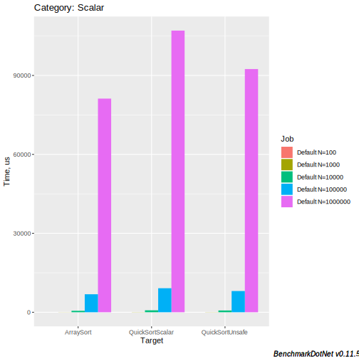

# CoreCLR 3.0 Intrinsics

### (Are they any good?)

---

## getent passwd $(whoami)

<small>dmg:*:666:666:Dan Shechter:/home/dmg:/usr/bin/zsh</small>

<span class="fragment fade-in-then-out">
I'm a CTO of a high-frequency trading* firm that trades global markets from inside exchanges.
</span>

<span class="fragment">
Also, *nix programmer that likes <span class="fragment highlight-blue">low-level & perf</span> and whose been around the block:
<span class="fragment highlight-blue">Windows/Linux kernel programming, </span><span class="fragment highlight-red">Hypervisors</span>
</span>

<table>
<tr>
<td style="border-right: 1px solid black; padding-top: 0px; padding-bottom: 0px">
<a href="https://bits.houmus.org">
<object style="margin: auto;pointer-events: none;" type="image/svg+xml" width="48"  data="logos/atari.svg"/>
</a>
</td>
<td style="border-right: 1px solid black; padding-top: 0px; padding-bottom: 0px">
<a href="http://twitter.com/damageboy">
<object style="margin: auto;pointer-events: none;" type="image/svg+xml" width="48"  data="logos/twitter.svg" />
</a>
</td>
<td style="padding-top: 0px; padding-bottom: 0px">
<a href="https://github.com/damageboy">
<object style="margin: auto;pointer-events: none;" type="image/svg+xml" width="48"  data="logos/github.svg" />
</td>
</tr>
</table>

---

## Today

- What is it?
- Why / Why Now?
- Describe a well known algorithm
- (Re)build it together using intrinsics
  - Oh yeah, learn intrinsics while at it <!-- .element: class="fragment" data-fragment-index="3"-->
- Profit! <!-- .element: class="fragment" data-fragment-index="1" -->
- Q&A <!-- .element: class="fragment" data-fragment-index="2" -->

---

## Wikipedia

[Intrinsic function](https://en.wikipedia.org/wiki/Intrinsic_function)

<blockquote>...an intrinsic function is a function available for use in a given programming language whose implementation is <span class="fragment highlight-red" data-fragment-index="0">handled specially by the 
<span class="fragment fade-in" style="position:inline; margin-left: auto; margin-right: auto; left: 0; right: 0;" data-fragment-index="1">JIT.</span>
<span class="fragment fade-out" style="position:relative; margin-left: auto; margin-right: auto; left: -60px; right: 0;" data-fragment-index="1">compiler.</span>
</span>
</blockquote>

--

Traditionally, used to expose processor functionality that *doesn't* map well to the language:

<ul>
<span class="fragment"><li>Atomic operations</li></span>
<span class="fragment"><li>System-Programming (e.g. kernel mode)</li></span>
<span class="fragment"><li>Crypto instructions</li></span>
<span class="fragment"><li>Niche instructions</li></span>
<span class="fragment"><span class="fragment highlight-blue"><span class="fragment highlight-green"><span class="fragment highlight-red"><li>**Vectorization**</li></span></span></span></span>
</ul>

--

## Where do intrinsics come from?

CPU designers add large groups of intrinsics and expose their availability through CPU feature flags.

Intel currently supports: <!-- .element: class="fragment" -->

- 1,218 distinct intrinsics <!-- .element: class="fragment" -->
- In 6,180 (!) combinations <!-- .element: class="fragment" -->
- Grouped in 67 code-names / feature flags. <!-- .element: class="fragment" -->

<aside class="notes">
Generated the #s with this little mostrosity
<pre>
grep 'instruction' intrinsics-guide/intrinsics_files/data-3.4.4.xml  | sed 's/.*name=.\([a-z0-9]*\).[ /].*/\1/' | sort -u | wc -l
grep 'CPUID' intrinsics-guide/intrinsics_files/data-3.4.4.xml  | cut -f 2 -d '>' | cut -f 1 -d '<' | sort -u
grep '&gt;intrinsic ' intrinsics-guide/intrinsics_files/data-3.4.4.xml | wc -l
</pre>

</aside>

--

<iframe data-src="intrinsics-guide/intrinsics.html" width="1600" height="600" frameborder="0" marginwidth="0" marginheight="0" scrolling="" style="border:3px solid #666; margin-bottom:5px; max-width: 100%;" allowfullscreen=""></iframe>

--

## In C# #

<ul>
<span class="fragment fade-up">
<li>Not new! (since .NET 1.1)
<ul>
<li>Almost all of [`Interlocked.*`](https://docs.microsoft.com/en-us/dotnet/api/system.threading.interlocked?view=netframework-4.8#methods) & more</li>
</ul>
</li>
</span>
<span class="fragment fade-up"><li>Very limited until CoreCLR 3.0 came along...</li>
<ul>
<li>x86/x64 now has <span class="fragment highlight-red">226</span> new intrinsics in [15 classes](https://docs.microsoft.com/en-us/dotnet/api/system.runtime.intrinsics.x86?view=netcore-3.0&viewFallbackFrom=dotnet-plat-ext-3.0)</li>
<ul>
<li>Up to AVX2</li>
</ul>
<li>arm64 now has <span class="fragment highlight-red">24</span> new intrinsics in [5 classes](https://docs.microsoft.com/en-us/dotnet/api/system.runtime.intrinsics.arm.arm64?view=dotnet-plat-ext-3.0)</li>
</ul>
</span>
</ul>

<aside class="notes">
Generated the #s with this little mostrosity
<pre>
~/projects/public/coreclr/src/System.Private.CoreLib/shared/System/Runtime/Intrinsics/X86> for i in $(ls | grep -v Platform); do cat $i; done | grep static | cut -f 1 -d '('  | sed 's#\(public \|static \|unsafe \|void \|uint \|int\|bool \|ulong \|long \|new \)##g' | grep -v IsSupported | sed 's#Vector.*>##'  | sed -r 's/^\s*(\S+(\s+\S+)*)\s*$/\1/' | sort -u | grep -v class | wc -l
</pre>

Should mention that AVX2 is relatively old and widespread:
[Intel > 2013|AMD > 2015]

</aside>

--

## Namespaces

- Common stuff is in `System.Runtime.Intrinsics`
- x86 stuff is in `System.Runtime.Intrinsics.X86`
- arm64 stuff is in `System.Runtime.Intrinsics.Arm.Arm64`

--

## Detection

- Each class / group has a:
```csharp
  public static bool IsSupported { get; }
```  
  that tests availability on CPU @ runtime
- Special check recognized during code-gen (JIT!)     <!-- .element: class="fragment" -->
- So in reality: ZERO cost                               <!-- .element: class="fragment" -->
- Already nicer than C++... <!-- .element: class="fragment" -->

---

## Why should I care?

Performance gains flowing from silicon are shrinking:


<!-- --

Worse, In real terms, CPU perf has actually been going back, due to 2018- discovered CPU bugs (Meltdown,Spectre,Zombieland):

<span class="fragment fade-up">

</span>

-->

--

When all else fails, we look for exotic sources for perf; intrinsics provide an answer...  
This includes [CoreCLR itself](https://devblogs.microsoft.com/dotnet/performance-improvements-in-net-core-3-0/):

> <span class="fragment">...Further, .NET Core 3.0 includes new hardware intrinsics that allow a <span class="fragment highlight-blue">properly-motivated</span> developer to eke out the <span class="fragment highlight-blue">best possible performance</span> on supporting hardware, utilizing extensions like AVX or SSE that can compare well more than 8 bytes at a time. <span class="fragment highlight-blue">Many of the improvements in .NET Core 3.0</span> come from utilizing these techniques. </span>

--

## CoreCLR 3.0 vs. 2.1


--

Now that I've got you ~~scared~~ motivated enough...

Let's get busy!

---

## Math is hard, let's go sorting!

We're going to redo **QuickSort**, with intrinsics/vectorization.

<span class="fragment">Why QuickSort?</span>

<ul>
<span class="fragment"><li>Universally known</li></span>
<span class="fragment"><li>Non-trivial use of intrinsics/vectorization</li></span>
<span class="fragment"><li>It's pretty close to `Array.Sort`<sup>*</sup></li></span>
</ul>

--

## Reminder

- QuickSort uses a *divide-and-conquer* approach
  - It's recursive
- Has average O(*n* log *n*) comparisons for *n* items
- Performs an in-place sort

--

1. Pick a pivot value
2. Partition the array around the pivot value <!-- .element: class="fragment highlight-red" data-fragment-index="1" -->
3. Recurse on the left side of the pivot
4. Recurse on the right side of the pivot

--

## Visualizing QuickSort

To grasp better how/why it works, we'll use visualizations made by @mbostock, where:


--

<iframe data-src="quicksort-mbostock/qs-static.html" width="1600" height="600" frameborder="0" marginwidth="0" marginheight="0" scrolling="" style="border:3px solid #666; max-width: 100%;background: #FFFFFF;" allowfullscreen=""></iframe>

--

<iframe data-src="quicksort-mbostock/qs-animated.html" width="100%" height="400" frameborder="0" marginwidth="0" marginheight="0" scrolling="" style="border:3px solid #666; margin-bottom:5px; max-width: 100%;background: #FFFFFF;" allowfullscreen=""></iframe>

--

```csharp
void QuickSort(int[] items, int left, int right)
{
    if (left == right) return;
    int pivot = PickPivot(items, left, right);
    int pivotPos = Partition(items, pivot, left, right);
    QuickSort(items, left, pivotPos);
    QuickSort(items, pivotPos + 1, right);
}

```

--

```csharp
int Partition(int[] array, int pivot, int left, int right)
{
    while (left <= right) {
        while (array[left] < pivot) left++;
        while (array[right] > pivot) right--;

        if (left <= right) {
            var t = array[left];
            array[left++]  = array[right];
            array[right--] = t;
        }
    }
    return left;
}
```

--

# Compared to Array.Sort

--

## Same

Array.Sort in CoreCLR is *similar* to QuickSort.

- Picks pivot <!-- .element: class="fragment" -->
  - Median of {first, middle, last} elements
- Uses same divide-and-conquer approach <!-- .element: class="fragment" -->
  - And recursion pattern <!-- .element: class="fragment" -->

--

## But different

Technically it's called [IntroSort](https://en.wikipedia.org/wiki/Introsort)

- Hybrid partitioning: <!-- .element: class="fragment" -->
  - HeapSort, QuickSort, Insertion Sort <!-- .element: class="fragment" -->
  - Depending on depth / partition size <!-- .element: class="fragment" -->
  - Better worst-case behaviour <!-- .element: class="fragment" -->
- In CoreCLR, is implemented in C++ <!-- .element: class="fragment" -->
  - Better code quality vs. JIT <!-- .element: class="fragment" -->
  - No bounds checking <!-- .element: class="fragment" -->

--

## BDN Time

--



---

# Step aside scalar, SIMD is coming

Here we go...

--

## Plan

We'll write `Partition` to use AVX+AVX2 Vectorization/SIMD.

- What is SIMD?
- Which intrinsics do we pick?
- How do they exactly work?

--

## SIMD

<span class="fragment">
We've mentioned that CPUs have 1000s of instructions that have to do with vectorization.
</span>

<span class="fragment">
Also referred to as SIMD instructions / intrinsics:
</span>

<span class="fragment">
**S**ingle **I**nstruction **M**ultiple **D**ata
</span>

--

## How?

How can an instruction operate on a vector?

<span class="fragment">
Does it operate on memory?
</span>

--

## SIMD Vectors

<span class="fragment">
SIMD instructions operate on vector types that are supported at the CPU level: <span class="fragment">registers</span>
</span>

<span class="fragment">
SIMD registers have constant size in bits.
</span>

<span class="fragment">
CoreCLR 3.0 supports SIMD instructions that use 64/128/256 bit wide registers.
</span>

--

## Vectors in C# #

C# vectorized intrinsics accept and return these types:

- [`Vector64<T>`](https://github.com/dotnet/coreclr/blob/master/src/System.Private.CoreLib/shared/System/Runtime/Intrinsics/Vector64_1.cs)
- [`Vector128<T>`](https://github.com/dotnet/coreclr/blob/master/src/System.Private.CoreLib/shared/System/Runtime/Intrinsics/Vector128_1.cs)
- [`Vector256<T>`](https://github.com/dotnet/coreclr/blob/master/src/System.Private.CoreLib/shared/System/Runtime/Intrinsics/Vector256_1.cs)

Where `T` is some primitive type.

--

Example: `Vector256<T>` can be:

<span class="fragment">
Integer:
<table class="fragment">
<tr><td style="border: none"><code>byte / sbyte</code></td>  <td style="border: none">➡</td> <td style="border: none">32 x 8b</td></tr>
<tr><td style="border: none"><code>short / ushort</code></td><td style="border: none">➡</td> <td style="border: none">16 x 16b</td></tr>
<tr><td style="border: none"><code>int / uint</code></td>    <td style="border: none">➡</td> <td style="border: none">8 x 32b</td></tr>
<tr><td style="border: none"><code>long / ulong</code></td>  <td style="border: none">➡</td> <td style="border: none">4 x 64b</td></tr>
</table>
</span>

<span class="fragment">
Floating point:
<table class="fragment">
<tr><td style="border: none"><code>float</code></td>  <td style="border: none">➡</td> <td style="border: none">8 x 32b</td></tr>
<tr><td style="border: none"><code>double</code></td> <td style="border: none">➡</td> <td style="border: none">4 x 64b</td></tr>
</table>
</span>

--

## Vector registers

<table style="text-align: center; line-height: normal;">
<tbody><tr>
<td style="width: 600; border: none; border-right: 1px solid black; font-size: xx-small;"><span style="float: left">511</span> <span style="float: right">256</span></td>
<td style="width: 25%; border: none; border-right: 1px solid black; font-size: xx-small;"><span style="float: left">255</span> <span style="float: right">128</span></td>
<td style="width: 25%; border: none; border-right: 1px solid black; font-size: xx-small;"><span style="float: left">127</span> <span style="float: right">0</span></td>
</tr><tr>
<td style="border-top: none; border-right: 1px solid black;"></td>
<td style="border-top: none; border-right: 1px solid black;"></td>
<td style="border-top: none; border-right: 1px solid black;"></td>
</tr><tr>
<td style="padding:0; font-size: 0.6em; border-right: 1px solid black"><pre>zmm0        </pre></td>
<td style="padding:0; font-size: 0.6em; border-right: 1px solid black; background: #ddd"><pre>ymm0        </pre></td>
<td style="padding:0; font-size: 0.6em; border-right: 1px solid black; background: #ccc"><pre>xmm0        </pre></td>
</tr><tr>
<td style="padding:0; font-size: 0.6em; border-right: 1px solid black"><pre>zmm1        </pre></td>
<td style="padding:0; font-size: 0.6em; border-right: 1px solid black; background: #ddd"><pre>ymm1        </pre></td>
<td style="padding:0; font-size: 0.6em; border-right: 1px solid black; background: #ccc"><pre>xmm1        </pre></td>
</tr><tr>
<td style="padding:0; font-size: 0.6em; border-right: 1px solid black"><pre>zmm2        </pre></td>
<td style="padding:0; font-size: 0.6em; border-right: 1px solid black; background: #ddd"><pre>ymm2        </pre></td>
<td style="padding:0; font-size: 0.6em; border-right: 1px solid black; background: #ccc"><pre>xmm2        </pre></td>
</tr><tr>
<td style="padding:0; font-size: 0.6em; border-right: 1px solid black"><pre>zmm3        </pre></td>
<td style="padding:0; font-size: 0.6em; border-right: 1px solid black; background: #ddd"><pre>ymm3        </pre></td>
<td style="padding:0; font-size: 0.6em; border-right: 1px solid black; background: #ccc"><pre>xmm3        </pre></td>
</tr><tr>
<td style="padding:0; font-size: 0.6em; border-right: 1px solid black"><pre>zmm4        </pre></td>
<td style="padding:0; font-size: 0.6em; border-right: 1px solid black; background: #ddd"><pre>ymm4        </pre></td>
<td style="padding:0; font-size: 0.6em; border-right: 1px solid black; background: #ccc"><pre>xmm4        </pre></td>
</tr>
<tr>
<td style="padding:0; font-size: 0.6em; border-right: 1px solid black"><pre>zmm5        </pre></td>
<td style="padding:0; font-size: 0.6em; border-right: 1px solid black; background: #ddd"><pre>ymm5        </pre></td>
<td style="padding:0; font-size: 0.6em; border-right: 1px solid black; background: #ccc"><pre>xmm5        </pre></td>
</tr>
<tr>
<td style="padding:0; font-size: 0.6em; border-right: 1px solid black"><pre>zmm6        </pre></td>
<td style="padding:0; font-size: 0.6em; border-right: 1px solid black; background: #ddd"><pre>ymm6        </pre></td>
<td style="padding:0; font-size: 0.6em; border-right: 1px solid black; background: #ccc"><pre>xmm6        </pre></td>
</tr><tr>
<td style="padding:0; font-size: 0.6em; border-right: 1px solid black"><pre>zmm7        </pre></td>
<td style="padding:0; font-size: 0.6em; border-right: 1px solid black; background: #ddd"><pre>ymm7        </pre></td>
<td style="padding:0; font-size: 0.6em; border-right: 1px solid black; background: #ccc"><pre>xmm7        </pre></td>
</tr><tr>
<td style="padding:0; font-size: 0.6em; border-right: 1px solid black"><pre>zmm8        </pre></td>
<td style="padding:0; font-size: 0.6em; border-right: 1px solid black; background: #ddd"><pre>ymm8        </pre></td>
<td style="padding:0; font-size: 0.6em; border-right: 1px solid black; background: #ccc"><pre>xmm8        </pre></td>
</tr><tr>
<td style="padding:0; font-size: 0.6em; border-right: 1px solid black"><pre>zmm9        </pre></td>
<td style="padding:0; font-size: 0.6em; border-right: 1px solid black; background: #ddd"><pre>ymm9        </pre></td>
<td style="padding:0; font-size: 0.6em; border-right: 1px solid black; background: #ccc"><pre>xmm9        </pre></td>
</tr><tr>
<td style="padding:0; font-size: 0.6em; border-right: 1px solid black"><pre>zmm10        </pre></td>
<td style="padding:0; font-size: 0.6em; border-right: 1px solid black; background: #ddd"><pre>ymm10        </pre></td>
<td style="padding:0; font-size: 0.6em; border-right: 1px solid black; background: #ccc"><pre>xmm10        </pre></td>
</tr><tr>
<td style="padding:0; font-size: 0.6em; border-right: 1px solid black"><pre>zmm11        </pre></td>
<td style="padding:0; font-size: 0.6em; border-right: 1px solid black; background: #ddd"><pre>ymm11        </pre></td>
<td style="padding:0; font-size: 0.6em; border-right: 1px solid black; background: #ccc"><pre>xmm11        </pre></td>
</tr><tr>
<td style="padding:0; font-size: 0.6em; border-right: 1px solid black"><pre>zmm12        </pre></td>
<td style="padding:0; font-size: 0.6em; border-right: 1px solid black; background: #ddd"><pre>ymm12        </pre></td>
<td style="padding:0; font-size: 0.6em; border-right: 1px solid black; background: #ccc"><pre>xmm12        </pre></td>
</tr><tr>
<td style="padding:0; font-size: 0.6em; border-right: 1px solid black"><pre>zmm13        </pre></td>
<td style="padding:0; font-size: 0.6em; border-right: 1px solid black; background: #ddd"><pre>ymm13        </pre></td>
<td style="padding:0; font-size: 0.6em; border-right: 1px solid black; background: #ccc"><pre>xmm13        </pre></td>
</tr><tr>
<td style="padding:0; font-size: 0.6em; border-right: 1px solid black"><pre>zmm14        </pre></td>
<td style="padding:0; font-size: 0.6em; border-right: 1px solid black; background: #ddd"><pre>ymm14        </pre></td>
<td style="padding:0; font-size: 0.6em; border-right: 1px solid black; background: #ccc"><pre>xmm14        </pre></td>
</tr><tr>
<td style="padding:0; font-size: 0.6em; border-right: 1px solid black"><pre>zmm15        </pre></td>
<td style="padding:0; font-size: 0.6em; border-right: 1px solid black; background: #ddd"><pre>ymm15        </pre></td>
<td style="padding:0; font-size: 0.6em; border-right: 1px solid black; background: #ccc"><pre>xmm15        </pre></td>
</tr><tr>
<td style="padding:0; font-size: 0.6em; border-right: 1px solid black"><pre>zmm16        </pre></td>
<td style="padding:0; font-size: 0.6em; border-right: 1px solid black"><pre>ymm16        </pre></td>
<td style="padding:0; font-size: 0.6em; border-right: 1px solid black"><pre>xmm16        </pre></td>
</tr><tr>
<td style="padding:0; font-size: 0.6em; border-right: 1px solid black"><pre>zmm17        </pre></td>
<td style="padding:0; font-size: 0.6em; border-right: 1px solid black"><pre>ymm17        </pre></td>
<td style="padding:0; font-size: 0.6em; border-right: 1px solid black"><pre>xmm17        </pre></td>
</tr><tr>
<td style="padding:0; font-size: 0.6em; border-right: 1px solid black"><pre>zmm18        </pre></td>
<td style="padding:0; font-size: 0.6em; border-right: 1px solid black"><pre>ymm18        </pre></td>
<td style="padding:0; font-size: 0.6em; border-right: 1px solid black"><pre>xmm18        </pre></td>
</tr><tr>
<td style="padding:0; font-size: 0.6em; border-right: 1px solid black"><pre>zmm19        </pre></td>
<td style="padding:0; font-size: 0.6em; border-right: 1px solid black"><pre>ymm19        </pre></td>
<td style="padding:0; font-size: 0.6em; border-right: 1px solid black"><pre>xmm19        </pre></td>
</tr><tr>
<td style="padding:0; font-size: 0.6em; border-right: 1px solid black"><pre>zmm20        </pre></td>
<td style="padding:0; font-size: 0.6em; border-right: 1px solid black"><pre>ymm20        </pre></td>
<td style="padding:0; font-size: 0.6em; border-right: 1px solid black"><pre>xmm20        </pre></td>
</tr><tr>
<td style="padding:0; font-size: 0.6em; border-right: 1px solid black"><pre>zmm21        </pre></td>
<td style="padding:0; font-size: 0.6em; border-right: 1px solid black"><pre>ymm21        </pre></td>
<td style="padding:0; font-size: 0.6em; border-right: 1px solid black"><pre>xmm21        </pre></td>
</tr><tr>
<td style="padding:0; font-size: 0.6em; border-right: 1px solid black"><pre>zmm22        </pre></td>
<td style="padding:0; font-size: 0.6em; border-right: 1px solid black"><pre>ymm22        </pre></td>
<td style="padding:0; font-size: 0.6em; border-right: 1px solid black"><pre>xmm22        </pre></td>
</tr><tr>
<td style="padding:0; font-size: 0.6em; border-right: 1px solid black"><pre>zmm23        </pre></td>
<td style="padding:0; font-size: 0.6em; border-right: 1px solid black"><pre>ymm23        </pre></td>
<td style="padding:0; font-size: 0.6em; border-right: 1px solid black"><pre>xmm23        </pre></td>
</tr><tr>
<td style="padding:0; font-size: 0.6em; border-right: 1px solid black"><pre>zmm24        </pre></td>
<td style="padding:0; font-size: 0.6em; border-right: 1px solid black"><pre>ymm24        </pre></td>
<td style="padding:0; font-size: 0.6em; border-right: 1px solid black"><pre>xmm24        </pre></td>
</tr><tr>
<td style="padding:0; font-size: 0.6em; border-right: 1px solid black"><pre>zmm25        </pre></td>
<td style="padding:0; font-size: 0.6em; border-right: 1px solid black"><pre>ymm25        </pre></td>
<td style="padding:0; font-size: 0.6em; border-right: 1px solid black"><pre>xmm25        </pre></td>
</tr><tr>
<td style="padding:0; font-size: 0.6em; border-right: 1px solid black"><pre>zmm26        </pre></td>
<td style="padding:0; font-size: 0.6em; border-right: 1px solid black"><pre>ymm26        </pre></td>
<td style="padding:0; font-size: 0.6em; border-right: 1px solid black"><pre>xmm26        </pre></td>
</tr><tr>
<td style="padding:0; font-size: 0.6em; border-right: 1px solid black"><pre>zmm27        </pre></td>
<td style="padding:0; font-size: 0.6em; border-right: 1px solid black"><pre>ymm27        </pre></td>
<td style="padding:0; font-size: 0.6em; border-right: 1px solid black"><pre>xmm27        </pre></td>
</tr><tr>
<td style="padding:0; font-size: 0.6em; border-right: 1px solid black"><pre>zmm28        </pre></td>
<td style="padding:0; font-size: 0.6em; border-right: 1px solid black"><pre>ymm28        </pre></td>
<td style="padding:0; font-size: 0.6em; border-right: 1px solid black"><pre>xmm28        </pre></td>
</tr><tr>
<td style="padding:0; font-size: 0.6em; border-right: 1px solid black"><pre>zmm29        </pre></td>
<td style="padding:0; font-size: 0.6em; border-right: 1px solid black"><pre>ymm29        </pre></td>
<td style="padding:0; font-size: 0.6em; border-right: 1px solid black"><pre>xmm29        </pre></td>
</tr><tr>
<td style="padding:0; font-size: 0.6em; border-right: 1px solid black"><pre>zmm30        </pre></td>
<td style="padding:0; font-size: 0.6em; border-right: 1px solid black"><pre>ymm30        </pre></td>
<td style="padding:0; font-size: 0.6em; border-right: 1px solid black"><pre>xmm30        </pre></td>
</tr><tr>
<td style="padding:0; font-size: 0.6em; border-right: 1px solid black"><pre>zmm31        </pre></td>
<td style="padding:0; font-size: 0.6em; border-right: 1px solid black"><pre>ymm31        </pre></td>
<td style="padding:0; font-size: 0.6em; border-right: 1px solid black"><pre>xmm31        </pre></td>
</tr></tbody></table>

--

For this talk we need:

<table><thead><tr>
<th style="font-size: x-large;text-align:left;"  ><span class="fragment" data-fragment-index="3"><code>x64 asm</code></span></th>
<th style="font-size: x-large;text-align:center;"><span class="fragment" data-fragment-index="2"><code>Intel</code></span></th>
<th style="font-size: x-large;text-align:right;" ><span class="fragment" data-fragment-index="1"><code>CoreCLR</code></span></th>
</tr></thead>
<tbody><tr>
<td style="font-size: x-large;text-align:left;"  ><span class="fragment" data-fragment-index="3"><code>vbroadcastd</code></span></td>
<td style="font-size: x-large;text-align:center;"><span class="fragment" data-fragment-index="2"><code>_mm256_broadcastd_epi32</code></span></td>
<td style="font-size: x-large;text-align:right;" ><span class="fragment" data-fragment-index="1"><code>Vector256.Create(int)</code></span></td>
</tr><tr>
<td style="font-size: x-large;text-align:left;"  ><span class="fragment" data-fragment-index="3"><code>vlddqu</code></span></td>
<td style="font-size: x-large;text-align:center;"><span class="fragment" data-fragment-index="2"><code>_mm256_lddqu_si256</code></span></td>
<td style="font-size: x-large;text-align:right;" ><span class="fragment" data-fragment-index="1"><code>Avx.LoadDquVector256</code></span></td>
</tr><tr>
<td style="font-size: x-large;text-align:left;"  ><span class="fragment" data-fragment-index="3"><code>vpcmpgtd</code></span></td>
<td style="font-size: x-large;text-align:center;"><span class="fragment" data-fragment-index="2"><code>_mm256_cmpgt_epi32</code></span></td>
<td style="font-size: x-large;text-align:right;" ><span class="fragment" data-fragment-index="1"><code>Avx2.CompareGreaterThan</code></span></td>
</tr><tr>
<td style="font-size: x-large;text-align:left;"  ><span class="fragment" data-fragment-index="3"><code>vmovmskps</code></span></td>
<td style="font-size: x-large;text-align:center;"><span class="fragment" data-fragment-index="2"><code>_mm256_movemask_ps</code></span></td>
<td style="font-size: x-large;text-align:right;" ><span class="fragment" data-fragment-index="1"><code>Avx.MoveMask</code></span></td>
</tr><tr>
<td style="font-size: x-large;text-align:left;"  ><span class="fragment" data-fragment-index="3"><code>popcnt</code></span></td>
<td style="font-size: x-large;text-align:center;"><span class="fragment" data-fragment-index="2"><code>_mm_popcnt_u32</code></span></td>
<td style="font-size: x-large;text-align:right;" ><span class="fragment" data-fragment-index="1"><code>Popcnt.PopCount</code></span></td>
</tr><tr>
<td style="font-size: x-large;text-align:left;"  ><span class="fragment" data-fragment-index="3"><code>vpermd</code></span></td>
<td style="font-size: x-large;text-align:center;"><span class="fragment" data-fragment-index="2"><code>_mm256_permutevar8x32_epi32</code></span></td>
<td style="font-size: x-large;text-align:right;" ><span class="fragment" data-fragment-index="1"><code>Avx2.PermuteVar8x32</code></span></td>
</tr><tr>
<td style="font-size: x-large;text-align:left;"  ><span class="fragment" data-fragment-index="3"><code>vmovdqu</code></span></td>
<td style="font-size: x-large;text-align:center;"><span class="fragment" data-fragment-index="2"><code>_mm256_storeu_si256</code></span></td>
<td style="font-size: x-large;text-align:right;" ><span class="fragment" data-fragment-index="1"><code>Avx.Store</code></span></td>
</tr></tbody></table>

--

## Vector256.Create()

- Accepts a single primitive value
- returns a vector where all elements contain the value

--

C#:

```csharp
Vector256<int> someVector256 = Vector256.Create(0x42);
```

asm:

```x86asm
vmovd  xmm0, rax          ; 3 cycle latency
                          ; 1 cycle throughput
vpbroadcastd ymm0, xmm0   ; 3 cycle latency
                          ; 1 cycle throughput
```

<object style="margin: auto" type="image/svg+xml" data="inst-animations/vbroadcast.svg" />

--

## LoadDquVector256

- Accepts a pointer to an array of supported primitives
- Returns a vector with copied data from the array

--

C#

```csharp
int *ptr = ...; // Get some pointer to a big enough array
Vector256<int> data = Avx2.LoadDquVector256(ptr);
```

asm:

```x86asm
vlddqu ymm1, ymmword ptr [rdi] ; 5 cycle latency +
                               ; cache/memory
                               ; 0.5 cycle throughput
```

<object stle="margin: auto" type="image/svg+xml" data="inst-animations/lddqu.svg" />

--

## CompareGreaterThan

- Compares 2 vectors element by element
- Returns a 3<sup>rd</sup> vector where:
  - *Greater than* elements are marked with `-1`
  - *Smaller than -or- equal* are marked as `0`

--

C#:

```csharp
Vector256<int> data, comperand;
Vector256<int> result =
    Avx2.CompareGreaterThan(data, comperand);
```

asm:

```x86asm
vpcmpgtd ymm2, ymm1, ymm0 ; 1 cycle latency
                          ; 0.5 cycle throughput
```

<object stle="margin: auto" type="image/svg+xml" data="inst-animations/vpcmpgtd.svg" />

--

## MoveMask

- Set each bit of result based on the most significant bit of the corresponding 32-bit element
- Technically, expect 32-bit floating point only

--

C#:

```csharp
Vector256<int> data;
int result = Avx.MoveMask(data.AsSingle());
```

asm:

```x86asm
vmovmskps rax, ymm2  ; 5 cycle latency
                     ; 1 cycle throughput
```

<object stle="margin: auto" type="image/svg+xml" data="inst-animations/vmovmskps.svg" />

--

## PopCount

- returns the number of '1' bits in a 32/64 bit primitive

C#:

```csharp

int result = PcpCnt.PopCount(0b0000111100110011);
// result == 8
```

asm:

```x86asm
popcnt rax, rdx  ; 3 cycle latency
                 ; 1 cycle throughput
```

--

## Avx2.PermuteVar8x32

- Accepts two vectors: source, permutation
- Permutes the source according to the permutation order

--

C#:

```csharp
Vector256<int> data, perm;
Vector256<int> result = Avx2.PermuteVar8x32(data, perm);
```

asm:

```x86asm
vpermd ymm1, ymm2, ymm1 ; 3 cycles latency
                        ; 1 cycles throughput
```

<object stle="margin: auto" type="image/svg+xml" data="inst-animations/vpermd.svg" />

--

## Vectorized Partition Block

<ul>
<li>We're going to partition 8 x `int`s at a time</li>
<span class="fragment fade-up">
<ul>
<li>inside a Vector256</li>
</ul>
</span>
<span class="fragment fade-up"><li>Load <span class="fragment fade-up">➡ Compare <span class="fragment fade-up">➡ Permute <span class="fragment fade-up">➡ Store</span></span></span></li>
<span class="fragment fade-up">
<ul>
<li>The result is written to both sides of the array</li>
<li>Then advance the next write pos for each side</li>
</ul>
</span>
</span>
<span class="fragment fade-up"><li>With no branching<span class="fragment fade-up"><span style="color: blue">(!)</span></span></li></span>
</ul>

--

```csharp
var P = Vector256.Create(pivot);
...
var current = Avx2.LoadDquVector256(nextPtr);
var mask = (uint) Avx.MoveMask(
    Avx2.CompareGreaterThan(current, P).AsSingle()));
current = Avx2.PermuteVar8x32(current, 
    LoadDquVector256(PermTablePtr + mask * 8));
Avx.Store(writeLeft, current);
Avx.Store(writeRight, current);
var popCount = PopCnt.PopCount(mask);
writeRight -= popCount;
writeLeft  += 8 - popCount;


```

<span class="code-presenting-annotation fragment current-only" data-code-focus="1">We generate a vectorized pivot, once per partition</span>
<span class="code-presenting-annotation fragment current-only" data-code-focus="3">Load 8 elements from somewhere.</span>
<span class="code-presenting-annotation fragment current-only" data-code-focus="5">Compare to pivot, cast to <code>Vector256&lt;float&gt;</code> (because <code>¯\\_(ツ)_/¯</code>)</span>
<span class="code-presenting-annotation fragment current-only" data-code-focus="4">Generate an 8-bit mask from the comparison result</span>
<span class="code-presenting-annotation fragment current-only" data-code-focus="7">Load permutation vector from table (next slides!)</span>
<span class="code-presenting-annotation fragment current-only" data-code-focus="6">Permute data (partition)</span>
<span class="code-presenting-annotation fragment current-only" data-code-focus="8">Store 8 elements to the left.</span>
<span class="code-presenting-annotation fragment current-only" data-code-focus="9">Store 8 elements to the right.</span>
<span class="code-presenting-annotation fragment current-only" data-code-focus="10">Count 1 bits ➡ How many are elemenets are > than pivot.</span>
<span class="code-presenting-annotation fragment current-only" data-code-focus="11">Advance right by popCount.</span>
<span class="code-presenting-annotation fragment current-only" data-code-focus="12">Advance left by 8 - popCount.</span>


--

```x86asm
vmovd xmm1,r15d                      ; Broadcast
vbroadcastd ymm1,xmm1                ; pivot
...
vlddqu ymm0, ymmword ptr [rax]       ; load 8 elements
vpcmpgtd ymm2, ymm0, ymm1            ; compare
vmovmskps ecx, ymm2                  ; movemask into scalar reg
mov r9d, ecx                         ; copy to r9
shl r9d, 0x3                         ; *= 8
vlddqu ymm2, qword ptr [rdx+r9d*4]   ; load permutation
vpermd ymm0, ymm2, ymm0              ; permute
vmovdqu ymmword ptr [r12], ymm0      ; store left
vmovdqu ymmword ptr [r8], ymm0       ; store right
popcnt ecx, ecx                      ; popcnt
shl ecx, 0x2                         ; pointer
mov r9d, ecx                         ; arithmetic
neg r9d                              ; for += 8 - popCount
add r9d, 0x20                        ;
add r12, r9                          ; Update writeLeft pos
sub r8, rcx                          ; Update writeRight pos

```

<span class="code-presenting-annotation fragment current-only" data-code-focus="1-2">We generate a vectorized pivot, once per partition</span>
<span class="code-presenting-annotation fragment current-only" data-code-focus="4">Load 8 elements from somewhere.</span>
<span class="code-presenting-annotation fragment current-only" data-code-focus="5">Compare to pivot, cast to <code>Vector256&lt;float&gt;</code> (because <code>¯\\_(ツ)_/¯</code>)</span>
<span class="code-presenting-annotation fragment current-only" data-code-focus="6">Generate an 8-bit mask from the comparison result</span>
<span class="code-presenting-annotation fragment current-only" data-code-focus="7-9">Load permutation vector from table</span>
<span class="code-presenting-annotation fragment current-only" data-code-focus="10">Permute data (partition)</span>
<span class="code-presenting-annotation fragment current-only" data-code-focus="11">Store 8 elements to the left.</span>
<span class="code-presenting-annotation fragment current-only" data-code-focus="12">Store 8 elements to the right.</span>
<span class="code-presenting-annotation fragment current-only" data-code-focus="13">Count 1 bits ➡ How many are elemenets are > than pivot.</span>
<span class="code-presenting-annotation fragment current-only" data-code-focus="14-18">Advance left by 8 - popCount.</span>
<span class="code-presenting-annotation fragment current-only" data-code-focus="19">Advance right by popCount.</span>

--

## Permutation Tables

- We need precomputed permutation tables
- 256 entries for every possible mask (2<sup>8</sup>)
- We pre-generate them as part of the source code
- Let's look at a few entries, to get a feel for them

--

```charp
static ReadOnlySpan<int> PermTable => new[] {
    0, 1, 2, 3, 4, 5, 6, 7,     // 0   => 0b00000000
    // ...
    3, 4, 5, 6, 7, 0, 1, 2,     // 7   => 0b00000111
    // ...
    0, 2, 4, 6, 1, 3, 5, 7,     // 170 => 0b10101010
    // ...
    0, 1, 2, 3, 4, 5, 6, 7,     // 255 => 0b11111111
};
```

<span class="code-presenting-annotation fragment current-only" data-code-focus="2,8">Everything stays in place</span>
<span class="code-presenting-annotation fragment current-only" data-code-focus="4">Move 3 from left to right</span>
<span class="code-presenting-annotation fragment current-only" data-code-focus="6">4/4 split</span>

--

## The outer loop

- The idea is we read 8 at every iteration
- Then write 8 **both** to left + right
- How can we keep everything in place?
- Remember allocation is <span style="color: red">bad</span>

--

## stackalloc to the rescue

- We cheat just a bit: <code>¯\\_(ツ)_/¯</code>
- `stackalloc Vector256<int>[4]`
- Total temp memory: 128 bytes
  - constant, regardless of how much we're sorting

--

## Now what

<ul>
<li>We read ahead 2 vectors from left + 2 from right</li>
<li>Partition them separately</li>
<span class="fragment fade-up">
<li>Now we can read <b>ahead</b> of where we write</li>
</span>
<span class="fragment fade-up">
<li>Every iteration we decide to read from <span class="fragment highlight-blue">left</span>/<span class="fragment highlight-red">right</span></li>
<ul><li>According to which "head" is closest to being <b>overwritten</b></li>
</ul>
</span>
</ul>

--

```csharp
while (readRight >= readLeft) {
    int *nextPtr;
    if (readLeft   - writeLeft <= 
        writeRight - readRight) {
        nextPtr = readLeft;
        readLeft += 8;
    } else {
        nextPtr = readRight;
        readRight -= 8;
    }
    var current = Avx.LoadDquVector256(nextPtr);
    //...
}
```

<span class="code-presenting-annotation fragment current-only" data-code-focus="1">Anything left to partition?</span>
<span class="code-presenting-annotation fragment current-only" data-code-focus="3-4">Which side is closer to being overwritten?</span>
<span class="code-presenting-annotation fragment current-only" data-code-focus="5-6">Pick left</span>
<span class="code-presenting-annotation fragment current-only" data-code-focus="8-9">Pick right</span>

--

## Yeah yeah, are we fast yet?


--

## Can we go faster?

- That "pick a side" is actually super bad for perf
  - The branch is 100% random data dependent
  - Not fun!
- How bad?

<iframe data-src="perf/avx2doublepumped-perf.html" width="1600" height="600" frameborder="0" marginwidth="0" marginheight="0" scrolling="" style="border:0px solid #666; margin-bottom:5px; max-width: 100%;" allowfullscreen=""/>

--

## Bad Speculation is Bad

- When the CPU branch predictor is 40% wrong,
  you're going to have a bad day.
- We need to overcome this if we want to go faster
- But how?

--

## If I had a cmov

- x86 supports conditional mov, or `cmov`
- Only good for simple branches
  - Execute the same code but with different data 
- CoreCLR JIT <span style="color: red">does not</span> support this
- But we can imagine:

--

## To cmov or not to cmov

```csharp
    // Current
    if (readLeft   - writeLeft <= 
        writeRight - readRight) {
        nextPtr = readLeft;
        readLeft += 8;
    } else {
        nextPtr = readRight;
        readRight -= 8;
    }

    // With cmov
    var goLeft = readLeft   - writeLeft <= 
                 writeRight - readRight;
    var nextPtr = goLeft ? readLeft : readRight;
    readLeft   += goLeft ? 8 : 0;
    readRight  -= goLeft ? 0 : 8;
```

<span class="code-presenting-annotation fragment current-only" data-code-focus="2-3,12-13">Same condition</span>
<span class="code-presenting-annotation fragment current-only" data-code-focus="4,7,14">nextPtr</span>
<span class="code-presenting-annotation fragment current-only" data-code-focus="5,15">readLeft</span>
<span class="code-presenting-annotation fragment current-only" data-code-focus="8,16">readRight</span>

--

## Back to reality

- One option would be to wait for .NET Core JIT to catch up
  - But ain't nobody got time for that
- Instead we can turn to an older trick:

--

## Unroll the code

- Change the ratio between work/branches predicted
- CPU prediction will continue to suck             <!-- .element: class="fragment" data-fragment-index="1" -->
  - But once every N partitioning operations       <!-- .element: class="fragment" data-fragment-index="1" -->
- We need to allocate more temporary space:        <!-- .element: class="fragment" data-fragment-index="2" -->
  - `2*(N+1)*Vector256<int>`                       <!-- .element: class="fragment" data-fragment-index="2" -->
  - `2*(4+1)*8*4 == 320 bytes`                     <!-- .element: class="fragment" data-fragment-index="2" -->

--

```csharp
while (readRight >= readLeft) {
    int *nextPtr;
    if (readLeft   - writeLeft <= 
        writeRight - readRight) {
        nextPtr = readLeft;
        readLeft += 8*4;
    } else {
        nextPtr = readRight;
        readRight -= 8*4;
    }
    var L0 = LoadDquVector256(nextPtr + 0*8);
    var L1 = LoadDquVector256(nextPtr + 1*8);
    var L2 = LoadDquVector256(nextPtr + 2*8);
    var L3 = LoadDquVector256(nextPtr + 3*8);

    var m0 = (uint) MoveMask(CompareGreaterThan(L0, P).AsSingle());
    var m1 = (uint) MoveMask(CompareGreaterThan(L1, P).AsSingle());
    var m2 = (uint) MoveMask(CompareGreaterThan(L2, P).AsSingle());
    var m3 = (uint) MoveMask(CompareGreaterThan(L3, P).AsSingle());

    L0 = PermuteVar8x32(L0, GetIntPermutation(pBase, m0));
    L1 = PermuteVar8x32(L1, GetIntPermutation(pBase, m1));
    L2 = PermuteVar8x32(L2, GetIntPermutation(pBase, m2));
    L3 = PermuteVar8x32(L3, GetIntPermutation(pBase, m3));

    var pc0 = PopCount(m0);
    var pc1 = PopCount(m1);
    var pc2 = PopCount(m2);
    var pc3 = PopCount(m3);

    Store(writeRight, L0);
    writeRight -= pc0;
    Store(writeRight, L1);
    writeRight -= pc1;
    Store(writeRight, L2);
    writeRight -= pc2;
    Store(writeRight, L3);
    writeRight -= pc3;

    pc0 = 8 - pc0;
    pc1 = 8 - pc1;
    pc2 = 8 - pc2;
    pc3 = 8 - pc3;

    Store(writeLeft, L0);
    writeLeft +=  pc0);
    Store(writeLeft, L1);
    writeLeft += pc1);
    Store(writeLeft, L2);
    writeLeft += pc2);
    Store(writeLeft, L3);
    writeLeft += pc3);
}


//  
```

<span class="code-presenting-annotation fragment current-only" data-code-focus="1-10">Can you spot the difference?</span>
<span class="code-presenting-annotation fragment current-only" data-code-focus="11-14">Load x4</span>
<span class="code-presenting-annotation fragment current-only" data-code-focus="16-19">Compare+MoveMask x4</span>
<span class="code-presenting-annotation fragment current-only" data-code-focus="21-24">Permute x4</span>
<span class="code-presenting-annotation fragment current-only" data-code-focus="26-29">PopCount x4</span>
<span class="code-presenting-annotation fragment current-only" data-code-focus="31-38">Store on the right x4</span>
<span class="code-presenting-annotation fragment current-only" data-code-focus="40-43">8 - PopCount x4</span>
<span class="code-presenting-annotation fragment current-only" data-code-focus="45-52">Store Left x4</span>

--

## Show me the money!

- Do we have less branch mis-predictions now?
  - Not really!               <!-- .element: class="fragment" data-fragment-index="1" -->
  - (Not in percent)          <!-- .element: class="fragment" data-fragment-index="1" -->
- Does it run faster though?  <!-- .element: class="fragment" data-fragment-index="2" -->

<iframe data-src="perf/avx2doublepumpedunrolled-perf.html" width="1600" height="600" frameborder="0" marginwidth="0" marginheight="0" scrolling="" style="border:0px solid #666; margin-bottom:5px; max-width: 100%;" allowfullscreen="">
</iframe>

--
## Vector256&lt;T&gt;

```csharp
public readonly struct Vector256<T> :
    IEquatable<Vector256<T>>
    where T : struct
{
    // Gets the number of T's that are in a Vector256<T>
    public static int Count { get; }
    // ...
}

public static class Vector256 {
    public static T GetElement<T>(this Vector256<T> v, int i)
        where T : struct;
}
```

--

High-Level languages, like C, C++, Java, C# often abstract the CPU from the unsuspecting user:

<table>
<tbody>
<tr>
<td><pre><code style="font-size: x-large;" class="csharp">
public int Sum(int[] a)
{
    // Is "sum" stored in memory?
    var sum = 0;
    // Or maybe "i"?
    for (var i = 0; i < a.Length; i++)
        sum += a[i];

    return sum;
}
</code></pre></td>
<td><span class="fragment"><pre><code style="font-size: x-large;">
xor eax, eax
xor ecx, ecx
mov r8d, [rdx+0x8]
test r8d, r8d
jle out
loop:
    movsxd r9, ecx
    # sum += a[i]
    add rax, [rdx+r9*8+0x10]
    # i++
    inc ecx
    cmp r8d, ecx
    jg loop
out:
ret
</code></pre></span></td>
</tr>
</table>

--

## Why?

Why bother with this complexity?  
Why not just always use memory?

<table>
<tbody>
<tr><td style="border: none"><span class="fragment">Slower:</span></td><td style="border: none"><span class="fragment">to execute</span></td><td style="border: none"><span class="fragment">to decode</span></td></tr>
<tr><td style="border: none" colspan="3"><span class="fragment">Not supported by every instruction</span></td></tr>
</tbody>
</table>

--

## Again: How?

How can an instruction operate on a vector?

Does it operate on memory?

--

## Vector...&lt;T&gt;

- These classes seem surprisingly "light"
- We pass them around as arguments to/from intrinsics
- Not supposed to directly mutate / consume them
- What little functionality exists  
  is mostly for debugging purposes

--

--

These `Vector`*nnn* aren't just *simple* structs!

In general, intrinsics don't accept -or- return plain memory<sup>*</sup>.

Instead, they use special registers, in the CPU:

--

When the JIT generates code involving intrinsics, it will allocate these special registers, and our code will use them:

```csharp
var someVector256 = Vector256.Create(0x42);
```

```x86asm
// Becomes:
mov rax, 0x42
vmovd  xmm0, rax
vpbroadcastd ymm0, xmm0
```

--

## Cool story bro, Why should I care?

Example: If we use more `Vector`*nnn* vars *in C#* than what our CPU has in one loop,
the JIT will add special code to spill+load registers to the stack...

---
