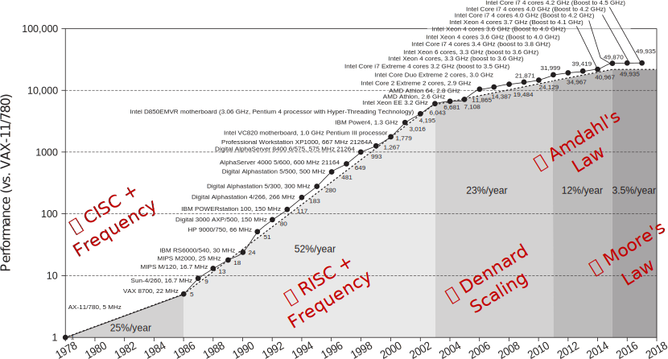

# CoreCLR 3.0 Intrinsics

<aside class="notes">
Hi Everyone,
This is CoreCLR 3.0 Intrinsics
</aside>

---

## getent passwd $USER

<small>dmg:*:666:666:Dan Shechter:/home/dmg:/usr/bin/zsh</small>

<p class="fragment fade-in-then-out">
CTO of a high-frequency trading* firm that trades global markets from inside exchanges.
</p>

<p class="fragment">
Also, *nix programmer that likes <span class="fragment highlight-blue">low-level & perf</span> and whose been around the block:
<span class="fragment highlight-blue">Windows/Linux kernel programming, </span><span class="fragment highlight-red">Hypervisors</span>
</p>

<table>
<tr>
<td style="border-right: 1px solid black; padding-top: 0px; padding-bottom: 0px">
<a href="https://bits.houmus.org">
<object style="margin: auto;pointer-events: none;" type="image/svg+xml" width="48"  data="logos/atari.svg"></object>
</a>
</td>
<td style="border-right: 1px solid black; padding-top: 0px; padding-bottom: 0px">
<a href="http://twitter.com/damageboy">
<object style="margin: auto;pointer-events: none;" type="image/svg+xml" width="48"  data="logos/twitter.svg"></object>
</a>
</td>
<td style="padding-top: 0px; padding-bottom: 0px">
<a href="https://github.com/damageboy">
<object style="margin: auto;pointer-events: none;" type="image/svg+xml" width="48"  data="logos/github.svg"></object>
</td>
</tr>
</table>

<aside class="notes">
I'm Dan, a.k.a Damageboy on these fine platforms below,

In my day job, I'm a CTO for a high frequency trading firm...
So this means a lot of things depending on context, but in our context here, this means
that I'm part of team that gets to make more money hen they succeed in running their code faster...

Other than that, old time unix programmer, with a passion for perf,
have done windows/linux kernel in my past, and also irreversibly traumatized by writing a hypervisor in 2003.
</aside>

---

# Why You're Here

<aside class="notes">

So you know those talks where the person on stage has these hopeful messages filled with positivity?
So I want to do the eastern-european version of my anscestors of that: Where a total stranger walks up
to you and tells you that everything is horrible and everything is falling apart...
And then offers you a small glimpse of hope.

</aside>

--



<span style="font-size: small;">From: "Computer Architecture: A Quantitative Approach, 6<sup>th</sup> Edition</span>

<aside class="notes">

So: Here is the last 40 years of single threaded performance improvemnets.
After a first happy couple of decades, at 2003, we're start seeing an ever increasing
slowdown in this rate, even thogh transistor density has been doubling all the way
till 2015 until we reach our current time, which is the dark ages at 3.5% per year.

Now, no one knows for sure what the future holds,
But I think we can all agree that the present sucks.

- Dennard observes that transistor dimensions are scaled by 30% (0.7x) every technology generation, thus reducing their area by 50%. This reduces the delay by 30% (0.7x) and therefore increases operating frequency by about 40% (1.4x). Finally, to keep the electric field constant, voltage is reduced by 30%, reducing energy by 65% and power (at 1.4x frequency) by 50%.[note 1] Therefore, in every technology generation the transistor density doubles, the circuit becomes 40% faster, and power consumption (with twice the number of transistors) stays the same.

- Amdahl's law can be formulated in the following way:
  ${\displaystyle S_{\text{latency}}(s)={\frac {1}{(1-p)+{\frac {p}{s}}}}}$
  
  where:

  - $S_{\text{latency}}$ is the theoretical speedup of the execution of the whole task;
  - s is the speedup of the part of the task that benefits from improved system resources;
  - p is the proportion of execution time that the part benefiting from improved resources originally occupied.

</aside>

--

<blockquote>
<span class="fragment fade-down">
"The reason processor performance is sub-linear with transistor count is <span class="fragment fade-down">[because] it's limited by <b>unpredictability</b>:</span>
<span class="fragment fade-in" style="color: red;">Branch predictability,</span><span class="fragment fade-in" style="color: blue;"> Data-predictability,</span> <span class="fragment fade-in" style="color: green;"> Instruction predictability."</span>
</span>
</blockquote>

[Jim Keller](https://en.wikipedia.org/wiki/Jim_Keller_(engineer))
From: [Moore's Law is Not Dead](https://youtu.be/oIG9ztQw2Gc?t=1788)

<aside class="notes">
But I did say I also have some hope to offer you:

This is a quote by Jim Keller who is a famous CPU architecht,
Who gave this ironically titled talk: "Moore's law is not dead", where he says
that the reason for this slowdown, is unpredictability:
branch, data, and instrunction unpredictability.

So the flip-side of this, is my message of hope to you: that by providing the CPU with predictability
we can definitely improve our odds at running code faster, and a very effective
way of doing this is with intrinsics...
</aside>

--

## Branch Prediction

- A single core executes hundreds of instructions at any given moment...
- To do this, the CPU has to guess the target of branches! { .fragment }
  - It usually does a good job                             { .fragment }
- But when it fails we get penalized                       { .fragment }
  - ~15 cycles for a single mis-prediction!                { .fragment }

<aside class="notes">

A modern CPU is processing hundreds of instructions in some form or another
at any given moment.

To pull this crazy feat, it has to guess the result of the conditions in our code.
So every if, while etc. has to be predicted, for the CPU not to be out of work.

Normally, it can do a pretty good job at this.
But it can't always be successful.
I magine that we feed it with purely random data.
It won't do any better than flipping a coin.

Every time it fails, the penalty is huge: 15 cycles on a modern Intel CPU for example.
To make it worse, in many cases, the code behind that branch is 1-2 cycles long...

</aside>

--

Now that I've got you ~~scared~~ motivated enough...

Let's get busy!

<aside class="notes">
So now that you're scared...
</aside>

---

## Intrinsics in English

A way to directly embed **specific** CPU instructions via special, *fake* method calls that the JIT replaces at code-generation time

<aside class="notes">
What are these intrinsics we're going to fix the world with?

Simply speaking, intrinsics are fake functions we call in our code, that the JIT
will replace, for us, with a very specific 1-2 CPU instructions. So you can think of a
bit like writing assembly code through function calls...

But why do we need it?
</aside>

--

Used to expose processor functionality that *doesn't* map well to the language:

<ul>
<span class="fragment"><li>Atomic operations</li></span>
<span class="fragment"><li>System-Programming (e.g. kernel mode)</li></span>
<span class="fragment"><li>Crypto instructions</li></span>
<span class="fragment"><li>Niche instructions</li></span>
<span class="fragment"><span class="fragment highlight-blue"><span class="fragment highlight-green"><span class="fragment highlight-red"><li><b>Vectorization</b></li></span></span></span></span><span class="fragment"> - Instructions that work on vectors</span>
</ul>

<aside class="notes">
Traditionally, CPUs always had lot of functionality that can't be mapped easily
into our programming languages, There are about 1,200 intrinsics in Intel CPUs alone, and
they cover this entire gamut, but if we're honest, it all comes down to vectorization.
That's about 96% of those 1,200 on Intel CPUs!
</aside>

--

## Vectorization 101

<object style="margin: auto" type="image/svg+xml" data="vec101.svg"></object>

Usually 1-3 CPU cycles!
{ .fragment }

---

## Math is hard, let's go sorting!

I needed to sort numbers, and really fast.

<p class="fragment zoom" data-fragment-index="1">
"Eh, I'll rewrite <span class="fragment fade-in" style="position:inline; margin-left: auto; margin-right: auto; left: 0; right: 0;" data-fragment-index="2">Array.Sort<sup>*</sup>.</span>
<span class="fragment fade-out" style="position:relative; margin-left: auto; margin-right: auto; left: -200px; right: 0;" data-fragment-index="2">QuickSort.</span>
<span class="fragment fade-down" style="position:relative; margin-left: auto; margin-right: auto; left: -200px; right: 0;" data-fragment-index="3">With intrinsics...</span>
<span class="fragment fade-down" data-fragment-index="4">How bad could it be?"</span>
</p>

<p class="fragment zoom" data-fragment-index="5">
<i>5 months later, and I'm still at it...</i>
</p>

<span class="fragment fade-up" data-fragment-index="6">
<b>But,</b>
</span>

<aside class="notes">
Let's go and sort some numbers!

So, a while back I decided I'd tackle a problem that both close to my heart
and my line of work...

I thought to my self, "I'll re-write quicksort, or really Array.Sort, because they're
very close to eachother. With intrinsics! I mean, really, how bad could it be?

So, that was 5 months ago! And I'm still having way too much fun with this...

But, I can share here something with you, thats...
</aside>

--

<!-- .slide: data-transition="none" data-background-transition="none" data-background="cats/t2.gif" -->

--

# It's 6x faster

## In this talk: 2.7x

<aside class="notes">
6x faster!
</aside>

--


--

## Why QuickSort?

- Universally known                                    { .fragment }
- Non-trivial use of intrinsics                        { .fragment .fade-down }
- Pretty close to <code>Array.Sort</code><sup>*</sup>  { .fragment .fade-up   }


<aside class="notes">
Now if you think you kind of remember how quicksort works, could you raise your hand and keep it up?

Great, now those of you who've implemented it, even if you were drunk and it was 20 years ago, can you keep you hand up?

OK!

So, as you can see, it's universally known.

Also, as we'll see, this will be a non-trivial use of intrinsics.
It's not one of those "Let's sum all the numbers in a array in 5 lines of code, then pat ourselves on the shoulder to say "good job" and move on...

And finally, as I've mentioned, our baseline for comparison isn't something we copy-pasted from stack-overflow, it's the actual
code we all rely on in the class libraries for .NET

</aside>

--

## Refresher

- QuickSort uses a *divide-and-conquer* approach
  - It's recursive                                         { .fragment }
- Has average O(*n* log *n*) comparisons for *n* items     { .fragment .fade-down }
- Performs an in-place sort                                { .fragment .fade-up   }

<aside class="notes">
So, a quick refresher about quicksort:

It uses a divide an conquer approach. So it's recursive
Has n*log(n) comparisons to sort N items

And most importantly, it's an in-place sort, so we don't need to allocate more memory
to sort numbers.
This last point, as we'll see, it great for users, but is going to haunt me..
</aside>

--

1. Pick a *pivot* value
2. Partition the array around the pivot value { .fragment .highlight-red }
3. Recurse on the left side of the pivot
4. Recurse on the right side of the pivot

<aside class="notes">
So in quicksort we:

1. Pick a pivot: which really means pick some number from the array. can really be anything
2. Re-arrange the array so that all the numbers on the left are smaller than the pivot,
   Then we have the pivot, in its final resting place, and then all the numbers larger that
   the pivot! This is really the big thing we will be working on, since other than that we simple:
3. Recurse on the left hand side of the new pivot position
4. And finally recurse on the right hand side.

It's that simple!
</aside>

--

## Visualizing QuickSort

To grasp better how/why it works, we'll use visualizations made by @mbostock, where:


<aside class="notes">
Now, I also wanted to put some visuals for this, so in the next couple of slides, I will use these
visualizations by michael bostock, where this messy pile of sticks on the top row represents our unsorted array
where each stick's angle, from -45 to +45 degrees repesents the number in our array.

Whenever we select a pivot we'll assign it a red color, and by the next row that pivot will move and the
array will be partitioned around it!
</aside>

--

<iframe data-src="quicksort-mbostock/qs-static.html" width="1600" height="600" frameborder="0" marginwidth="0" marginheight="0" scrolling="" style="border:1px solid #666; max-width: 100%;background: #FFFFFFAA;" allowfullscreen=""></iframe>

--

## By the numbers

<small>

| Stat              | 100  | 1K    | 10K    |   100K    | **1M**         |      10M    |
| ------------------|:---- |:----- |:------ |:--------- |:-------------- |:----------- |
| Max Depth         | 8    | 14    | 21     | 28        | **35**         | 42          |
| # Partitions      | 33   | 342   | 3,428  | 34,285    | **342,812**    | 3,428,258   |
| # Comparisons     | 422  | 6,559 | 89,198 | 1,128,145 | **13,698,171** | 155,534,152 |

</small>

<aside class="notes">
I also collected some stats from running quick-sort,
And for example, for 1M elements, in this table you can see
how deep the recursion is, how many calls to the partition function there are
and how many comparisons are involved, and it's clear there is a lot of work involved here.
</aside>

--

```csharp
int Partition(int[] array, int pivot, int left, int right)
{
    while (left <= right) {
        while (array[left] < pivot) left++;
        while (array[right] > pivot) right--;

        if (left <= right) {
            var t = array[left];
            array[left++]  = array[right];
            array[right--] = t;
        }
    }
    return left;
}
```

<span class="code-presenting-annotation fragment current-only" data-code-focus="3-7">Branches, Branches Everywhere! </span>
<span class="code-presenting-annotation fragment current-only" data-code-focus="4-5">👎 Unpredictable 👎</span>
<span class="code-presenting-annotation fragment current-only" data-code-focus="3,7">👍 Predictable 👍</span>

<aside class="notes">
Finally, before moving on to intrinsics: Here's the code for a pretty standard partition function.

We can see that it scan the array from left to right, comparing and swapping elements.

It's easy to see there are 4 branches in this function.
But's they're not the same.
These two, are pretty horrible, as we're branching based on actual, unsorted, so called random data
that we were tasked to sort.. So these are pretty bad for the CPU to predict, if we remember our observation
about unpredictability!

On the other hand, these two branches are rather easy to predict, since they're simply
true, 99% of the time.
</aside>

---

## Plan

Redo `Partition` with vectorized intrinsics.

- What intrinsics do we use?
- How do they work?

<aside class="notes">
So our plan, is obviously to use vectorized or SIMD intrinsics to
rewrite the partition function we saw before.

But what are those? How to they work?
</aside>

--

## How?

How can an instruction operate on a vector?

Does it operate <i>directly</i> on memory? { .fragment .fade-down}

Generally: <b>No!</b>                      { .fragment .fade-up }

<aside class="notes">
What does it really mean vectorized instruction?

Do these instruction simply take a pointer to memory?

So, in general: No!

Instead:
</aside>

--

## Vectors Types / Registers

<p class="fragment">
These intruction operate on <i>special</i> vector types that are supported at the CPU level: <span class="fragment">registers</span>
</p>

<p class="fragment">
Vector registers have constant size (in bits).
</p>

<aside class="notes">
All of these instruction accept and/or return special vector types, at the CPU level.
So really: registers!

The registers have a constant width in bits, let's look at what's there:
</aside>

--

## SIMD registers in CoreCLR 3.0

C# vectorized intrinsics accept and return these types:

- [`Vector64<T>`](https://github.com/dotnet/coreclr/blob/master/src/System.Private.CoreLib/shared/System/Runtime/Intrinsics/Vector64_1.cs)
- [`Vector128<T>`](https://github.com/dotnet/coreclr/blob/master/src/System.Private.CoreLib/shared/System/Runtime/Intrinsics/Vector128_1.cs)
- [`Vector256<T>`](https://github.com/dotnet/coreclr/blob/master/src/System.Private.CoreLib/shared/System/Runtime/Intrinsics/Vector256_1.cs)

Where `T` is some primitive type.

<aside class="notes">
So in CoreCLR, we have these 3 vector types: Vector 64, 128, and 256 of T.
These are special types recognized by the JIT, just like int or double are special.
</aside>

--

## Example:

`Vector256<T>` can be:
<table class="fragment">
<tr><td style="border: none"><code>byte / sbyte</code></td>  <td style="border: none">⮚</td> <td style="border: none">32 x 8b</td><td style="border: none"> == 256b</td></tr>
<tr><td style="border: none"><code>short / ushort</code></td><td style="border: none">⮚</td> <td style="border: none">16 x 16b</td><td style="border: none"> == 256b</td></tr>
<tr>
<td style="border: none; color: blue"><code>int / uint</code></td>
<td style="border: none; color: blue">⮚</td> <td style="border: none; color: blue">8 x 32b</td>
<td style="border: none; color: blue">== 256b</span></td></tr>  
<tr><td style="border: none"><code>long / ulong</code></td>  <td style="border: none">⮚</td> <td style="border: none">4 x 64b</td><td style="border: none"> == 256b</td></tr>
<tr><td style="border: none"><code>float</code></td>         <td style="border: none">⮚</td> <td style="border: none">8 x 32b</td><td style="border: none"> == 256b</td></tr>
<tr><td style="border: none"><code>double</code></td>        <td style="border: none">⮚</td> <td style="border: none">4 x 64b</td><td style="border: none"> == 256b</td></tr>
</table>

<aside class="notes">
Let's take 256 as an example, since we'll use it for the rest of the talk:

As you can see, we can use all these various primitive types instead of T, and then we get anywhere
from 32 down to 4 elements per such vector! But in all cases, we will end up with 256 bits in total
which is the size of the vector.
</aside>

--

## 7 for the road

For this talk we need 7 intrinsics,
Let's go over them!

<aside class="notes">
For the rest of this talk we'll use these 7 intrinsics.

Let's get to know our new lego blocks before we build a frankenstein out of them...
</aside>

--

## Create

- Accepts a single primitive value
- Returns a vector where all elements ⮘ value
- Scalar ⮚ Vector

<aside class="notes">
First one is the simplest, we take a single value, and "transmit" it to the entire vector
</aside>

--

<p style="text-align: left;">C#:</p>

```csharp
Vector256<int> someVector256 = Vector256.Create(0x42);
```

<p style="text-align: left;">asm:</p>

```x86asm
vmovd  xmm0, rax          ; 3 cycle latency
                          ; 1 cycle throughput
vpbroadcastd ymm0, xmm0   ; 3 cycle latency
                          ; 1 cycle throughput
```

<object style="margin: auto" type="image/svg+xml" data="inst-animations/vbroadcast.svg"></object>

<aside class="notes">

- On the top here, we see how we call it from C#, looks like a innocent function call
- The below it, we see this translates into 2 instructions for this intrinsic.
- And finally below that, I can show you a nifty animation of what happens when we fire this baby.

</aside>

--

## Load / Store

- Takes a pointer to an array of primitives
- Load reads a vector with copied data *from* memory
- Store writes a vector *into* memory

<aside class="notes">
Next are two of the few intrinsics that actually work directly with memory, unsurisingly that's the load and store
pair:
- one reads from memory into the CPU registers or vector types
- the other writes.
</aside>

--

<p style="text-align: left;">C#:</p>

```csharp
int *ptr = ...; // Get some pointer to a big enough array
Vector256<int> data = Avx2.LoadDquVector256(ptr);
Avx.Store(ptr, data);
```

<p style="text-align: left;">asm:</p>

```x86asm
vlddqu  ymm1,  [rdi] ; 5 cycle latency +
vmovdqu [r12], ymm1  ; cache/memory
                     ; 0.5 cycle throughput
```

<object style="margin: auto" type="image/svg+xml" data="inst-animations/lddqu.svg"></object>

<aside class="notes">

- Again, C# on the top: We provide a pointer and get a Vector back
- Then asm in the middle: vlddqu is for read, vmovdqu for write in this case
- And finally, the animation
- Think about this in terms of in terms of predictability, we providing a lot of work in one instruction!

</aside>

--

## Compare Greater Than

- Compares 2 vectors element by element
- Returns a 3<sup>rd</sup> vector where:
  - *Greater than* elements are marked with `-1`
  - *Smaller than -or- equal* are marked as `0`

<aside class="notes">
The first two ones were warm up, this is where it's about to get weird:
We take two vectors and compare them to each other element by element.
The result is a 3<sup>rd</sup> vector with either -1 or 0 as the result

</aside>

--

<p style="text-align: left;">C#:</p>

```csharp
Vector256<int> data, comparand;
Vector256<int> result =
    Avx2.CompareGreaterThan(data, comparand);
```

<p style="text-align: left;">asm:</p>

```x86asm
vpcmpgtd ymm2, ymm1, ymm0 ; 1 cycle latency
                          ; 0.5 cycle throughput
```

<object style="margin: auto" type="image/svg+xml" data="inst-animations/vpcmpgtd.svg"></object>

<aside class="notes">
- Pretty simple C# call
- Which translates to one assembly instruction
- And we can see how this unfolds in the animation...
- What's worth while to mention here is that we are compare 8 elements to another 8
  - In 1 cycle!
  - And get 8 results
- Again think about this in terms of expressin predictability
</aside>

--

## Move Mask

- Set each bit of the result based on the MSB of the corresponding 32-bit element
- Reverse of broadcat, for the MSB
- Vector ⮚ Scalar

<aside class="notes">

Now we start "chaining" these intrinsics together.  
With `MoveMask`, we get to do an interesting vector to scalar operation,
where we take the MSB from 8 elements, and move them to a scalar value we can use
in non-vectorized code!

</aside>

--

<p style="text-align: left;">C#:</p>

```csharp
Vector256<int> data;
int result = Avx.MoveMask(data.AsSingle());
```

<p style="text-align: left;">asm:</p>

```x86asm
vmovmskps rax, ymm2  ; 5 cycle latency
                     ; 1 cycle throughput
```

<object style="margin: auto" type="image/svg+xml" data="inst-animations/vmovmskps.svg"></object>

<aside class="notes">

- Pretty simple C# call, if you ignore that weird `.AsSingle()` in there which
  we have to shove there to make the compiler shut up
- Even simpler asm
- And easy to figure animation...

</aside>

--

## Population Count

- Counts # of '1' bits in a 32/64 bit primitive

<p style="text-align: left;">C#:</p>

```csharp

int result = PopCnt.PopCount(0b0000111100110011);
// result == 8
```

<p style="text-align: left;">asm:</p>

```x86asm
popcnt rax, rdx  ; 3 cycle latency
                 ; 1 cycle throughput
```

<aside class="notes">

Here's a super simple one, that I didn't even bother to animate...
We simply perform a population count, and get the total number of `1` bits in a 32/64 bit value.

So pretty easy to see it's 8 in this example.

</aside>

--

## 8-Way Permute

- Accepts two vectors: source, permutation
- Permutes the source according to the permutation order

<aside class="notes">

Finally, I saved the most trippy instruction for the end: a 8 wau permute, or in other words:
A single instruction that re-arranges a 8-element Vector256 according to some order we provide it with

</aside>

--

<p style="text-align: left;">C#:</p>

```csharp
Vector256<int> data, perm;
Vector256<int> result = Avx2.PermuteVar8x32(data, perm);
```

<p style="text-align: left;">asm:</p>

```x86asm
vpermd ymm1, ymm2, ymm1 ; 3 cycles latency
                        ; 1 cycles throughput
```

<object style="margin: auto" type="image/svg+xml" data="inst-animations/vpermd.svg"></object>

<aside class="notes">

- There's little to say here on the C#
- Or the assembly
- But this is a clear "one picture is worth 1000 words" type of situation.

</aside>

--

## Vectorized Partition Block

<ul>
<li>We're going to partition 8 x <code>int</code>s at a time</li>
<span class="fragment fade-up">
<ul>
<li>inside a Vector256</li>
</ul>
</span>
<span class="fragment fade-up"><li>Load <span class="fragment fade-up">⮚ Compare <span class="fragment fade-up">⮚ Permute <span class="fragment fade-up">⮚ Store</span></span></span></li>
</ul>

--

<object style="margin: auto" type="image/svg+xml" data="block1.svg"></object>

--

## Now what?

- `mask` tells us which element goes where!
- We could loop over the bits in the mask       { .fragment .fade-down }
  - Back to square one: 8-branches              { .fragment .fade-down }
- I did not fly all the way to Poland for this! { .fragment .fade-up   }

--

## Permutation Tables
  
- There are 256 possible mask values (2<sup>8</sup>)
- We can precompute all permutations in a table         { .fragment }
- Each permutation entry will provide the correct order
  for a given mask                                      { .fragment }
- The table is simply part of the source code           { .fragment }

--

```csharp
static int[] PermTable => new[] {
    0, 1, 2, 3, 4, 5, 6, 7,     // 0   => 0b00000000
    // ...
    3, 4, 5, 6, 7, 0, 1, 2,     // 7   => 0b00000111
    // ...
    0, 2, 4, 6, 1, 3, 5, 7,     // 170 => 0b10101010
    // ...
    0, 1, 2, 3, 4, 5, 6, 7,     // 255 => 0b11111111
};
```

<span class="code-presenting-annotation fragment current-only" data-code-focus="2,8">Everything stays in place</span>
<span class="code-presenting-annotation fragment current-only" data-code-focus="4">Move 3 from left to right</span>
<span class="code-presenting-annotation fragment current-only" data-code-focus="6">4/4 split</span>

--

<object style="margin: auto" type="image/svg+xml" data="block2.svg"></object>

--

```csharp
var P = Vector256.Create(pivot);
...
var current = Avx2.LoadDquVector256(nextPtr);
var mask = (uint) Avx.MoveMask(
    Avx2.CompareGreaterThan(current, P).AsSingle()));
current = Avx2.PermuteVar8x32(current,
    LoadDquVector256(PermTablePtr + mask * 8));
Avx.Store(writeLeft, current);
Avx.Store(writeRight, current);
var popCount = PopCnt.PopCount(mask);
writeRight -= popCount;
writeLeft  += 8 - popCount;
```

<span class="code-presenting-annotation fragment current-only" data-code-focus="1">We generate a vectorized pivot, once per partition</span>
<span class="code-presenting-annotation fragment current-only" data-code-focus="3">Load 8 elements from somewhere.</span>
<span class="code-presenting-annotation fragment current-only" data-code-focus="5">Compare to pivot, cast to <code>Vector256&lt;float&gt;</code> (because <code>¯\\_(ツ)_/¯</code>)</span>
<span class="code-presenting-annotation fragment current-only" data-code-focus="4">Generate an 8-bit mask from the comparison result</span>
<span class="code-presenting-annotation fragment current-only" data-code-focus="7">Load permutation vector from table (next slides!)</span>
<span class="code-presenting-annotation fragment current-only" data-code-focus="6">Permute data (partition)</span>
<span class="code-presenting-annotation fragment current-only" data-code-focus="8">Store 8 elements to the left.</span>
<span class="code-presenting-annotation fragment current-only" data-code-focus="9">Store 8 elements to the right.</span>
<span class="code-presenting-annotation fragment current-only" data-code-focus="10">Count 1 bits ⮚ How many are elemenets are > than pivot.</span>
<span class="code-presenting-annotation fragment current-only" data-code-focus="11">Advance right by popCount.</span>
<span class="code-presenting-annotation fragment current-only" data-code-focus="12">Advance left by 8 - popCount.</span>
<span class="code-presenting-annotation fragment current-only" data-code-focus="3-12">8.5 cycle throughput</span>

<aside class="notes">
From the top:

- We start with creating a vectorized pivot value, once per partition call
- Somewhere, insdie a loop body we will shortly discuss, we continue to:
  - Load data
  - Compare it to the vectorized pivot 8-elements at a time
  - Compress the result back to a regular integer
  - Use that to load a pre-fabricate permutation entry! (which we will discuss)
  - Call the permutation intrinsic with our data and new order
  - Store all 8 elements to the left side
  - Store them again(!) to the right side
  - Call PopCount() to get the number of elements INSIDE our vector that belonged to the right!
  - Update the next write pointers using that pop count value!

</aside>

--

## OK, So now the vector is partitioned, what's next?

<aside class="notes">

So we finally have enough explosive to blow this joint!

We are going to read and partition 8 elements, at a time, within a vector256 inside the CPU!

Load, Compare, Permute, Write

But once we finish partitioning, we have, in our vector both elements larger and smaller,
So we write the resulting vector to BOTH sides of our original array!

We'll see that in a moment, but let's look at the code first

</aside>

--

## The outer loop

- The idea is we read 8 at every iteration                   { .fragment            }
- Then write 8 **both** to left + right                      { .fragment .fade-down }
- How can we keep everything in place?                       { .fragment .fade-down }
- Remember allocation is <span style="color: red">bad</span> { .fragment .fade-up   }

--

## stackalloc to the rescue

- We "cheat" just a bit: <code>¯\\_(ツ)_/¯</code>
- `stackalloc Vector256<int>[2]`   { .fragment }
- Total temp memory: 64 bytes      { .fragment .fade-down }
  - Constant                       { .fragment .fade-up   }
  - No matter how much we sort     { .fragment .fade-up   }

--

## Outer loop

<object stle="margin: auto" type="image/svg+xml" data="double-pumped-loop.svg"></object>
<object stle="margin: auto" type="image/svg+xml" data="double-pumped-loop-legend.svg"></object>

<aside class="notes">
<ul>
<li>We read ahead a vector from left + right</li>
<ul><li>Partition them separately</li></ul>
<span class="fragment fade-up">
<li>Now we can read <b>ahead</b> of where we write</li>
</span>
<span class="fragment fade-up">
<li>Every iteration we decide to read from <span class="fragment highlight-blue">left</span>/<span class="fragment highlight-red">right</span></li>
<ul><li>Which side is closest to being <b>overrun</b></li>
</ul>
</span>
</ul>
</aside>

--

## Yeah yeah, are we fast yet?

<canvas data-chart="line">

N,100,1K,10K,100K,1M,10M
ArraySort,              1   ,  1    , 1,   1    , 1   , 1
AVX2DoublePumpedNaive,  1.149425287,	1.666666667,	1.724137931,	2.564102564,	2.702702703,	2.702702703,

<!-- 
{ 
 "data" : {
  "datasets" : [
    { "borderColor": "#3e95cd", "borderDash": [], "fill": false },
    { "borderColor": "#8e5ea2", "borderDash": [], "fill": false }
  ]
 },
 "options": {
    "title": { "text": "Scalar Sorting - Scaled to Array.Sort", "fontColor": "#666666", "display": true },
    "scales": { 
      "yAxes": [{ 
        "ticks": { "min": 0.3, "fontColor": "#666666" },
        "scaleLabel": { "display": true, "labelString": "Scaling (%)", "fontColor": "#666666" },
        "gridLines": { "color": "#666666" }
      }],
      "xAxes": [{ 
          "ticks": { "fontColor": "#666666" },
          "scaleLabel": { "display": true, "labelString": "N (elements)", "fontColor": "#666666" },
          "gridLines": { "color": "#666666" }
          }]
    },
    "legend": { "display": true, "position": "bottom", "labels": { "fontSize": 14, "fontColor": "#666666" } },
    "title": { "position": "top" }
  }
}
-->

</canvas>

---

## In summary

We can and *should* re-approach even age old problems to find ways
to increase the predictablity of our code by using instrinsics!

This is now available to us in C#/.NET as part of CoreCLR 3.0.
{ .fragment }

Be nice to your CPUs!
{ .fragment }

<aside class="notes">

Also, while I could not possible show it in this talk, there are many more optimizations
that I ended up , and probably more in the future all had to do with fighting this
monster that is hiding in plain sight insid our code.

</aside>

