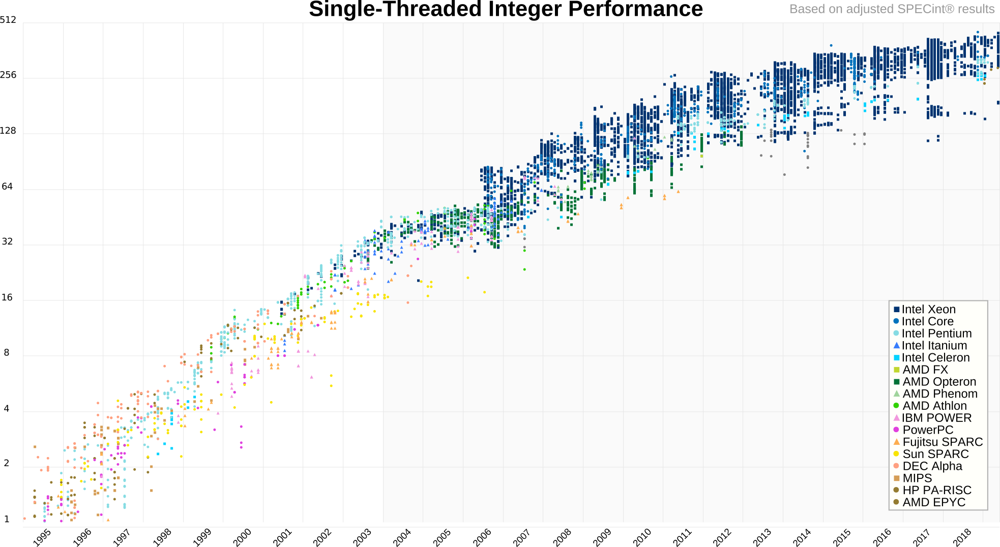
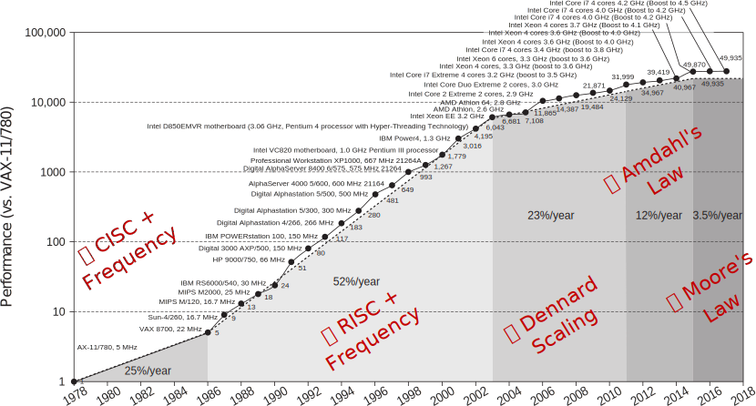
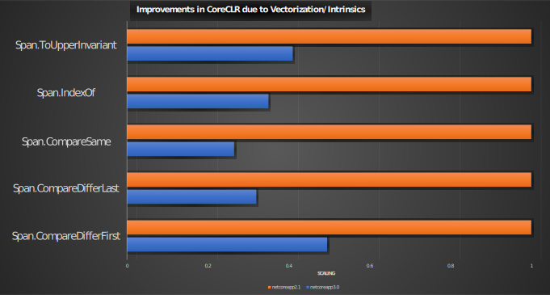

Wifi:
SSID: DKV-Public  
Key: P@zdzi3rnik20!9

## http://bit.ly/dotnetos-intrinsics

# CoreCLR 3.0 Intrinsics

### Workshop


---

## getent passwd $USER

<small>dmg:*:666:666:Dan Shechter:/home/dmg:/usr/bin/zsh</small>

<p class="fragment fade-in-then-out">
CTO of a high-frequency trading* firm that trades global markets from inside exchanges.
</p>

<p class="fragment">
Also, *nix programmer that likes <span class="fragment highlight-blue">low-level & perf</span> and whose been around the block:
<span class="fragment highlight-blue">Windows/Linux kernel programming, </span><span class="fragment highlight-red">Hypervisors</span>
</p>

<table>
<tr>
<td style="border-right: 1px solid black; padding-top: 0px; padding-bottom: 0px">
<a href="https://bits.houmus.org">
<object style="margin: auto;pointer-events: none;" type="image/svg+xml" width="48"  data="logos/atari.svg"></object>
</a>
</td>
<td style="border-right: 1px solid black; padding-top: 0px; padding-bottom: 0px">
<a href="http://twitter.com/damageboy">
<object style="margin: auto;pointer-events: none;" type="image/svg+xml" width="48"  data="logos/twitter.svg"></object>
</a>
</td>
<td style="padding-top: 0px; padding-bottom: 0px">
<a href="https://github.com/damageboy">
<object style="margin: auto;pointer-events: none;" type="image/svg+xml" width="48"  data="logos/github.svg"></object>
</td>
</tr>
</table>

---

## Today

- Why (now)?
- What?
- Hello Intrinsics World
- Excercises

---

## Why You're Here

Performance gains flowing from silicon are shrinking


--

## There's a reason for everything



<span style="font-size: small;">From: "Computer Architecture: A Quantitative Approach, 6<sup>th</sup> Edition</span>

<aside class="notes">

- Dennard observes that transistor dimensions are scaled by 30% (0.7x) every technology generation, thus reducing their area by 50%. This reduces the delay by 30% (0.7x) and therefore increases operating frequency by about 40% (1.4x). Finally, to keep the electric field constant, voltage is reduced by 30%, reducing energy by 65% and power (at 1.4x frequency) by 50%.[note 1] Therefore, in every technology generation the transistor density doubles, the circuit becomes 40% faster, and power consumption (with twice the number of transistors) stays the same.

- Amdahl's law can be formulated in the following way:
  ${\displaystyle S_{\text{latency}}(s)={\frac {1}{(1-p)+{\frac {p}{s}}}}}$
  
  where:

  - $S_{\text{latency}}$ is the theoretical speedup of the execution of the whole task;
  - s is the speedup of the part of the task that benefits from improved system resources;
  - p is the proportion of execution time that the part benefiting from improved resources originally occupied.

</aside>

--

<blockquote>
<span class="fragment fade-down">
"The reason processor performance is sub-linear with transistor count is [because] it's limited by   <b>unpredictability</b>:
<span class="fragment fade-in" style="color: red;">Branch predictability,</span><span class="fragment fade-in" style="color: blue;"> Data-predictability,</span> <span class="fragment fade-in" style="color: green;"> Instruction predictability."</span>
</span>
</blockquote>

[Jim Keller](https://en.wikipedia.org/wiki/Jim_Keller_(engineer))
From: [Moore's Law is Not Dead](https://youtu.be/oIG9ztQw2Gc?t=1788)

--

When all else fails, we look for exotic sources for perf; intrinsics provide an answer...  
This includes [CoreCLR itself](https://devblogs.microsoft.com/dotnet/performance-improvements-in-net-core-3-0/):

> <span class="fragment">...Further, .NET Core 3.0 includes new hardware intrinsics that allow a <span class="fragment highlight-blue">properly-motivated</span> developer to eke out the <span class="fragment highlight-blue">best possible performance</span> on supporting hardware, utilizing extensions like AVX or SSE that can compare well more than 8 bytes at a time. <span class="fragment highlight-blue">Many of the improvements in .NET Core 3.0</span> come from utilizing these techniques. </span>

--

## CoreCLR 3.0 vs. 2.1



--

Now that I've got you ~~scared~~ motivated enough...

Let's get busy!

---

## Wikipedia

[Intrinsic function](https://en.wikipedia.org/wiki/Intrinsic_function)

<blockquote>...an intrinsic function is a function available for use in a given programming language whose implementation is <span class="fragment highlight-red" data-fragment-index="0">handled specially by the
<span class="fragment fade-in" style="position:inline; margin-left: auto; margin-right: auto; left: 0; right: 0;" data-fragment-index="1">JIT.</span>
<span class="fragment fade-out" style="position:relative; margin-left: auto; margin-right: auto; left: -60px; right: 0;" data-fragment-index="1">compiler.</span>
</span>
</blockquote>

--

## Plain English

A way to directly embed **specific** CPU instructions via special, *fake* method calls that the JIT replaces at code-generation time

--

Used to expose processor functionality that *doesn't* map well to the language:

<ul>
<span class="fragment"><li>Atomic operations</li></span>
<span class="fragment"><li>System-Programming (e.g. kernel mode)</li></span>
<span class="fragment"><li>Crypto instructions</li></span>
<span class="fragment"><li>Niche instructions</li></span>
<span class="fragment"><span class="fragment highlight-blue"><span class="fragment highlight-green"><span class="fragment highlight-red"><li><b>Vectorization</b></li></span></span></span></span>
</ul>

--

## Where do intrinsics come from?

CPU designers add large groups of intrinsics and expose their availability through CPU feature flags.

Intel currently supports: <!-- .element: class="fragment" -->

- 1,218 distinct intrinsics <!-- .element: class="fragment" -->
- In 6,180 (!) combinations <!-- .element: class="fragment" -->
- Grouped in 67 code-names / feature flags. <!-- .element: class="fragment" -->

<aside class="notes">
Generated the #s with this little mostrosity
<pre>
grep 'instruction' intrinsics-guide/intrinsics_files/data-3.4.4.xml  | sed 's/.*name=.\([a-z0-9]*\).[ /].*/\1/' | sort -u | wc -l
grep 'CPUID' intrinsics-guide/intrinsics_files/data-3.4.4.xml  | cut -f 2 -d '>' | cut -f 1 -d '<' | sort -u
grep '&gt;intrinsic ' intrinsics-guide/intrinsics_files/data-3.4.4.xml | wc -l
</pre>

</aside>

--

<iframe data-src="intrinsics-guide/intrinsics.html" width="1600" height="600" frameborder="0" marginwidth="0" marginheight="0" scrolling="" style="border:3px solid #666; margin-bottom:5px; max-width: 100%;" allowfullscreen=""></iframe>

--

## In C# #

<ul>
<span class="fragment fade-up">
<li>Not new! (since .NET 1.1)
<ul>
<li>Almost all of <a href="https://docs.microsoft.com/en-us/dotnet/api/system.threading.interlocked?view=netframework-4.8#methods"><code>Interlocked.*</code></a> & more</li>
</ul>
</li>
</span>
<span class="fragment fade-up"><li>Very limited until CoreCLR 3.0 came along...</li>
<ul>
<li>x86 now has <span class="fragment highlight-red">226</span> intrinsics in <a href="https://docs.microsoft.com/en-us/dotnet/api/system.runtime.intrinsics.x86?view=netcore-3.0&viewFallbackFrom=dotnet-plat-ext-3.0">15 classes</a></li>
<ul>
<li>Up to AVX2</li>
</ul>
<li>arm64 now has <span class="fragment highlight-red">24</span> intrinsics in <a href="https://docs.microsoft.com/en-us/dotnet/api/system.runtime.intrinsics.arm.arm64?view=dotnet-plat-ext-3.0">5 classes</a></li>
<ul>
<li>Didn't make it to CoreCLR 3.0</li>
</ul>
</ul>
</span>
</ul>

<aside class="notes">
Generated the #s with this little mostrosity
<pre>
~/projects/public/coreclr/src/System.Private.CoreLib/shared/System/Runtime/Intrinsics/X86> for i in $(ls | grep -v Platform); do cat $i; done | grep static | cut -f 1 -d '('  | sed 's#\(public \|static \|unsafe \|void \|uint \|int\|bool \|ulong \|long \|new \)##g' | grep -v IsSupported | sed 's#Vector.*>##'  | sed -r 's/^\s*(\S+(\s+\S+)*)\s*$/\1/' | sort -u | grep -v class | wc -l
</pre>

Should mention that AVX2 is relatively old and widespread:
[Intel > 2013|AMD > 2015]

</aside>

--

## Namespaces

<table class="fragment">
<tr><td style="border: none">Common</td> <td style="border: none">⮚</td> <td style="border: none"><code>System.Runtime.Intrinsics</code></td></tr>
<tr><td style="border: none">x86</td>    <td style="border: none">⮚</td> <td style="border: none"><code>System.Runtime.Intrinsics.<b>X86</b></code></td></tr>
<tr><td style="border: none">arm64</td>  <td style="border: none">⮚</td> <td style="border: none"><code>System.Runtime.Intrinsics.<b>Arm.Arm64</b></code></td></tr>
</table>

--

## Detection

Each class / group has a:
```csharp
  public static bool IsSupported { get; }
```  

<br/>

- This tests availability on CPU @ "runtime"       <!-- .element: class="fragment" -->
- Special check recognized during code-gen (JIT!)  <!-- .element: class="fragment" -->
  - So in reality: ZERO cost                       <!-- .element: class="fragment" -->
  - Already nicer than C++...                      <!-- .element: class="fragment" -->

--

## Controlling JIT

Want to force the JIT to enable/disable instrinsics?

The JIT giveth [knobs](https://github.com/dotnet/coreclr/blob/master/Documentation/project-docs/clr-configuration-knobs.md#jit-hardware-intrinsics-configuration-knobs) for intrinsics.
<!-- .element: class="fragment" -->

--

```bash
# Linux/Mac
export COMPlus_EnableAVX2=1 # force AVX2 support

# Windows
set COMPlus_EnableAVX2=0 # force no AVX2 support

# Powershell (universal?)
$env:COMPlus_EnableAVX2=0

```

---

# Step aside scalar, SIMD is coming

Here we go...

--

## Workshop

We will learn to overcome unpredictability with vectorizatrion/SIMD:

- What is SIMD?
- Some intrinsics for the road...
- How do they exactly work?
- How do they help with unpredictability?

--

## SIMD

<p class="fragment">
We've mentioned that CPUs have 1000s of instructions that have to do with vectorization.
</p>

<p class="fragment fade-down">
Also referred to as SIMD instructions / intrinsics:
</p>

<p class="fragment fade-up">
<span style="color: black"><b>S</b></span>ingle
<span style="color: black"><b>I</b></span>nstruction
<span style="color: black"><b>M</b></span>ultiple
<span style="color: black"><b>D</b></span>ata
</p>

--

## How?

How can an instruction operate on a vector?

<p class="fragment fade-down">
Does it operate on memory?
</p>

<p class="fragment fade-up">
Generally, <b>No!</b> 
</p>

--

## SIMD Vectors

SIMD instructions operate on vector types that are supported at the CPU level: <span class="fragment">registers</span>

<p class="fragment fade-down">
SIMD registers have <i>constant</i> size in bits.
</p>

<p class="fragment fade-up">
CoreCLR 3.0 supports SIMD instructions that use 64/128/256 bit wide registers.
</p>

--

## Vectors in C# #

C# vectorized intrinsics accept and return these types:

- [`Vector64<T>`](https://github.com/dotnet/coreclr/blob/master/src/System.Private.CoreLib/shared/System/Runtime/Intrinsics/Vector64_1.cs)
- [`Vector128<T>`](https://github.com/dotnet/coreclr/blob/master/src/System.Private.CoreLib/shared/System/Runtime/Intrinsics/Vector128_1.cs)
- [`Vector256<T>`](https://github.com/dotnet/coreclr/blob/master/src/System.Private.CoreLib/shared/System/Runtime/Intrinsics/Vector256_1.cs)

Where `T` is some primitive type.

--

## Example:

`Vector256<T>` can be:
<table class="fragment">
<tr><td style="border: none"><code>byte / sbyte</code></td>  <td style="border: none">⮚</td> <td style="border: none">32 x 8b</td><td style="border: none"> == 256b</td></tr>
<tr><td style="border: none"><code>short / ushort</code></td><td style="border: none">⮚</td> <td style="border: none">16 x 16b</td><td style="border: none"> == 256b</td></tr>
<tr><td style="border: none;"><code>int / uint</code></td>   <td style="border: none">⮚</td> <td style="border: none">8 x 32b</td><td style="border: none">== 256b</span></td></tr>  
<tr><td style="border: none"><code>long / ulong</code></td>  <td style="border: none">⮚</td> <td style="border: none">4 x 64b</td><td style="border: none"> == 256b</td></tr>
<tr><td style="border: none"><code>float</code></td>         <td style="border: none">⮚</td> <td style="border: none">8 x 32b</td><td style="border: none"> == 256b</td></tr>
<tr><td style="border: none"><code>double</code></td>        <td style="border: none">⮚</td> <td style="border: none">4 x 64b</td><td style="border: none"> == 256b</td></tr>
</table>

--

## Vector registers

<table style="text-align: center; line-height: normal;">
<tbody><tr>
<td style="width: 600; border: none; border-right: 1px solid black; font-size: xx-small;"><span style="float: left">511</span> <span style="float: right">256</span></td>
<td style="width: 25%; border: none; border-right: 1px solid black; font-size: xx-small;"><span style="float: left">255</span> <span style="float: right">128</span></td>
<td style="width: 25%; border: none; border-right: 1px solid black; font-size: xx-small;"><span style="float: left">127</span> <span style="float: right">0</span></td>
</tr><tr>
<td style="border-top: none; border-right: 1px solid black;"></td>
<td style="border-top: none; border-right: 1px solid black;"></td>
<td style="border-top: none; border-right: 1px solid black;"></td>
</tr><tr>
<td style="padding:0; font-size: 0.6em; border-right: 1px solid black"><pre>zmm0        </pre></td>
<td style="padding:0; font-size: 0.6em; border-right: 1px solid black; background: #ddd"><pre>ymm0        </pre></td>
<td style="padding:0; font-size: 0.6em; border-right: 1px solid black; background: #ccc"><pre>xmm0        </pre></td>
</tr><tr>
<td style="padding:0; font-size: 0.6em; border-right: 1px solid black"><pre>zmm1        </pre></td>
<td style="padding:0; font-size: 0.6em; border-right: 1px solid black; background: #ddd"><pre>ymm1        </pre></td>
<td style="padding:0; font-size: 0.6em; border-right: 1px solid black; background: #ccc"><pre>xmm1        </pre></td>
</tr><tr>
<td style="padding:0; font-size: 0.6em; border-right: 1px solid black"><pre>zmm2        </pre></td>
<td style="padding:0; font-size: 0.6em; border-right: 1px solid black; background: #ddd"><pre>ymm2        </pre></td>
<td style="padding:0; font-size: 0.6em; border-right: 1px solid black; background: #ccc"><pre>xmm2        </pre></td>
</tr><tr>
<td style="padding:0; font-size: 0.6em; border-right: 1px solid black"><pre>zmm3        </pre></td>
<td style="padding:0; font-size: 0.6em; border-right: 1px solid black; background: #ddd"><pre>ymm3        </pre></td>
<td style="padding:0; font-size: 0.6em; border-right: 1px solid black; background: #ccc"><pre>xmm3        </pre></td>
</tr><tr>
<td style="padding:0; font-size: 0.6em; border-right: 1px solid black"><pre>zmm4        </pre></td>
<td style="padding:0; font-size: 0.6em; border-right: 1px solid black; background: #ddd"><pre>ymm4        </pre></td>
<td style="padding:0; font-size: 0.6em; border-right: 1px solid black; background: #ccc"><pre>xmm4        </pre></td>
</tr>
<tr>
<td style="padding:0; font-size: 0.6em; border-right: 1px solid black"><pre>zmm5        </pre></td>
<td style="padding:0; font-size: 0.6em; border-right: 1px solid black; background: #ddd"><pre>ymm5        </pre></td>
<td style="padding:0; font-size: 0.6em; border-right: 1px solid black; background: #ccc"><pre>xmm5        </pre></td>
</tr>
<tr>
<td style="padding:0; font-size: 0.6em; border-right: 1px solid black"><pre>zmm6        </pre></td>
<td style="padding:0; font-size: 0.6em; border-right: 1px solid black; background: #ddd"><pre>ymm6        </pre></td>
<td style="padding:0; font-size: 0.6em; border-right: 1px solid black; background: #ccc"><pre>xmm6        </pre></td>
</tr><tr>
<td style="padding:0; font-size: 0.6em; border-right: 1px solid black"><pre>zmm7        </pre></td>
<td style="padding:0; font-size: 0.6em; border-right: 1px solid black; background: #ddd"><pre>ymm7        </pre></td>
<td style="padding:0; font-size: 0.6em; border-right: 1px solid black; background: #ccc"><pre>xmm7        </pre></td>
</tr><tr>
<td style="padding:0; font-size: 0.6em; border-right: 1px solid black"><pre>zmm8        </pre></td>
<td style="padding:0; font-size: 0.6em; border-right: 1px solid black; background: #ddd"><pre>ymm8        </pre></td>
<td style="padding:0; font-size: 0.6em; border-right: 1px solid black; background: #ccc"><pre>xmm8        </pre></td>
</tr><tr>
<td style="padding:0; font-size: 0.6em; border-right: 1px solid black"><pre>zmm9        </pre></td>
<td style="padding:0; font-size: 0.6em; border-right: 1px solid black; background: #ddd"><pre>ymm9        </pre></td>
<td style="padding:0; font-size: 0.6em; border-right: 1px solid black; background: #ccc"><pre>xmm9        </pre></td>
</tr><tr>
<td style="padding:0; font-size: 0.6em; border-right: 1px solid black"><pre>zmm10        </pre></td>
<td style="padding:0; font-size: 0.6em; border-right: 1px solid black; background: #ddd"><pre>ymm10        </pre></td>
<td style="padding:0; font-size: 0.6em; border-right: 1px solid black; background: #ccc"><pre>xmm10        </pre></td>
</tr><tr>
<td style="padding:0; font-size: 0.6em; border-right: 1px solid black"><pre>zmm11        </pre></td>
<td style="padding:0; font-size: 0.6em; border-right: 1px solid black; background: #ddd"><pre>ymm11        </pre></td>
<td style="padding:0; font-size: 0.6em; border-right: 1px solid black; background: #ccc"><pre>xmm11        </pre></td>
</tr><tr>
<td style="padding:0; font-size: 0.6em; border-right: 1px solid black"><pre>zmm12        </pre></td>
<td style="padding:0; font-size: 0.6em; border-right: 1px solid black; background: #ddd"><pre>ymm12        </pre></td>
<td style="padding:0; font-size: 0.6em; border-right: 1px solid black; background: #ccc"><pre>xmm12        </pre></td>
</tr><tr>
<td style="padding:0; font-size: 0.6em; border-right: 1px solid black"><pre>zmm13        </pre></td>
<td style="padding:0; font-size: 0.6em; border-right: 1px solid black; background: #ddd"><pre>ymm13        </pre></td>
<td style="padding:0; font-size: 0.6em; border-right: 1px solid black; background: #ccc"><pre>xmm13        </pre></td>
</tr><tr>
<td style="padding:0; font-size: 0.6em; border-right: 1px solid black"><pre>zmm14        </pre></td>
<td style="padding:0; font-size: 0.6em; border-right: 1px solid black; background: #ddd"><pre>ymm14        </pre></td>
<td style="padding:0; font-size: 0.6em; border-right: 1px solid black; background: #ccc"><pre>xmm14        </pre></td>
</tr><tr>
<td style="padding:0; font-size: 0.6em; border-right: 1px solid black"><pre>zmm15        </pre></td>
<td style="padding:0; font-size: 0.6em; border-right: 1px solid black; background: #ddd"><pre>ymm15        </pre></td>
<td style="padding:0; font-size: 0.6em; border-right: 1px solid black; background: #ccc"><pre>xmm15        </pre></td>
</tr><tr>
<td style="padding:0; font-size: 0.6em; border-right: 1px solid black"><pre>zmm16        </pre></td>
<td style="padding:0; font-size: 0.6em; border-right: 1px solid black"><pre>ymm16        </pre></td>
<td style="padding:0; font-size: 0.6em; border-right: 1px solid black"><pre>xmm16        </pre></td>
</tr><tr>
<td style="padding:0; font-size: 0.6em; border-right: 1px solid black"><pre>zmm17        </pre></td>
<td style="padding:0; font-size: 0.6em; border-right: 1px solid black"><pre>ymm17        </pre></td>
<td style="padding:0; font-size: 0.6em; border-right: 1px solid black"><pre>xmm17        </pre></td>
</tr><tr>
<td style="padding:0; font-size: 0.6em; border-right: 1px solid black"><pre>zmm18        </pre></td>
<td style="padding:0; font-size: 0.6em; border-right: 1px solid black"><pre>ymm18        </pre></td>
<td style="padding:0; font-size: 0.6em; border-right: 1px solid black"><pre>xmm18        </pre></td>
</tr><tr>
<td style="padding:0; font-size: 0.6em; border-right: 1px solid black"><pre>zmm19        </pre></td>
<td style="padding:0; font-size: 0.6em; border-right: 1px solid black"><pre>ymm19        </pre></td>
<td style="padding:0; font-size: 0.6em; border-right: 1px solid black"><pre>xmm19        </pre></td>
</tr><tr>
<td style="padding:0; font-size: 0.6em; border-right: 1px solid black"><pre>zmm20        </pre></td>
<td style="padding:0; font-size: 0.6em; border-right: 1px solid black"><pre>ymm20        </pre></td>
<td style="padding:0; font-size: 0.6em; border-right: 1px solid black"><pre>xmm20        </pre></td>
</tr><tr>
<td style="padding:0; font-size: 0.6em; border-right: 1px solid black"><pre>zmm21        </pre></td>
<td style="padding:0; font-size: 0.6em; border-right: 1px solid black"><pre>ymm21        </pre></td>
<td style="padding:0; font-size: 0.6em; border-right: 1px solid black"><pre>xmm21        </pre></td>
</tr><tr>
<td style="padding:0; font-size: 0.6em; border-right: 1px solid black"><pre>zmm22        </pre></td>
<td style="padding:0; font-size: 0.6em; border-right: 1px solid black"><pre>ymm22        </pre></td>
<td style="padding:0; font-size: 0.6em; border-right: 1px solid black"><pre>xmm22        </pre></td>
</tr><tr>
<td style="padding:0; font-size: 0.6em; border-right: 1px solid black"><pre>zmm23        </pre></td>
<td style="padding:0; font-size: 0.6em; border-right: 1px solid black"><pre>ymm23        </pre></td>
<td style="padding:0; font-size: 0.6em; border-right: 1px solid black"><pre>xmm23        </pre></td>
</tr><tr>
<td style="padding:0; font-size: 0.6em; border-right: 1px solid black"><pre>zmm24        </pre></td>
<td style="padding:0; font-size: 0.6em; border-right: 1px solid black"><pre>ymm24        </pre></td>
<td style="padding:0; font-size: 0.6em; border-right: 1px solid black"><pre>xmm24        </pre></td>
</tr><tr>
<td style="padding:0; font-size: 0.6em; border-right: 1px solid black"><pre>zmm25        </pre></td>
<td style="padding:0; font-size: 0.6em; border-right: 1px solid black"><pre>ymm25        </pre></td>
<td style="padding:0; font-size: 0.6em; border-right: 1px solid black"><pre>xmm25        </pre></td>
</tr><tr>
<td style="padding:0; font-size: 0.6em; border-right: 1px solid black"><pre>zmm26        </pre></td>
<td style="padding:0; font-size: 0.6em; border-right: 1px solid black"><pre>ymm26        </pre></td>
<td style="padding:0; font-size: 0.6em; border-right: 1px solid black"><pre>xmm26        </pre></td>
</tr><tr>
<td style="padding:0; font-size: 0.6em; border-right: 1px solid black"><pre>zmm27        </pre></td>
<td style="padding:0; font-size: 0.6em; border-right: 1px solid black"><pre>ymm27        </pre></td>
<td style="padding:0; font-size: 0.6em; border-right: 1px solid black"><pre>xmm27        </pre></td>
</tr><tr>
<td style="padding:0; font-size: 0.6em; border-right: 1px solid black"><pre>zmm28        </pre></td>
<td style="padding:0; font-size: 0.6em; border-right: 1px solid black"><pre>ymm28        </pre></td>
<td style="padding:0; font-size: 0.6em; border-right: 1px solid black"><pre>xmm28        </pre></td>
</tr><tr>
<td style="padding:0; font-size: 0.6em; border-right: 1px solid black"><pre>zmm29        </pre></td>
<td style="padding:0; font-size: 0.6em; border-right: 1px solid black"><pre>ymm29        </pre></td>
<td style="padding:0; font-size: 0.6em; border-right: 1px solid black"><pre>xmm29        </pre></td>
</tr><tr>
<td style="padding:0; font-size: 0.6em; border-right: 1px solid black"><pre>zmm30        </pre></td>
<td style="padding:0; font-size: 0.6em; border-right: 1px solid black"><pre>ymm30        </pre></td>
<td style="padding:0; font-size: 0.6em; border-right: 1px solid black"><pre>xmm30        </pre></td>
</tr><tr>
<td style="padding:0; font-size: 0.6em; border-right: 1px solid black"><pre>zmm31        </pre></td>
<td style="padding:0; font-size: 0.6em; border-right: 1px solid black"><pre>ymm31        </pre></td>
<td style="padding:0; font-size: 0.6em; border-right: 1px solid black"><pre>xmm31        </pre></td>
</tr></tbody></table>

--

We'll start with this:

<table><thead><tr>
<th style="font-size: x-large;text-align:left;"  ><span class="fragment" data-fragment-index="3"><code>x64 asm</code></span></th>
<th style="font-size: x-large;text-align:center;"><span class="fragment" data-fragment-index="2"><code>Intel</code></span></th>
<th style="font-size: x-large;text-align:right;" ><span class="fragment" data-fragment-index="1"><code>CoreCLR</code></span></th>
</tr></thead>
<tbody><tr>
<td style="font-size: x-large;text-align:left;"  ><span class="fragment" data-fragment-index="3"><code>vbroadcastd</code></span></td>
<td style="font-size: x-large;text-align:center;"><span class="fragment" data-fragment-index="2"><code>_mm256_broadcastd_epi32</code></span></td>
<td style="font-size: x-large;text-align:right;" ><span class="fragment" data-fragment-index="1"><code>Vector256.Create(int)</code></span></td>
</tr><tr>
<td style="font-size: x-large;text-align:left;"  ><span class="fragment" data-fragment-index="3"><code>vlddqu</code></span></td>
<td style="font-size: x-large;text-align:center;"><span class="fragment" data-fragment-index="2"><code>_mm256_lddqu_si256</code></span></td>
<td style="font-size: x-large;text-align:right;" ><span class="fragment" data-fragment-index="1"><code>Avx.LoadDquVector256</code></span></td>
</tr><tr>
<td style="font-size: x-large;text-align:left;"  ><span class="fragment" data-fragment-index="3"><code>vmovdqu</code></span></td>
<td style="font-size: x-large;text-align:center;"><span class="fragment" data-fragment-index="2"><code>_mm256_storeu_si256</code></span></td>
<td style="font-size: x-large;text-align:right;" ><span class="fragment" data-fragment-index="1"><code>Avx.Store</code></span></td>
</tr><tr>
<td style="font-size: x-large;text-align:left;"  ><span class="fragment" data-fragment-index="3"><code>vpcmpgtd</code></span></td>
<td style="font-size: x-large;text-align:center;"><span class="fragment" data-fragment-index="2"><code>_mm256_cmpgt_epi32</code></span></td>
<td style="font-size: x-large;text-align:right;" ><span class="fragment" data-fragment-index="1"><code>Avx2.CompareGreaterThan</code></span></td>
</tr><tr>
<td style="font-size: x-large;text-align:left;"  ><span class="fragment" data-fragment-index="3"><code>vmovmskps</code></span></td>
<td style="font-size: x-large;text-align:center;"><span class="fragment" data-fragment-index="2"><code>_mm256_movemask_ps</code></span></td>
<td style="font-size: x-large;text-align:right;" ><span class="fragment" data-fragment-index="1"><code>Avx.MoveMask</code></span></td>
</tr><tr>
<td style="font-size: x-large;text-align:left;"  ><span class="fragment" data-fragment-index="3"><code>popcnt</code></span></td>
<td style="font-size: x-large;text-align:center;"><span class="fragment" data-fragment-index="2"><code>_mm_popcnt_u32</code></span></td>
<td style="font-size: x-large;text-align:right;" ><span class="fragment" data-fragment-index="1"><code>Popcnt.PopCount</code></span></td>
</tr><tr>
<td style="font-size: x-large;text-align:left;"  ><span class="fragment" data-fragment-index="3"><code>vpermd</code></span></td>
<td style="font-size: x-large;text-align:center;"><span class="fragment" data-fragment-index="2"><code>_mm256_permutevar8x32_epi32</code></span></td>
<td style="font-size: x-large;text-align:right;" ><span class="fragment" data-fragment-index="1"><code>Avx2.PermuteVar8x32</code></span></td>
</tr></tbody></table>

--

## Create

- Accepts a single primitive value
- Returns a vector where all elements ⮘ value
- Scalar ⮚ Vector

<aside class="notes">
First one is the simplest, we take a single value, and "transmit" it to the entire vector
</aside>

--

<p style="text-align: left;">C#:</p>

```csharp
Vector256<int> someVector256 = Vector256.Create(0x42);
```

<p style="text-align: left;">asm:</p>

```x86asm
vmovd  xmm0, rax          ; 3 cycle latency
                          ; 1 cycle throughput
vpbroadcastd ymm0, xmm0   ; 3 cycle latency
                          ; 1 cycle throughput
```

<object style="margin: auto" type="image/svg+xml" data="inst-animations/vbroadcast.svg"></object>

<aside class="notes">

- On the top here, we see how we call it from C#, looks like a innocent function call
- The below it, we see this translates into 2 instructions for this intrinsic.
- And finally below that, I can show you a nifty animation of what happens when we fire this baby.

</aside>

--

## Load / Store

- Takes a pointer to an array of primitives
- Load reads a vector with copied data *from* memory
- Store writes a vector *into* memory

<aside class="notes">
Next are two of the few intrinsics that actually work directly with memory, unsurisingly that's the load and store
pair:
- one reads from memory into the CPU registers or vector types
- the other writes.
</aside>

--

<p style="text-align: left;">C#:</p>

```csharp
int *ptr = ...; // Get some pointer to a big enough array
Vector256<int> data = Avx2.LoadDquVector256(ptr);
Avx.Store(ptr, data);
```

<p style="text-align: left;">asm:</p>

```x86asm
vlddqu  ymm1,  [rdi] ; 5 cycle latency +
vmovdqu [r12], ymm1  ; cache/memory
                     ; 0.5 cycle throughput
```

<object style="margin: auto" type="image/svg+xml" data="inst-animations/lddqu.svg"></object>

<aside class="notes">

- Again, C# on the top: We provide a pointer and get a Vector back
- Then asm in the middle: vlddqu is for read, vmovdqu for write in this case
- And finally, the animation
- Think about this in terms of in terms of predictability, we providing a lot of work in one instruction!

</aside>

--

## Compare Greater Than

- Compares 2 vectors element by element
- Returns a 3<sup>rd</sup> vector where:
  - *Greater than* elements are marked with `-1`
  - *Smaller than -or- equal* are marked as `0`

<aside class="notes">
The first two ones were warm up, this is where it's about to get weird:
We take two vectors and compare them to each other element by element.
The result is a 3<sup>rd</sup> vector with either -1 or 0 as the result

</aside>

--

<p style="text-align: left;">C#:</p>

```csharp
Vector256<int> data, comparand;
Vector256<int> result =
    Avx2.CompareGreaterThan(data, comparand);
```

<p style="text-align: left;">asm:</p>

```x86asm
vpcmpgtd ymm2, ymm1, ymm0 ; 1 cycle latency
                          ; 0.5 cycle throughput
```

<object style="margin: auto" type="image/svg+xml" data="inst-animations/vpcmpgtd.svg"></object>

<aside class="notes">
- Pretty simple C# call
- Which translates to one assembly instruction
- And we can see how this unfolds in the animation...
- What's worth while to mention here is that we are compare 8 elements to another 8
  - In 1 cycle!
  - And get 8 results
- Again think about this in terms of expressin predictability
</aside>

--

## Move Mask

- Set each bit of the result based on the MSB of the corresponding 32-bit element
- Reverse of broadcat, for the MSB
- Vector ⮚ Scalar

<aside class="notes">

Now we start "chaining" these intrinsics together.  
With `MoveMask`, we get to do an interesting vector to scalar operation,
where we take the MSB from 8 elements, and move them to a scalar value we can use
in non-vectorized code!

</aside>

--

<p style="text-align: left;">C#:</p>

```csharp
Vector256<int> data;
int result = Avx.MoveMask(data.AsSingle());
```

<p style="text-align: left;">asm:</p>

```x86asm
vmovmskps rax, ymm2  ; 5 cycle latency
                     ; 1 cycle throughput
```

<object style="margin: auto" type="image/svg+xml" data="inst-animations/vmovmskps.svg"></object>

<aside class="notes">

- Pretty simple C# call, if you ignore that weird `.AsSingle()` in there which
  we have to shove there to make the compiler shut up
- Even simpler asm
- And easy to figure animation...

</aside>

--

## Population Count

- Counts # of '1' bits in a 32/64 bit primitive

<p style="text-align: left;">C#:</p>

```csharp

int result = PopCnt.PopCount(0b0000111100110011);
// result == 8
```

<p style="text-align: left;">asm:</p>

```x86asm
popcnt rax, rdx  ; 3 cycle latency
                 ; 1 cycle throughput
```

<aside class="notes">

Here's a super simple one, that I didn't even bother to animate...
We simply perform a population count, and get the total number of `1` bits in a 32/64 bit value.

So pretty easy to see it's 8 in this example.

</aside>

--

## 8-Way Permute

- Accepts two vectors: source, permutation
- Permutes the source according to the permutation order

<aside class="notes">

Finally, I saved the most trippy instruction for the end: a 8 wau permute, or in other words:
A single instruction that re-arranges a 8-element Vector256 according to some order we provide it with

</aside>

--

<p style="text-align: left;">C#:</p>

```csharp
Vector256<int> data, perm;
Vector256<int> result = Avx2.PermuteVar8x32(data, perm);
```

<p style="text-align: left;">asm:</p>

```x86asm
vpermd ymm1, ymm2, ymm1 ; 3 cycles latency
                        ; 1 cycles throughput
```

<object style="margin: auto" type="image/svg+xml" data="inst-animations/vpermd.svg"></object>

<aside class="notes">

- There's little to say here on the C#
- Or the assembly
- But this is a clear "one picture is worth 1000 words" type of situation.

</aside>

--

## Unpredictability?

- Less instructions for more work
- Bigger data chunks
- Replacing branches with arithmetic
  - If you try to go fully vectorized

---

## Hello Intrinsics World

```bash
git clone https://github.com/damageboy/coreclr-intrinsics-workshop
cd Hi
# Windows
.\run-with-scalar.cmd
# Linux / OSX
./run-with-scalar.sh

Hello Scalar World!!!!!
# Works
dotnet run
# (Boom)

```

---

## Exercise Project Structure

- Workshop Library (excercise)
- Unit tests (NUnit)
- Benchmark (BDN)
- Console driver (for VTune/perf)

--

## Exercise structure:

```csharp
int SomeExercise(int[] data) =>
    Avx2.IsSupported ? 
        SomeExerciseVectorized(data) :  // This is your task
        SomeExerciseScalar(data);       // This is provided
```

--

## Unit Test Structure

```csharp
public class SomeExerciseTests
{
    // ...
    [TestCaseSource(nameof(LotsOfTestCases))]
    public unsafe void TestScalar(IntGenerator generator)
    {
        var (data, param, reproContext) = generator();
        // Test code provided for scalar
        Assert.That(..., reproContext);
    }

    [TestCaseSource(nameof(LotsOfTestCases))]
    public unsafe void TestVectorized(FloatGenerator generator)
    {
        // ... Same as above
    }
}
```

--

## Running tests

You should be able to run the unit tests from your IDE.

Alternatively you always have the command line:

```bash
dotnet test -c {debug,release} # This will run tests
dotnet test -t                 # List the tests
dotnet test --filter "SomeExerciseTests.TestScalar"

```

--

## Benchmark Structure

```csharp
[InvocationCount(InvocationsPerIteration)]
[Config(typeof(ShortConfig))]
public class SomeExerciseBench
{
    const int InvocationsPerIteration = 100;

    [Params(100, 1_000, 10_000, 100_000, 1_000_000)]
    public int N;

    // ...Setup

    [Benchmark(Baseline = true)]
    public int Scalar() => SomeExercise.SomeScalar(_arrayPtrs[_iterationIndex++], N);

    [Benchmark]
    public int Vectorized() => SomeExercise.SomeVectorized(_arrayPtrs[_iterationIndex++], N);
}
```

--

## Running benchmarks

```bash
dotnet run -c release -- --filter "*SomeExerciseBench*"
```

<small>

|     Method |       N |            Mean | Ratio |
|----------- |-------- |----------------:|------:|
|     Scalar |     100 |     14,857.3 ns |  1.00 |
| Vectorized |     100 |        462.9 ns |  0.03 |
|     Scalar |    1000 |    132,203.6 ns |  1.00 |
| Vectorized |    1000 |      2,357.7 ns |  0.02 |
|     Scalar |   10000 |    776,175.5 ns |  1.00 |
| Vectorized |   10000 |     28,254.0 ns |  0.04 |
|     Scalar |  100000 |  5,608,591.6 ns |  1.00 |
| Vectorized |  100000 |    430,801.4 ns |  0.08 |
|     Scalar | 1000000 | 55,220,355.6 ns |  1.00 |
| Vectorized | 1000000 |  3,819,837.4 ns |  0.07 |

</small>

---

# Excercises

--

## Ex00

Open the README.md (on github.com)

--

OK, That was simple,
Now let's look at asm:

--

Clean and nice?

```x86asm
; while (p < endVectorized) {
  cmp         rcx,rdx  
  jae         skip
;   Store(p, Multiply(LoadVector256(p), constantVec));
loop:
  vmulps      ymm1,ymm0,ymmword ptr [rcx]  
  vmovups     ymmword ptr [rcx],ymm1  
;    p += 8;
  add         rcx,20h  
; while (p < endVectorized) {
  cmp         rcx,rdx  
  jb          00007FFD7E3BBE6E  
skip:
```

--

## Unrolling the code

When the ratio between overhead / work is close to 50/50

It's time to unroll!

--

Better!

```x86asm
; while (p < endVectorized4) {
 cmp         rcx,rdx  
 jae         skip  
loop:
; Store(p + N*0, Multiply(LoadVector256(p + N*0), constantVec));
 vmulps      ymm1,ymm0,ymmword ptr [rcx]  
 vmovups     ymmword ptr [rcx],ymm1  
; Store(p + N*1, Multiply(LoadVector256(p + N*1), constantVec));
 vmulps      ymm1,ymm0,ymmword ptr [rcx+20h]  
 vmovups     ymmword ptr [rcx+20h],ymm1  
; Store(p + N*2, Multiply(LoadVector256(p + N*2), constantVec));
 vmulps      ymm1,ymm0,ymmword ptr [rcx+40h]  
 vmovups     ymmword ptr [rcx+40h],ymm1  
; Store(p + N*3, Multiply(LoadVector256(p + N*3), constantVec));
 vmulps      ymm1,ymm0,ymmword ptr [rcx+60h]  
 vmovups     ymmword ptr [rcx+60h],ymm1  
; p += N * 4;
 add         rcx,80h  
; while (p < endVectorized4) {
 cmp         rcx,rdx  
 jb          loop
skip:

```

--

## Debugging Memory Corruption

- More often than not you're going to have memory corruptions
  - "We are no longer in managed world, Dorothy"
- But we can still do something about it

--

```csharp
using static System.Runtime.Intrinsics.X86.Avx;

//...

// We calling the function witout the class name
// relying on using static for release
// and calling our debugging code for DEBUG
LoadVector256(dataPtr);


#if DEBUG
Vector256<float> LoadVector256(float *p)
{
    Debug.Assert(p >= dataPtr, "reading from before start of array");
    Debug.Assert(p <= (dataPtr + length) - 8, "reading from after end of array");
    // Finally, call the real stuff
    return Avx.LoadVector256(p);
}
#endif

```

---

# Thanks!
